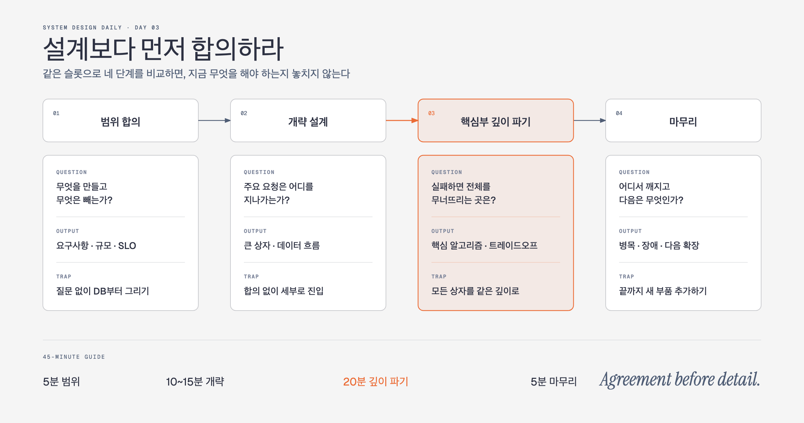

# System Design Daily

40일 동안 하루에 하나씩 시스템 설계의 뼈대를 익히는 과정이다. 원문을 줄여 옮기는 대신 “왜 이런 구조가 나왔는가”를 중심으로 다시 설명한다. 각 강의는 5~8분 분량이며, 그림 한 장과 확인 문제 하나로 끝난다.

원본: [liquidslr/system-design-notes](https://github.com/liquidslr/system-design-notes)

## 40일 커리큘럼

| Day | 주제 | 오늘 붙잡을 질문 |
|---:|---|---|
| 01 | 0명에서 수백만 명까지 | 사용자가 늘 때 가장 먼저 분리해야 할 병목은 어디인가? |
| 02 | 대략적인 용량 계산 | 설계 전에 QPS와 저장 용량을 왜 계산해야 하는가? |
| 03 | 시스템 설계 4단계 | 좋은 설계보다 먼저 합의해야 하는 것은 무엇인가? |
| 04 | Rate Limiter | 요청을 어디에서, 어떤 기준으로 제한할 것인가? |
| 05 | Consistent Hashing | 서버가 늘고 줄어도 데이터 이동을 줄일 수 있을까? |
| 06 | Key-Value Store | 가용성과 일관성 사이에서 무엇을 선택할 것인가? |
| 07 | 분산 Unique ID | 충돌 없이 정렬 가능한 ID를 어떻게 만들까? |
| 08 | URL Shortener | 짧은 키를 어떻게 만들고 빠르게 찾을까? |
| 09 | Web Crawler | 인터넷을 예의 바르고 중복 없이 수집하려면? |
| 10 | Notification System | 알림 채널이 늘어도 발송 흐름을 어떻게 단순하게 유지할까? |
| 11 | News Feed | 쓰기 때 계산할까, 읽기 때 계산할까? |
| 12 | Chat System | 실시간 연결과 메시지 저장을 어떻게 나눌까? |
| 13 | Search Autocomplete | 입력할 때마다 빠르게 후보를 찾으려면? |
| 14 | YouTube | 거대한 영상을 어떻게 업로드하고 전 세계에 전달할까? |
| 15 | Google Drive | 파일 동기화 충돌과 큰 파일 전송을 어떻게 다룰까? |
| 16 | Proximity Service | “내 주변”을 빠르게 찾는 공간 인덱스는 어떻게 동작할까? |
| 17 | Nearby Friends ① | 위치 업데이트와 친구 조회 흐름을 어떻게 나눌까? |
| 18 | Nearby Friends ② | Redis Pub/Sub이 커질 때 어디서 막힐까? |
| 19 | Google Maps ① | 지도 타일과 위치 검색을 어떻게 제공할까? |
| 20 | Google Maps ② | 경로 탐색과 실시간 교통 정보를 어떻게 합칠까? |
| 21 | Distributed Queue ① | 토픽·파티션·Consumer Group은 왜 필요한가? |
| 22 | Distributed Queue ② | 재처리와 순서, 전달 보장을 어디까지 약속할까? |
| 23 | Monitoring ① | 수많은 시계열 지표를 어떻게 수집할까? |
| 24 | Monitoring ② | 저장·조회·알림을 어떻게 확장할까? |
| 25 | Ad Click Aggregation ① | 실시간 집계에서 시간 창을 어떻게 정의할까? |
| 26 | Ad Click Aggregation ② | 중복과 지연 이벤트 속에서 결과를 어떻게 믿을까? |
| 27 | Hotel Reservation ① | 객실과 재고를 어떤 데이터 모델로 표현할까? |
| 28 | Hotel Reservation ② | 마지막 한 방을 두 사람이 동시에 예약하면? |
| 29 | Distributed Email ① | 메일 전송·수신·저장을 어떻게 분리할까? |
| 30 | Distributed Email ② | 전달률, 검색, 스팸 대응을 어떻게 확장할까? |
| 31 | S3-like Storage ① | 객체 데이터와 메타데이터를 왜 나눠야 할까? |
| 32 | S3-like Storage ② | 멀티파트 업로드·버전·GC를 어떻게 설계할까? |
| 33 | Gaming Leaderboard ① | 실시간 순위를 어떤 자료구조로 구할까? |
| 34 | Gaming Leaderboard ② | Redis를 언제, 어떤 키로 샤딩할까? |
| 35 | Payment System ① | 결제 흐름과 원장을 어떻게 분리할까? |
| 36 | Payment System ② | 중복 결제와 지연 응답을 어떻게 견딜까? |
| 37 | Digital Wallet ① | 여러 지갑의 잔액을 원자적으로 옮길 수 있을까? |
| 38 | Digital Wallet ② | Event Sourcing으로 잔액을 다시 계산할 수 있을까? |
| 39 | Stock Exchange ① | 주문 접수와 Matching Engine을 어떻게 분리할까? |
| 40 | Stock Exchange ② | 결정성·공정성·고가용성을 동시에 지킬 수 있을까? |

---

## Day 01. 확장은 서버를 늘리는 일이 아니다


처음부터 CDN, Redis, 메시지 큐, 샤딩을 모두 넣는 설계는 멋져 보일 수 있다. 하지만 좋은 시스템은 부품이 많은 시스템이 아니다. **지금 막힌 곳을 정확히 풀고 다음 병목이 드러날 때까지 기다릴 수 있는 시스템**이다.

사용자가 거의 없을 때는 애플리케이션과 데이터베이스를 한 서버에 둬도 된다. 느려지기 시작하면 먼저 측정한다. 애플리케이션 CPU가 바쁜가, 데이터베이스 쿼리가 느린가, 같은 정적 파일을 멀리 있는 사용자가 반복해서 내려받는가? 원인이 확인되면 그 부분만 분리한다.

흐름은 대개 이렇게 진화한다.

1. **데이터베이스를 분리한다.** 애플리케이션과 데이터 계층을 독립적으로 키울 수 있다.
2. **애플리케이션을 무상태로 만든다.** 세션을 서버 메모리에 붙잡아 두지 않아야 서버를 여러 대로 늘릴 수 있다.
3. **로드밸런서를 둔다.** 요청을 여러 애플리케이션 서버로 나누고, 고장 난 서버를 우회한다.
4. **반복 조회를 캐시한다.** 데이터베이스까지 가지 않아도 되는 요청을 앞에서 끝낸다.
5. **정적 콘텐츠를 CDN으로 보낸다.** 이미지와 JavaScript를 사용자 가까이에서 전달한다.
6. **읽기 복제본을 둔다.** 읽기가 쓰기보다 훨씬 많을 때 읽기 부하를 분산한다.

여기서 중요한 건 순서가 고정돼 있지 않다는 점이다. 이미지 서비스라면 CDN이 먼저일 수 있고, 사내 정산 시스템이라면 데이터베이스 쿼리와 인덱스가 먼저일 수 있다. 트래픽이 늘었다는 이유만으로 샤딩부터 꺼내면 안 된다. 샤딩은 조인, 재분배, 핫키 같은 새 문제를 데려온다.

### 오늘의 한 문장

> 확장은 “더 큰 구조를 미리 만드는 일”이 아니라, 측정된 병목을 하나씩 분리하는 일이다.

### 확인 문제

읽기 요청이 급증했고 데이터베이스 CPU가 90%다. 같은 상품 정보가 계속 조회된다. 무엇부터 확인하겠는가?

<details>
<summary>강사의 답</summary>

먼저 느린 쿼리와 인덱스를 확인한다. 쿼리가 정상인데 같은 데이터를 반복해서 읽는 것이 병목이라면 캐시를 붙인다. 그다음에도 읽기 부하가 크면 읽기 복제본을 검토한다. 샤딩은 이 단계의 첫 선택이 아니다.

</details>

원문: [Chapter 1 — Scale from Zero to Millions of Users](https://github.com/liquidslr/system-design-notes/tree/main/01.%20Scaling)

---

## Day 02. 숫자는 정답이 아니라 설계의 방향이다


시스템 설계에서 계산을 건너뛰면 “큰 트래픽”, “많은 데이터” 같은 말만 남는다. 이 말로는 서버 한 대가 충분한지, 파티션이 필요한지, CDN 비용이 얼마나 나올지 판단할 수 없다. 반대로 소수점까지 맞히느라 붙들고 있으면 설계를 시작하지 못한다. 필요한 건 **자릿수를 맞히는 계산**이다.

예를 들어 하루 사용자 1,000만 명이 한 사람당 두 번씩 글을 쓴다고 하자.

```text
하루 요청 수 = 10,000,000명 × 2회 = 20,000,000회
평균 QPS = 20,000,000 ÷ 86,400초 ≈ 230
피크 QPS = 평균 QPS × 5 ≈ 1,150
```

이 숫자가 나오면 설계가 달라진다. 평균 230 QPS만 보고 서버를 고르면 출근 시간의 피크를 견디지 못할 수 있다. 그래서 평균과 피크를 나눠 본다. 피크 배수는 서비스 성격에 따라 2배일 수도, 10배일 수도 있다. 정확한 값이 없으면 가정을 적고 계산을 계속하면 된다.

저장 용량도 같은 방식이다. 글의 5%에 평균 2MB 이미지가 붙는다면 하루 이미지 수는 100만 개, 저장량은 약 2TB다. 1년이면 복제본과 메타데이터를 빼고도 약 730TB다. 여기까지 계산하면 “이미지는 데이터베이스에 넣자” 같은 선택이 얼마나 비싼지 바로 보인다.

계산할 때는 세 가지만 지키자.

- **가정을 먼저 적는다.** DAU, 사용자당 행동 수, 객체 크기, 보관 기간을 숨기지 않는다.
- **단위를 끝까지 붙인다.** MB와 Mb, 초와 일을 섞으면 결과가 천 배씩 틀어진다.
- **반올림한다.** 86,400을 100,000에 가깝게 보고 계산해도 설계 판단에는 충분한 경우가 많다.

### 오늘의 한 문장

> 대략적인 계산은 서버 수를 맞히는 시험이 아니라, 어디를 깊게 설계할지 정하는 나침반이다.

### 확인 문제

평균 QPS가 500이고 점심시간 피크가 평균의 8배라면, 시스템의 첫 용량 목표는 몇 QPS 이상이어야 할까?

<details>
<summary>강사의 답</summary>

최소 4,000 QPS다. 실제 용량 계획에서는 장애 여유와 성장분을 더한다. 중요한 것은 500 QPS만 보고 설계하지 않는 것이다.

</details>

원문: [Chapter 2 — Back-of-the-Envelope Estimation](https://github.com/liquidslr/system-design-notes/tree/main/02.%20Back%20Of%20the%20Envelope%20Estimation)

---

## Day 03. 설계보다 먼저 합의하라



“뉴스 피드를 설계해보세요.” 이 말을 듣자마자 Kafka와 Cassandra를 그리기 시작하면 대개 꼬인다. 어떤 피드인지 아직 모르기 때문이다. 친구 글만 나오는가? 추천 글도 섞이는가? 사진과 영상이 있는가? 최신순인가, 랭킹순인가? 질문에 따라 데이터 모델과 읽기·쓰기 전략이 전부 달라진다.

시스템 설계는 네 단계로 진행하면 안정적이다.

### 1. 문제와 범위를 합의한다

핵심 기능, 사용자 규모, 지연시간, 일관성, 지원 클라이언트를 묻는다. 모르는 값은 가정으로 선언한다. 이 단계의 산출물은 기술 스택이 아니라 **설계할 문제의 경계**다.

### 2. 개략 설계를 함께 그린다

클라이언트, API, 저장소, 캐시처럼 큰 상자만 놓고 주요 요청 흐름을 따라간다. 대략적인 QPS와 저장량도 여기서 확인한다. 면접관이나 동료가 이 방향에 동의해야 다음 단계로 간다.

### 3. 가장 위험한 부분을 깊게 판다

모든 상자를 같은 깊이로 설명할 필요는 없다. URL 단축기라면 키 생성과 충돌, 채팅이라면 연결 관리와 메시지 순서, 뉴스 피드라면 fan-out 전략이 핵심이다. **실패했을 때 전체 설계를 무너뜨리는 부분**을 고른다.

### 4. 한계와 다음 단계를 정리한다

병목, 장애 처리, 데이터 일관성, 관측 방법을 짚고 중요한 트레이드오프를 다시 말한다. 시간이 남으면 “사용자가 열 배가 되면 무엇부터 바꿀지”를 덧붙인다.

45분 인터뷰라면 범위 합의 5분, 개략 설계 10~15분, 깊이 파기 20분, 마무리 5분 정도가 무난하다. 핵심은 시간을 정확히 지키는 데 있지 않다. 첫 20분을 요구사항 질문에 다 쓰거나 마지막 1분까지 새 컴포넌트를 추가하는 일만 피하면 된다.

### 오늘의 한 문장

> 시스템 설계는 혼자 정답을 발표하는 시간이 아니라, 불확실한 문제를 함께 좁혀 가는 과정이다.

### 확인 문제

개략 설계를 그렸는데 읽기 경로와 쓰기 경로 모두 복잡하다. 어느 쪽을 깊게 파야 할까?

<details>
<summary>강사의 답</summary>

요구사항과 위험도가 결정한다. 읽기 지연시간이 핵심 SLO이고 읽기 트래픽이 압도적이라면 읽기 경로를, 데이터 유실이 치명적이고 쓰기 순서가 중요하다면 쓰기 경로를 고른다. 둘 다 설명하려다 둘 다 얕아지는 것보다 선택 근거를 밝히는 편이 낫다.

</details>

원문: [Chapter 3 — A Framework for System Design Interviews](https://github.com/liquidslr/system-design-notes/tree/main/03.%20System%20Design%20Framework)
