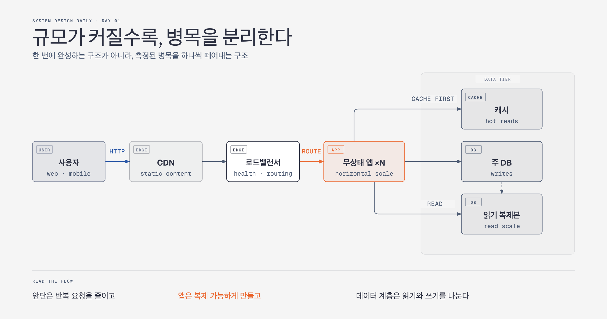

# Day 01. 확장은 서버를 늘리는 일이 아니다

처음부터 CDN, Redis, 메시지 큐, 샤딩을 모두 넣는 설계는 멋져 보일 수 있다. 하지만 좋은 시스템은 부품이 많은 시스템이 아니다. **지금 막힌 곳을 정확히 풀고 다음 병목이 드러날 때까지 기다릴 수 있는 시스템**이다.

사용자가 거의 없을 때는 애플리케이션과 데이터베이스를 한 서버에 둬도 된다. 느려지기 시작하면 먼저 측정한다. 애플리케이션 CPU가 바쁜가, 데이터베이스 쿼리가 느린가, 같은 정적 파일을 멀리 있는 사용자가 반복해서 내려받는가? 원인이 확인되면 그 부분만 분리한다.

## 시스템이 커지는 순서

1. **데이터베이스를 분리한다.** 애플리케이션과 데이터 계층을 독립적으로 키울 수 있다.
2. **애플리케이션을 무상태로 만든다.** 세션을 서버 메모리에 붙잡아 두지 않아야 서버를 여러 대로 늘릴 수 있다.
3. **로드밸런서를 둔다.** 요청을 여러 애플리케이션 서버로 나누고, 고장 난 서버를 우회한다.
4. **반복 조회를 캐시한다.** 데이터베이스까지 가지 않아도 되는 요청을 앞에서 끝낸다.
5. **정적 콘텐츠를 CDN으로 보낸다.** 이미지와 JavaScript를 사용자 가까이에서 전달한다.
6. **읽기 복제본을 둔다.** 읽기가 쓰기보다 훨씬 많을 때 읽기 부하를 분산한다.

## 함정 체크

- 순서는 서비스마다 다르다. 이미지 서비스라면 CDN이 먼저일 수 있다.
- 트래픽이 늘었다는 이유만으로 샤딩부터 꺼내면 안 된다.
- 샤딩은 조인, 재분배, 핫키 같은 새 문제를 데려온다.

## 오늘의 한 문장

> 확장은 “더 큰 구조를 미리 만드는 일”이 아니라, 측정된 병목을 하나씩 분리하는 일이다.

## 30초 확인 문제

읽기 요청이 급증했고 데이터베이스 CPU가 90%다. 같은 상품 정보가 계속 조회된다. 무엇부터 확인하겠는가?

## 정답과 해설

- 느린 쿼리와 인덱스를 먼저 확인한다.
- 쿼리가 정상인데 같은 데이터를 반복해서 읽는 것이 병목이라면 캐시를 붙인다.
- 그래도 읽기 부하가 크면 읽기 복제본을 검토한다.
- 샤딩은 이 단계의 첫 선택이 아니다.

원문: [Chapter 1 — Scale from Zero to Millions of Users](https://github.com/liquidslr/system-design-notes/tree/main/01.%20Scaling)
