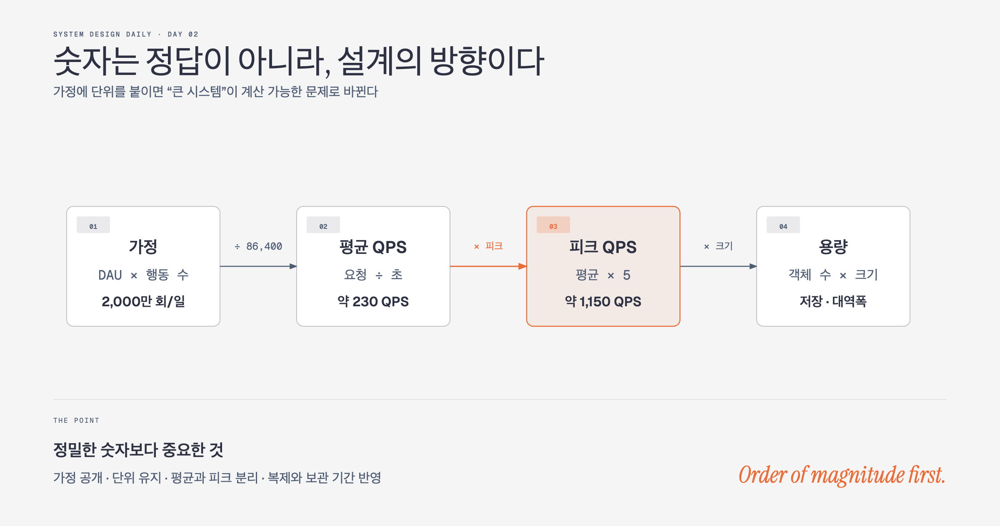

# Day 02. 숫자는 정답이 아니라 설계의 방향이다



## 오늘의 질문

설계 전에 QPS와 저장 용량을 왜 계산해야 할까?

숫자를 맞히기 위해서가 아니다. 어떤 문제를 먼저 풀어야 하는지 결정하기 위해서다. "트래픽이 많다"는 말만으로는 캐시가 필요한지, 저장소를 나눠야 하는지, 서버 한 대로 충분한지 판단할 수 없다. 대략적인 숫자가 나오면 설계의 우선순위가 보인다.

## WHY: 계산이 설계 질문을 바꾼다

하루 요청이 10만 건인 서비스와 초당 요청이 10만 건인 서비스는 같은 API를 제공해도 구조가 달라진다. 계산 없이 구성 요소부터 고르면 익숙한 기술을 늘어놓기 쉽다. 요청량, 객체 크기, 보관 기간을 먼저 계산하면 네트워크와 저장 비용이 커지는 지점이 드러난다.

계산은 용량을 확정하지 않는다. 측정하고 검증할 기준을 만든다. 피크 쓰기가 7,000 QPS라면 곧바로 샤딩을 선택하는 대신 현재 데이터베이스가 그 부하를 감당하는지 시험할 수 있다.

## WHAT: 가정, 단위, 평균과 피크

원문의 소셜 서비스 예시를 계산해보자.

```text
월간 사용자 3억 명
매일 사용하는 비율 50%
한 사람이 하루에 쓰는 글 2개
글 중 미디어가 붙는 비율 10%
미디어 한 개의 평균 크기 1MB
보관 기간 5년
```

하루 활성 사용자는 1억 5천만 명이고 하루 글은 3억 개다.

```text
평균 쓰기 QPS = 3억 / 86,400초 ≈ 3,500
피크 쓰기 QPS = 평균의 2배 ≈ 7,000
```

평균은 평소 비용을 가늠하게 하고 피크는 장애 가능성을 보여준다. 출근 시간, 이벤트 시작, 푸시 발송 직후처럼 요청이 몰리는 서비스라면 피크 배수를 별도로 잡아야 한다.

저장 용량도 같은 가정에서 이어진다.

```text
하루 미디어 저장량 = 3억 x 10% x 1MB = 30TB
5년 원본 저장량 = 30TB x 365 x 5 ≈ 55PB
```

55PB가 보이면 미디어를 일반 데이터베이스에 넣자는 선택을 다시 검토하게 된다. 객체 저장소, 수명 주기 정책, 썸네일 보관 기간, 지역 간 복제 비용이 핵심 질문으로 올라온다.

## HOW: 설계 선택을 바꾸는 숫자부터 구한다

모든 수치를 한꺼번에 계산할 필요는 없다.

1. 핵심 행동을 정한다. 읽기, 쓰기, 업로드처럼 비용을 만드는 행동을 고른다.
2. 사용자 수와 행동 횟수를 곱해 하루 요청량을 구한다.
3. 초 단위로 나누고 피크 배수를 적용한다.
4. 객체 크기와 보관 기간을 곱해 저장량과 대역폭을 구한다.
5. 결과를 기술 선택으로 번역한다. 캐시, 객체 저장소, 파티션, 비동기 처리 중 무엇을 검증할지 정한다.

정밀도보다 자릿수가 중요하다. `86,400`을 `100,000`으로 반올림해도 기술 선택이 같다면 빠르게 진행하는 편이 낫다. 다만 MB와 Mb, 초와 일을 섞으면 결과가 크게 어긋나므로 단위는 끝까지 적어야 한다.

실무에서는 복제본, 인덱스, 백업, 메타데이터, 여유 용량을 원본 크기에 더한다. 이미지 원본이 100TB라고 해서 디스크 100TB면 충분한 것이 아니다. 복제 계수 3, 인덱스, 장애 중 재복제할 여유까지 잡으면 필요한 물리 용량은 몇 배가 된다.

## 트레이드오프와 실패 모드

빠른 추정은 의사결정을 돕지만 가정을 숨기면 거짓 정밀도가 된다. 피크 배수 2가 실제로는 20이라면 평균 QPS에 맞춘 시스템은 이벤트 시작과 함께 무너진다. 압축률, 캐시 적중률, 데이터 보관 기간도 실제 관측값에 따라 바뀐다.

숫자가 크다는 이유만으로 복잡한 분산 시스템부터 넣는 것도 실패다. 7,000 QPS를 단일 데이터베이스가 처리할 수도 있고, 비효율적인 쿼리 하나 때문에 700 QPS에서 막힐 수도 있다. 계산 뒤에는 부하 테스트와 운영 지표가 와야 한다.

## 함정 체크

- 평균 QPS만 계산하면 순간 트래픽을 놓친다.
- 원본 데이터만 세면 복제본, 인덱스, 백업 비용을 과소평가한다.
- 계산 결과를 확정 요구사항처럼 다루면 안 된다. 가정은 실제 지표가 생기면 갱신한다.
- 큰 숫자를 본 즉시 샤딩을 선택하지 않는다. 현재 구성의 한계를 먼저 측정한다.
- 가용성 99.9%와 99.99%의 차이는 작아 보여도 허용 장애 시간과 비용은 크게 달라진다.

## 오늘의 한 문장

> 대략적인 계산은 정답을 맞히는 시험이 아니라, 어디를 깊게 설계할지 정하는 나침반이다.

## 30초 확인 문제

평균 쓰기 QPS가 500이고 점심시간 피크가 평균의 8배라면 첫 용량 목표는 최소 몇 QPS여야 할까? 이 숫자만으로 샤딩을 결정해도 될까?

## 정답과 해설

최소 4,000 QPS다.

```text
500 x 8 = 4,000 QPS
```

실제 목표에는 장애 여유와 성장분도 더한다. 다만 4,000이라는 숫자만으로 샤딩을 결정하면 안 된다. 현재 애플리케이션과 데이터베이스가 4,000 QPS를 처리하는지 부하 테스트로 확인하고, 부족하다면 느린 쿼리, 인덱스, 캐시, 읽기 복제본처럼 단순한 수단부터 검토한다.

원문: [Chapter 2, Back-of-the-Envelope Estimation](https://github.com/liquidslr/system-design-notes/tree/main/02.%20Back%20Of%20the%20Envelope%20Estimation)
