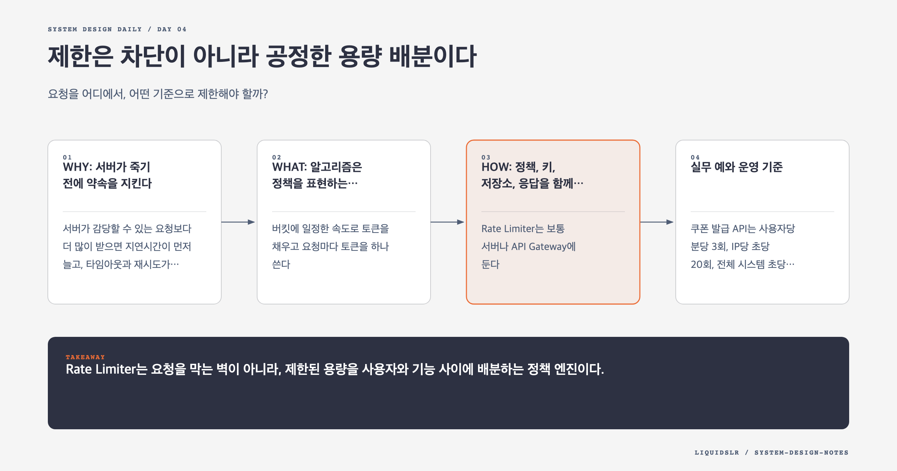

# Day 04. 제한은 차단이 아니라 공정한 용량 배분이다



## 오늘의 질문

요청을 어디에서, 어떤 기준으로 제한해야 할까?

Rate Limiter는 나쁜 사용자를 막는 장치만이 아니다. 한 사용자의 폭주가 다른 사용자의 요청까지 밀어내지 않도록 한정된 처리 용량을 나누는 장치다. 로그인 시도, 게시물 작성, 외부 API 호출, 쿠폰 발급처럼 비용이나 피해가 큰 동작에서 특히 필요하다.

## WHY: 서버가 죽기 전에 약속을 지킨다

서버가 감당할 수 있는 요청보다 더 많이 받으면 지연시간이 먼저 늘고, 타임아웃과 재시도가 겹치면서 부하가 더 커진다. Rate Limiter는 과부하가 내부로 번지기 전에 요청을 거절한다. 유료 API 비용을 통제하고, 무차별 대입과 크롤링을 줄이며, 사용자별 공정성도 지킨다.

중요한 질문은 "초당 몇 건을 막을까"가 아니다. 누구를 하나의 주체로 볼지, 어떤 API를 묶을지, 순간 폭주를 얼마나 허용할지 결정해야 한다.

## WHAT: 알고리즘은 정책을 표현하는 수단이다

### Token Bucket

버킷에 일정한 속도로 토큰을 채우고 요청마다 토큰을 하나 쓴다. 버킷에 토큰이 남아 있으면 짧은 폭주를 허용한다.

```text
bucket size = 20
refill rate = 10 tokens/second
```

평소 요청이 적었다면 최대 20건을 한꺼번에 처리할 수 있고, 이후에는 초당 10건으로 제한된다. 평균 속도를 제한하면서 짧은 버스트를 허용할 때 잘 맞는다.

### Leaky Bucket

요청을 큐에 넣고 일정한 속도로 꺼낸다. 출력 속도가 안정적이지만 큐가 차면 새 요청을 버리거나 오래 기다리게 된다. 하류 시스템에 일정한 유입량을 보장해야 할 때 적합하다.

### Fixed Window Counter

1분 단위 같은 고정 구간마다 횟수를 센다. 단순하고 메모리를 적게 쓰지만 경계 문제가 있다. 12시 00분 59초에 100건, 12시 01분 00초에 100건이 통과하면 실제 2초 동안 200건이 처리된다.

### Sliding Window

최근 1분처럼 움직이는 구간을 본다. 모든 요청 시각을 기록하는 로그 방식은 정확하지만 메모리를 많이 쓴다. 이전 구간과 현재 구간의 카운터를 가중합하는 방식은 가볍지만 근사치다.

## HOW: 정책, 키, 저장소, 응답을 함께 설계한다

Rate Limiter는 보통 서버나 API Gateway에 둔다. 클라이언트 제한은 쉽게 우회할 수 있으므로 보호 장치가 될 수 없다. 여러 서버가 같은 제한을 공유해야 한다면 Redis 같은 중앙 인메모리 저장소에서 카운터를 원자적으로 갱신한다.

```text
key = user:42:POST:/orders
limit = 5 requests/minute
```

요청 흐름은 다음과 같다.

1. 인증 정보, IP, API 경로로 제한 키를 만든다.
2. 해당 키의 정책을 조회한다.
3. 카운터 또는 토큰을 원자적으로 갱신한다.
4. 허용하면 하류 서비스로 보내고, 거절하면 `429 Too Many Requests`를 반환한다.
5. `Retry-After`와 남은 한도를 알려 클라이언트가 재시도 시점을 조절하게 한다.

Redis에서 값을 읽고 애플리케이션에서 계산한 뒤 다시 쓰면 경쟁 조건이 생긴다. 두 서버가 같은 남은 토큰을 보고 둘 다 허용할 수 있다. Lua script나 원자 명령으로 확인과 차감을 한 번에 처리해야 한다.

## 실무 예와 운영 기준

쿠폰 발급 API는 사용자당 분당 3회, IP당 초당 20회, 전체 시스템 초당 5,000회처럼 여러 층의 제한이 필요할 수 있다. 사용자 제한은 오용을 막고, IP 제한은 익명 공격을 줄이며, 전체 제한은 데이터베이스를 보호한다.

모니터링에서는 거절률만 보지 않는다. 정책별 허용과 거절 수, Redis 지연시간, 제한 저장소 오류, 하류 서비스의 포화도를 함께 본다. 거절률이 갑자기 늘면 공격일 수도 있지만 정상 이벤트의 트래픽을 잘못 막은 것일 수도 있다.

## 트레이드오프와 실패 모드

중앙 저장소는 정확도를 높이지만 지연과 단일 장애 지점을 만든다. 지역별 카운터를 두면 빠르고 가용성이 높아지지만 전역 한도를 조금 넘길 수 있다. 결제나 보안 제한은 정확성을 우선하고, 읽기 API 보호는 근사 제한을 허용할 수 있다.

제한 저장소가 장애 났을 때도 정책이 필요하다. 로그인 방어처럼 보안이 핵심이면 닫힌 상태로 실패해 요청을 막을 수 있다. 상품 조회처럼 가용성이 중요하면 열린 상태로 실패해 요청을 통과시키되 하류 보호 장치를 별도로 둔다.

## 함정 체크

- 클라이언트 구현만 믿지 않는다. 제한은 신뢰할 수 있는 서버 경계에서 집행한다.
- 가벼운 조회와 비싼 연산에 같은 한도를 적용하지 않는다.
- Fixed Window의 경계 폭주를 무시하지 않는다.
- 분산 카운터의 읽기와 쓰기를 따로 처리하지 않는다. 원자성이 필요하다.
- `429`만 반환하고 재시도 정보를 생략하지 않는다.
- 저장소 장애 시 fail-open과 fail-closed 중 어느 쪽을 택할지 미리 정한다.

## 오늘의 한 문장

> Rate Limiter는 요청을 막는 벽이 아니라, 제한된 용량을 사용자와 기능 사이에 배분하는 정책 엔진이다.

## 30초 확인 문제

분당 100건을 허용하는 Fixed Window에서 한 사용자가 12시 00분 59초에 100건, 12시 01분 00초에 100건을 보냈다. 왜 200건이 통과할 수 있고, 어떤 방식으로 줄일 수 있을까?

## 정답과 해설

두 요청 묶음이 서로 다른 1분 구간의 카운터에 들어가기 때문이다. 각 구간은 100건 이하이지만 실제로는 2초 동안 200건이 통과한다.

Sliding Window Log는 최근 60초의 요청 시각을 직접 세어 정확하게 막는다. 메모리 비용이 부담되면 Sliding Window Counter로 근사할 수 있다. 순간 폭주를 일부 허용해도 된다면 Token Bucket의 버킷 크기로 허용 범위를 명시할 수 있다.

원문: [Chapter 4, Design a Rate Limiter](https://github.com/liquidslr/system-design-notes/tree/main/04.%20Rate%20Limiter)
