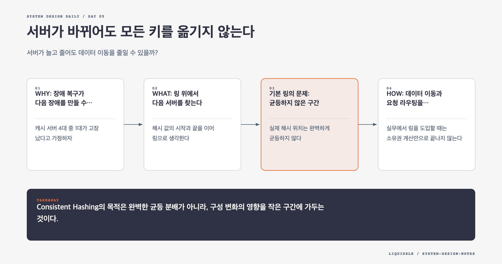

# Day 05. 서버가 바뀌어도 모든 키를 옮기지 않는다



## 오늘의 질문

서버가 늘고 줄어도 데이터 이동을 줄일 수 있을까?

키를 서버에 나누는 가장 단순한 식은 `hash(key) % N`이다. 서버 수 `N`이 고정돼 있다면 잘 동작한다. 하지만 서버 한 대가 추가되거나 빠지는 순간 대부분의 키가 다른 서버를 가리킨다. 캐시라면 대량 Miss가 발생하고, 저장소라면 큰 재배치가 시작된다.

## WHY: 장애 복구가 다음 장애를 만들 수 있다

캐시 서버 4대 중 1대가 고장 났다고 가정하자. 나머지 3대로 `hash(key) % 3`을 다시 계산하면 고장 난 서버의 키만 이동하지 않는다. 기존 키 대부분의 나머지가 바뀐다. 캐시 Miss가 데이터베이스로 몰리고, 복구를 위해 서버를 추가했는데 원본 저장소까지 과부하에 빠질 수 있다.

Consistent Hashing은 서버 수를 식의 나눗값으로 쓰지 않는다. 키와 서버를 같은 해시 공간에 배치해 변화가 생긴 주변 구간만 옮긴다.

## WHAT: 링 위에서 다음 서버를 찾는다

해시 값의 시작과 끝을 이어 링으로 생각한다. 서버와 키를 같은 해시 함수로 링에 올린다. 키는 시계 방향으로 이동해 처음 만나는 서버에 속한다.

```text
hash(key) -> ring position
owner(key) -> first server clockwise from key
```

서버를 추가하면 새 서버와 그 이전 서버 사이의 키만 새 서버로 이동한다. 서버를 제거하면 그 서버가 맡던 구간만 다음 서버로 넘어간다. 전체 키를 다시 나누는 대신 대략 `1/N` 정도만 재배치한다.

## 기본 링의 문제: 균등하지 않은 구간

실제 해시 위치는 완벽하게 균등하지 않다. 서버 세 대가 링의 한쪽에 몰리면 어떤 서버는 작은 구간만 맡고 다른 서버는 큰 구간을 맡는다. 키 자체도 특정 패턴에 몰릴 수 있다. 링을 썼다는 이유만으로 부하가 자동으로 균등해지는 것은 아니다.

Virtual Node는 물리 서버 하나를 링의 여러 위치에 배치한다.

```text
server A -> A-1, A-2, A-3, ...
server B -> B-1, B-2, B-3, ...
```

가상 노드가 많을수록 각 서버가 떨어진 여러 구간을 맡아 편차가 줄어든다. 서버 용량이 다르면 큰 서버에 더 많은 가상 노드를 줄 수도 있다.

## HOW: 데이터 이동과 요청 라우팅을 분리한다

실무에서 링을 도입할 때는 소유권 계산만으로 끝나지 않는다.

1. 키와 서버를 해시하는 규칙을 모든 노드가 동일하게 알아야 한다.
2. 서버 목록 변경을 일관되게 배포해야 한다.
3. 새 서버가 받을 구간의 데이터를 백필한다.
4. 백필 중 읽기와 쓰기를 어느 서버가 처리할지 정한다.
5. 이동 속도를 제한해 네트워크와 디스크가 포화되지 않게 한다.
6. 키 수보다 실제 바이트와 요청량을 관측해 핫스팟을 찾는다.

이미지 캐시는 서버 추가 직후 새 노드가 비어 있다. 라우팅만 먼저 바꾸면 새 노드의 모든 요청이 원본 저장소로 향한다. 기존 노드에서 데이터를 복사하거나, 천천히 트래픽을 넘기거나, Miss가 원본에 미치는 영향을 제한해야 한다.

## 트레이드오프와 실패 모드

가상 노드를 늘리면 분포는 좋아지지만 링 메타데이터와 이동 작업이 늘어난다. 복제본까지 고려하면 서로 다른 장애 도메인에 배치해야 하므로 단순히 시계 방향의 다음 노드를 고르는 것만으로 부족할 수 있다.

Consistent Hashing은 핫키를 해결하지 않는다. 유명인의 게시물처럼 하나의 키에 요청이 몰리면 키가 어느 서버에 있든 그 서버가 뜨거워진다. 키 복제, 요청 병합, 지역 캐시 같은 별도 전략이 필요하다.

노드 장애를 너무 빠르게 판정하면 일시적인 네트워크 지연에도 대규모 재배치가 반복된다. 장애 감지와 데이터 이동 사이에 확인 시간과 속도 제한을 둬야 한다.

## 함정 체크

- `hash(key) % N`은 서버 수가 바뀌면 대부분의 키를 다시 매핑한다.
- 기본 해시 링만으로 균등 분배를 보장하지 않는다. Virtual Node가 필요하다.
- 키 개수가 균등해도 키별 크기와 요청량이 다르면 부하는 불균등할 수 있다.
- 핫키 문제를 Consistent Hashing 하나로 해결하려 하지 않는다.
- 서버 추가 직후 데이터와 캐시가 비어 있다는 점을 무시하지 않는다.
- 일시 장애마다 즉시 재배치하면 복구 작업이 시스템을 더 흔들 수 있다.

## 오늘의 한 문장

> Consistent Hashing의 목적은 완벽한 균등 분배가 아니라, 구성 변화의 영향을 작은 구간에 가두는 것이다.

## 30초 확인 문제

캐시 서버가 4대에서 5대로 늘었다. `hash(key) % N`과 Consistent Hashing은 각각 어떤 키를 이동시키며, 새 서버를 붙인 직후 무엇을 조심해야 할까?

## 정답과 해설

나머지 연산은 나눗값이 4에서 5로 바뀌므로 대부분의 키가 다른 서버로 간다. Consistent Hashing은 새 서버가 들어온 위치와 이전 서버 사이의 키만 새 서버로 옮긴다.

하지만 새 서버의 캐시는 비어 있다. 트래픽을 한 번에 넘기면 원본 저장소로 Miss가 몰릴 수 있다. 데이터 백필, 점진적 트래픽 전환, 원본 요청 제한으로 워밍업 구간을 보호해야 한다.

원문: [Chapter 5, Design Consistent Hashing](https://github.com/liquidslr/system-design-notes/tree/main/05.%20Consistent%20Hashing)
