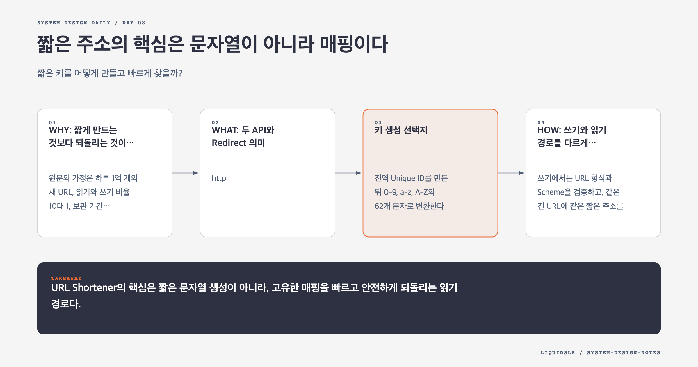

# Day 08. 짧은 주소의 핵심은 문자열이 아니라 매핑이다



## 오늘의 질문

짧은 키를 어떻게 만들고 빠르게 찾을까?

URL Shortener는 긴 URL을 짧게 보이는 서비스처럼 보인다. 실제 핵심은 짧은 키를 고유하게 만들고, 읽기 트래픽이 쓰기보다 훨씬 많은 환경에서 원래 URL을 빠르게 찾는 것이다. Redirect 방식과 만료, 악용 방지까지 정해야 서비스가 된다.

## WHY: 짧게 만드는 것보다 되돌리는 것이 어렵다

원문의 가정은 하루 1억 개의 새 URL, 읽기와 쓰기 비율 10대 1, 보관 기간 10년이다. 약 3,650억 개의 매핑을 저장해야 한다. 이 정도면 애플리케이션 서버보다 키 공간, 데이터 파티션, 캐시 적중률이 먼저 설계를 좌우한다.

```text
write = 100,000,000 URLs/day
read = write x 10
retention = 10 years
records ≈ 365 billion
```

짧은 키가 충돌하면 한 사용자가 전혀 다른 URL로 이동한다. 조회가 느리면 모든 링크 클릭이 느려진다. 두 실패 모두 사용자에게 바로 드러난다.

## WHAT: 두 API와 Redirect 의미

```http
POST /api/v1/urls
Content-Type: application/json

{"longUrl": "https://example.com/a/very/long/path"}
```

응답은 짧은 URL과 만료 시각을 담는다. 조회 API는 매핑을 찾은 뒤 `Location` Header로 Redirect한다.

`301 Moved Permanently`는 브라우저와 중간 캐시가 결과를 오래 저장할 수 있어 서버 부하를 줄인다. 반면 클릭 분석과 목적지 변경이 어렵다. `302 Found`는 요청이 서비스에 계속 들어와 분석하기 쉽지만 비용이 늘어난다.

## 키 생성 선택지

### Unique ID와 Base62

전역 Unique ID를 만든 뒤 `0-9`, `a-z`, `A-Z`의 62개 문자로 변환한다. 7글자면 `62^7`, 약 3.5조 개 조합을 표현한다.

```text
unique id -> Base62 -> short key
2009215674938 -> zn9edcu
```

충돌이 없고 다음 키를 만들기 쉽다. 대신 Unique ID Generator가 필요하고 연속 ID를 그대로 쓰면 외부에서 생성량을 추정하거나 URL을 순회하기 쉽다.

### Hash와 충돌 해결

긴 URL을 Hash한 뒤 앞 7글자를 사용한다. 중앙 ID Generator는 필요 없지만 충돌을 검사해야 한다. 충돌할 때 Salt를 바꿔 다시 Hash하거나 다른 후보를 만들어야 한다. 키 존재 확인이 쓰기 경로의 추가 비용이 된다.

## HOW: 쓰기와 읽기 경로를 다르게 최적화한다

쓰기에서는 URL 형식과 Scheme을 검증하고, 같은 긴 URL에 같은 짧은 주소를 줄지 정한다. Unique ID 또는 Hash로 키를 만들고 충돌을 확인한 뒤 `<shortKey, longUrl, owner, expiresAt>`을 저장한다.

읽기는 캐시를 먼저 본다. Miss면 데이터베이스에서 조회하고 만료와 차단 상태를 확인한다. 매핑을 캐시에 넣고 Redirect한다. 클릭 이벤트는 응답 경로를 막지 않도록 Queue로 보낸다.

조회가 쓰기보다 10배 많고 인기 링크에 트래픽이 몰리므로 캐시 효과가 크다. 애플리케이션 계층은 무상태로 늘리고, 데이터베이스는 짧은 키 기준으로 파티션할 수 있다.

## 실무 예와 트레이드오프

마케팅 링크는 클릭 분석과 목적지 변경이 중요하므로 `302`가 맞을 수 있다. 변하지 않는 공개 문서 링크는 `301`로 엣지 캐시를 활용할 수 있다. 사용자 지정 Alias는 기억하기 쉽지만 예약어, 사칭, 상표권, 선점 문제를 만든다.

같은 긴 URL을 항상 같은 키로 만들면 저장 공간을 줄일 수 있지만 사용자별 만료와 분석을 분리하기 어렵다. 사용자마다 새 키를 주면 제어는 쉬워지지만 레코드 수가 늘어난다.

## 실패 모드

악성 사용자가 피싱 URL을 대량 생성하면 짧은 도메인의 평판이 망가질 수 있다. 생성 API에 Rate Limiter, 도메인 차단, 신고와 비활성화 흐름이 필요하다.

인기 링크의 캐시가 만료되는 순간 많은 요청이 동시에 데이터베이스로 갈 수 있다. 요청 병합, 만료 시각 분산, 오래된 값의 짧은 재사용으로 원본을 보호한다.

분석 이벤트를 Redirect 트랜잭션에 함께 저장하면 분석 저장소 장애가 링크 이동까지 막는다. 사용자 Redirect와 분석 수집의 실패 범위를 분리해야 한다.

## 함정 체크

- Hash 앞부분을 자르면 충돌이 사라진다고 생각하지 않는다.
- `301`과 `302`를 성능 차이만으로 고르지 않는다. 분석과 목적지 변경 요구를 확인한다.
- 연속 Base62 키가 추측 가능하다는 점을 무시하지 않는다.
- 클릭 분석 쓰기가 Redirect 지연시간을 막지 않게 한다.
- 만료, 삭제, 악성 URL 차단 후 캐시 무효화를 설계한다.
- 긴 URL의 Scheme과 Redirect 대상 검증 없이 저장하지 않는다.

## 오늘의 한 문장

> URL Shortener의 핵심은 짧은 문자열 생성이 아니라, 고유한 매핑을 빠르고 안전하게 되돌리는 읽기 경로다.

## 30초 확인 문제

클릭 분석이 중요한 광고 링크에 `301`을 사용하면 어떤 문제가 생길 수 있고, 무엇을 선택하는 편이 나을까?

## 정답과 해설

브라우저나 중간 캐시가 `301` 응답을 저장하면 이후 클릭이 URL Shortener 서버에 도달하지 않을 수 있다. 클릭 수집이 누락되고 목적지를 바꿔도 사용자가 오래된 Redirect를 따를 수 있다.

분석과 목적지 변경이 중요하면 `302`를 사용해 요청이 서비스에 도달하게 하는 편이 낫다. 대신 읽기 부하가 늘므로 캐시와 무상태 서버 확장으로 처리한다.

원문: [Chapter 8, Design a URL Shortener](https://github.com/liquidslr/system-design-notes/tree/main/08.%20URL%20Shortener)
