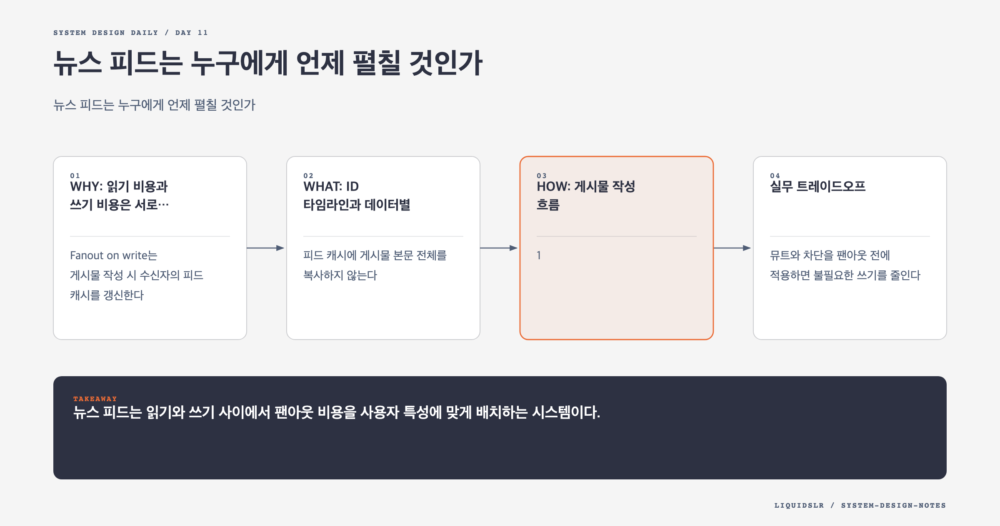

# Day 11. 뉴스 피드는 누구에게 언제 펼칠 것인가



뉴스 피드의 어려움은 게시물을 저장하는 데 있지 않다. 한 번 쓴 게시물을 누구의 피드에, 어느 시점에, 얼마의 비용으로 넣을지 결정하는 데 있다.

사용자가 피드를 열 때 친구 목록을 조회하고 친구마다 최신 글을 읽어 합치면 구현은 단순하다. 하지만 친구가 수천 명이면 조회 한 번이 수천 개 읽기로 번진다. 반대로 글을 쓸 때 모든 친구의 피드에 미리 넣으면 조회는 빨라지지만, 팔로워가 많은 작성자 한 명이 거대한 쓰기 폭풍을 만든다.

## WHY: 읽기 비용과 쓰기 비용은 서로 이동한다

**Fanout on write**는 게시물 작성 시 수신자의 피드 캐시를 갱신한다. 대부분의 사용자는 팔로워가 많지 않으므로 이 방식으로 빠른 조회를 제공할 수 있다. 그러나 비활성 사용자에게도 쓰기가 발생하고 유명 계정에는 맞지 않는다.

**Fanout on read**는 피드 조회 시 작성자들의 최신 글을 모은다. 실제 독자에게만 비용을 쓰지만 팔로우 수가 많을수록 지연이 커진다.

실무 설계는 둘을 섞는다. 보통 계정은 쓰기 팬아웃하고, 팔로워가 매우 많은 계정은 읽기 시점에 합친다. 피드 서비스는 미리 만든 피드와 유명 계정의 게시물을 병렬 조회해 하나의 결과로 정렬한다.

## WHAT: ID 타임라인과 데이터별 캐시

피드 캐시에 게시물 본문 전체를 복사하지 않는다. `(post_id, author_id)` 같은 참조만 저장한다. 그래야 본문 수정, 삭제, 공개 범위 변경을 한 곳에서 처리할 수 있다.

```text
News Feed Cache -> post ID 목록
Content Cache -> 게시물 본문
Social Graph Cache -> 친구와 팔로우 관계
Action Cache -> 좋아요와 공유 상태
Counter Cache -> 좋아요 수와 댓글 수
```

데이터 성격별로 캐시를 나누면 게시물 본문이 바뀌었다고 피드 목록 전체를 다시 만들 필요가 없다. 최근 몇 페이지의 ID만 메모리에 두고 오래된 페이지는 영속 저장소에서 읽으면 비활성 사용자의 캐시 비용도 제한할 수 있다.

## HOW: 게시물 작성 흐름

1. Web Server가 인증과 rate limit을 확인한다.
2. Post Service가 게시물 본문을 DB와 Content Cache에 저장한다.
3. Fanout Service가 Social Graph에서 수신자 목록을 읽는다.
4. 뮤트, 차단, 공개 범위를 적용한다.
5. Queue에 `(receiver_id, post_id)` 작업을 넣는다.
6. Worker가 각 수신자의 News Feed Cache를 갱신한다.
7. 필요하면 Notification Service에 별도 이벤트를 보낸다.

큐는 작성 요청과 대량 팬아웃을 분리하고 순간 트래픽을 흡수한다. 하지만 큐 적체가 길어지면 피드 최신성이 떨어진다. 큐 대기 시간, 처리량, 실패율을 함께 봐야 한다.

Worker 재시도는 같은 게시물을 두 번 넣을 수 있다. `(receiver_id, post_id)`를 멱등 키로 사용하고 캐시 갱신을 중복 안전하게 만든다. 피드에 중복이 보이지 않는지만 확인하지 말고 큐 재처리 횟수도 측정한다.

## 실무 트레이드오프

뮤트와 차단을 팬아웃 전에 적용하면 불필요한 쓰기를 줄인다. 다만 권한이 나중에 바뀌거나 캐시가 오래되면 이미 들어간 ID가 남을 수 있다. 조회 시점에도 최소한의 권한 검사를 둬야 한다.

시간순 피드는 구현이 쉽지만 제품이 랭킹 피드로 바뀌면 작성 시점 외에 품질 점수, 관계 점수, 최신성이 필요하다. 캐시에 정렬 결과를 완전히 고정하지 말고 게시물 ID와 점수 메타데이터를 재정렬할 수 있게 설계한다.

## 실패 모드

- 유명 계정을 쓰기 팬아웃하면 큐가 한 작성자의 이벤트로 잠긴다.
- 본문을 피드마다 복사하면 삭제와 권한 변경이 여러 사본에 퍼진다.
- 캐시를 무제한으로 유지하면 거의 읽지 않는 사용자가 메모리를 차지한다.
- 큐 재시도를 고려하지 않으면 피드 중복이 생긴다.

## 오늘의 한 문장

> 뉴스 피드는 읽기와 쓰기 사이에서 팬아웃 비용을 사용자 특성에 맞게 배치하는 시스템이다.

## 30초 확인 문제

팔로워 1천만 명인 계정의 글 때문에 팬아웃 큐가 밀렸다. 일반 사용자의 피드 조회 성능을 유지하면서 쓰기 폭발을 줄이려면 어떻게 해야 하는가?

## 정답과 해설

해당 계정을 읽기 팬아웃 대상으로 분리한다. 일반 계정 게시물은 기존처럼 수신자 피드에 미리 넣고, 유명 계정 게시물은 피드를 읽을 때 캐시에서 가져와 병합한다. 조회 비용이 늘기 때문에 유명 계정 게시물을 별도 캐시하고 병렬 조회한다.

원문: [Chapter 11: Design a News Feed System](https://github.com/liquidslr/system-design-notes/tree/main/11.%20News%20Feed%20System)
