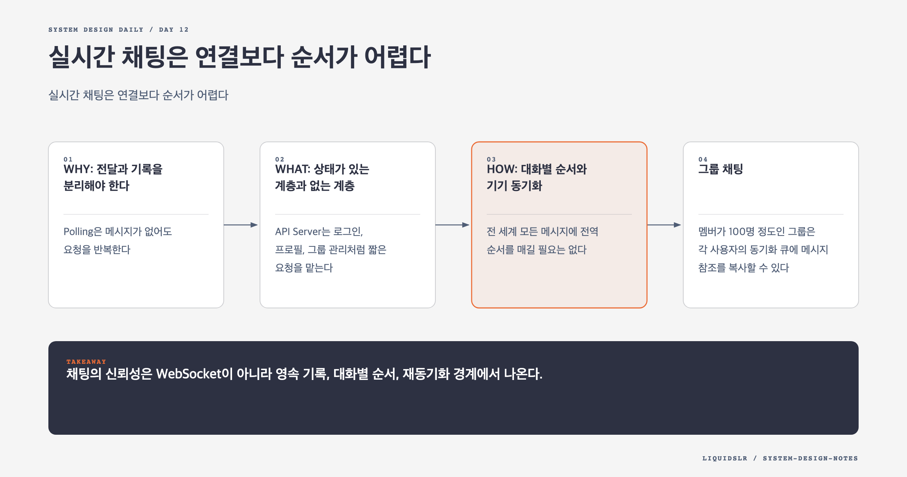

# Day 12. 실시간 채팅은 연결보다 순서가 어렵다



WebSocket을 연결했다고 채팅 시스템이 완성되지는 않는다. 연결은 실시간 전달 통로일 뿐이다. 서버가 재시작되고 기기가 오프라인이 되어도 메시지는 남아야 하며, 여러 기기가 같은 대화의 순서를 다시 맞출 수 있어야 한다.

## WHY: 전달과 기록을 분리해야 한다

Polling은 메시지가 없어도 요청을 반복한다. Long polling은 요청 수를 줄이지만 비활성 사용자의 열린 연결을 오래 유지한다. WebSocket은 양방향 지속 연결로 실시간 채팅에 잘 맞는다.

문제는 WebSocket 연결이 일시적이라는 점이다. 모바일 네트워크 전환, 앱 절전, Chat Server 장애로 언제든 끊어진다. 메시지의 기준은 연결 메모리가 아니라 영속 저장소여야 한다.

## WHAT: 상태가 있는 계층과 없는 계층

API Server는 로그인, 프로필, 그룹 관리처럼 짧은 요청을 맡는다. 수평 확장이 쉬운 무상태 계층이다.

Chat Server는 사용자와 WebSocket 연결을 유지한다. 어떤 사용자가 어느 서버에 연결됐는지 Service Discovery가 추적한다. 새 연결은 지역과 서버 용량을 기준으로 배정한다.

Key-Value Store는 메시지 기록을 영구 보관한다. 대화별 범위 조회와 높은 쓰기 처리량이 중요하므로 다음과 같은 키가 적합하다.

```text
(channel_id, message_id) -> sender_id, body, created_at
```

Presence Service는 heartbeat에서 온라인 상태를 계산한다. Notification Service는 오프라인 사용자에게 새 메시지가 있음을 알린다. 푸시 알림은 전달 보장이 아니라 복귀를 유도하는 신호다.

## HOW: 대화별 순서와 기기 동기화

전 세계 모든 메시지에 전역 순서를 매길 필요는 없다. 서로 다른 채널의 선후 관계는 사용자에게 의미가 없다. 각 일대일 대화나 그룹 채널 안에서만 증가하는 ID면 충분하다.

메시지를 보낼 때 서버는 먼저 ID를 발급하고 저장소에 기록한다. 그다음 수신자의 Chat Server로 전달한다. 저장 전에 전달하면 수신 화면에는 나타났지만 기록에는 없는 메시지가 생길 수 있다.

각 기기는 대화별 `cur_max_message_id`를 유지한다. 재연결할 때 이 값보다 큰 메시지를 요청한다. 실시간 전달과 과거 동기화가 겹치면 중복이 생길 수 있으므로 기기는 `message_id`로 병합한다.

## 그룹 채팅

멤버가 100명 정도인 그룹은 각 사용자의 동기화 큐에 메시지 참조를 복사할 수 있다. 읽기가 단순하고 각 사용자가 여러 채널의 메시지를 한 큐에서 받을 수 있다.

대형 공개 채널에 같은 모델을 적용하면 한 메시지가 수백만 쓰기로 번진다. 소규모 그룹과 대형 방송 채널은 요구가 다르므로 별도 전달 모델을 두는 편이 낫다.

## Presence와 서버 종료

heartbeat 한 번이 늦었다고 즉시 오프라인 처리하면 상태가 계속 깜빡인다. 마지막 heartbeat 이후 유예 시간을 둔다. Presence는 몇 초의 지연을 허용하고 가용성을 우선한다.

Chat Server를 내릴 때는 Load Balancer에서 먼저 `draining`으로 바꾼다. 새 연결을 받지 않고 기존 연결이 빠져나가거나 재연결할 시간을 준 뒤 종료한다. 즉시 종료하면 수많은 사용자가 동시에 재연결해 다른 서버까지 압박한다.

## 실패 모드

- 연결 메모리만 믿으면 장기 오프라인 메시지를 복구할 수 없다.
- 저장 전에 전달하면 장애 시 보였던 메시지가 기록에서 사라질 수 있다.
- 재시도와 동기화 중복을 제거하지 않으면 같은 메시지가 여러 번 보인다.
- heartbeat 누락을 즉시 오프라인으로 바꾸면 모바일 환경에서 상태가 흔들린다.

## 오늘의 한 문장

> 채팅의 신뢰성은 WebSocket이 아니라 영속 기록, 대화별 순서, 재동기화 경계에서 나온다.

## 30초 확인 문제

노트북이 이틀간 오프라인이었다가 다시 연결됐다. 누락된 메시지를 어떻게 찾는가?

## 정답과 해설

노트북이 마지막으로 처리한 채널별 `cur_max_message_id`를 보내고, 서버는 그보다 큰 메시지를 반환한다. 동시에 실시간 전달이 재개될 수 있으므로 클라이언트는 메시지 ID로 중복을 제거한다. Chat Server의 연결 이력만으로는 장기 오프라인을 복구할 수 없다.

원문: [Chapter 12: Design a Chat System](https://github.com/liquidslr/system-design-notes/tree/main/12.%20Chat%20System)
