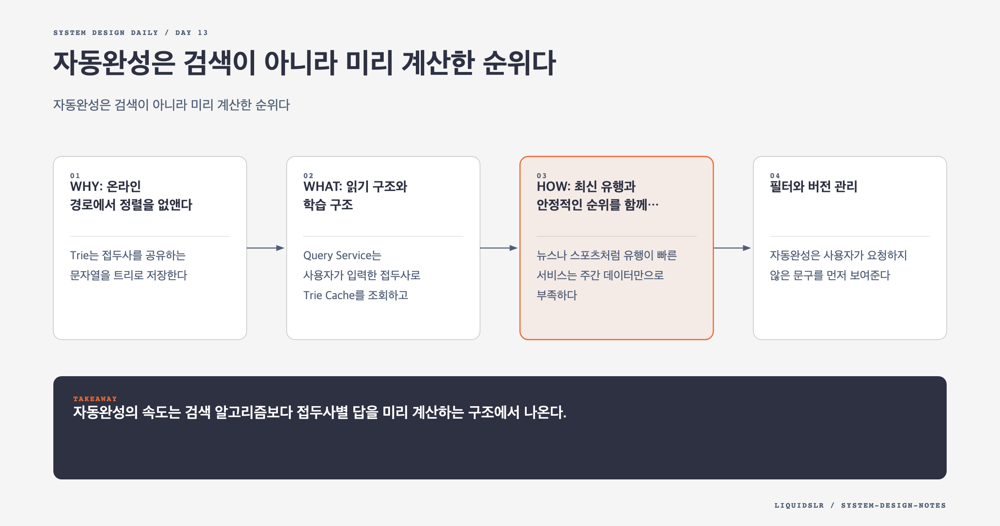

# Day 13. 자동완성은 검색이 아니라 미리 계산한 순위다



자동완성은 키 입력마다 호출된다. 검색 버튼을 누르는 횟수보다 요청이 훨씬 많고, 100ms 안팎의 지연도 입력 흐름을 끊는다. 요청마다 모든 후보를 찾고 정렬하는 구조는 인기 접두사에서 무너진다.

## WHY: 온라인 경로에서 정렬을 없앤다

Trie는 접두사를 공유하는 문자열을 트리로 저장한다. `sy` 노드까지 찾는 것은 빠르지만, 그 아래 모든 문자열을 순회하고 빈도순으로 정렬하면 후보가 많을수록 느려진다.

각 Trie 노드에 상위 K개 검색어를 미리 저장하면 조회는 접두사 길이에 가까운 비용으로 끝난다. 메모리를 더 쓰는 대신 응답 시간을 안정시킨다.

```text
prefix: "sy"
top_k:
  system design, 1240000
  syntax error, 820000
  sync files, 610000
```

## WHAT: 읽기 구조와 학습 구조

Query Service는 사용자가 입력한 접두사로 Trie Cache를 조회하고 상위 5개를 반환한다. 이 경로에는 로그 집계나 전체 정렬이 들어가지 않는다.

Data Gathering Service는 별도 파이프라인에서 검색 이벤트를 모은다.

1. 원시 검색을 append-only 분석 로그에 기록한다.
2. Aggregator가 검색어별 횟수를 계산한다.
3. Worker가 접두사별 Top K를 포함한 새 Trie를 만든다.
4. 스냅샷을 영속 저장소와 분산 캐시에 올린다.
5. Query Service가 새 버전으로 원자적으로 전환한다.

검색 이벤트마다 온라인 Trie를 수정하면 인기 노드에 쓰기 경합이 생기고 순위가 계속 흔들린다. 변화 속도가 느린 서비스는 주간 배치도 충분하다.

## HOW: 최신 유행과 안정적인 순위를 함께 다룬다

뉴스나 스포츠처럼 유행이 빠른 서비스는 주간 데이터만으로 부족하다. 그렇다고 전체 Trie를 실시간으로 다시 만들 필요는 없다.

장기 인기 점수는 정적 Trie에 두고, 최근 몇 분의 급상승 검색어를 작은 실시간 후보 저장소에 둔다. 조회 시 두 후보 집합을 합쳐 최종 점수를 계산한다. 이 구조는 안정적인 기본 결과와 빠른 유행 반영을 함께 제공한다.

## 필터와 버전 관리

자동완성은 사용자가 요청하지 않은 문구를 먼저 보여준다. 유해 문구를 긴급 차단할 필터 계층이 필요하다. 응답 필터로 즉시 숨긴 뒤 다음 스냅샷에서 물리적으로 제거한다.

새 Trie가 잘못 만들어질 수 있으므로 생성 시각, 데이터 구간, 필터 버전을 기록한다. 새 스냅샷을 일부 서버에 먼저 배포하고 빈 결과 비율과 클릭률을 확인한 뒤 전체 전환한다. 문제가 있으면 이전 버전으로 돌아간다.

## 샤딩 트레이드오프

알파벳 `a-m`, `n-z`로 나누면 구현은 쉽지만 검색어 분포는 균등하지 않다. `s` 같은 접두사에 요청이 몰릴 수 있다. 실제 접두사별 QPS와 데이터 크기를 기준으로 범위를 더 잘게 나누고 Shard Map이 요청을 라우팅하게 한다.

언어와 국가별로 별도 Trie를 만들면 검색 품질과 캐시 지역성이 좋아진다. Unicode 지원에서는 문자 수가 늘어나므로 영문자 전제의 배열 기반 노드 구조를 그대로 쓰면 메모리가 낭비된다.

## 실패 모드

- 요청마다 하위 Trie를 전부 순회하면 인기 접두사 지연이 폭증한다.
- 검색마다 Trie를 갱신하면 쓰기 경합과 캐시 무효화가 커진다.
- 균등 문자 범위 샤딩은 실제 트래픽 편향을 숨긴다.
- 버전과 롤백이 없으면 잘못된 추천을 빠르게 되돌릴 수 없다.

## 오늘의 한 문장

> 자동완성의 속도는 검색 알고리즘보다 접두사별 답을 미리 계산하는 구조에서 나온다.

## 30초 확인 문제

갑자기 시작된 결승전 검색어를 5분 안에 노출하려면 주간 Trie를 매 요청마다 수정해야 하는가?

## 정답과 해설

아니다. 짧은 구간의 검색을 집계하는 실시간 후보 저장소를 추가하고, 조회 시 정적 Trie 결과와 병합한다. 전체 구조의 안정성을 유지하면서 유행 반영 시간만 줄일 수 있다.

원문: [Chapter 13: Design a Search Autocomplete System](https://github.com/liquidslr/system-design-notes/tree/main/13.%20Search%20Autocomplete)
