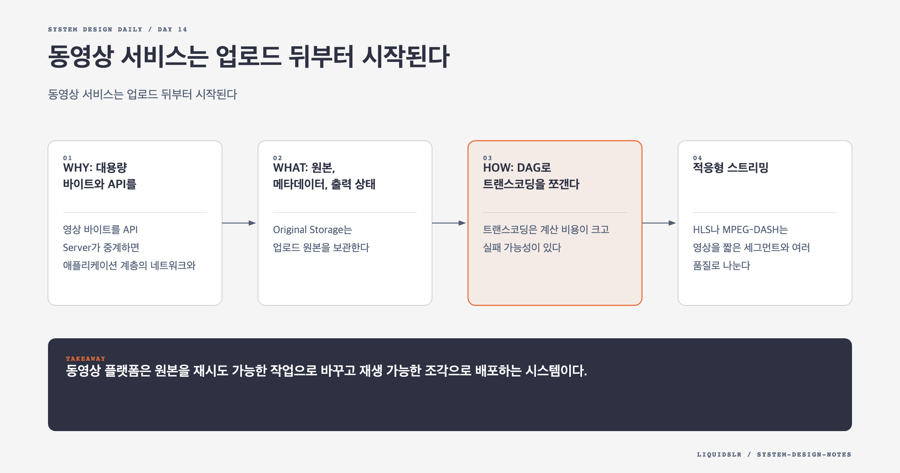

# Day 14. 동영상 서비스는 업로드 뒤부터 시작된다



사용자가 올린 원본 파일은 곧바로 재생할 수 있는 제품이 아니다. 기기마다 지원 코덱이 다르고 화면 크기와 네트워크 속도도 계속 변한다. 동영상 플랫폼은 원본을 안전하게 받은 뒤 여러 재생 형식으로 변환하고, 사용자 가까운 CDN에서 작은 조각으로 제공해야 한다.

## WHY: 대용량 바이트와 API를 분리한다

영상 바이트를 API Server가 중계하면 애플리케이션 계층의 네트워크와 메모리가 먼저 병목이 된다. API는 인증과 메타데이터를 맡고, 파일은 사전 서명 URL로 객체 저장소에 직접 업로드한다.

```text
Client -> API: 업로드 권한 요청
API -> Client: pre-signed URL
Client -> Original Storage: 원본 업로드
Storage Event -> Transcoding Queue
Transcoding -> Output Storage -> CDN
Completion Handler -> Metadata DB
```

재생도 API Server가 아니라 CDN이 담당한다. API는 접근 권한과 manifest URL만 반환한다.

## WHAT: 원본, 메타데이터, 출력 상태

Original Storage는 업로드 원본을 보관한다. Metadata DB는 제목, 소유자, 파일 크기, 처리 상태, 제공 가능한 출력 프로필을 저장한다. Transcoded Storage는 해상도와 코덱별 결과를 보관한다.

상태를 `uploading`, `processing`, `ready`, `failed`로 나누는 것이 중요하다. 업로드가 끝났다고 재생 준비가 끝난 것은 아니다. 필요한 출력물이 CDN에서 확인된 뒤에만 `ready`로 바꾼다.

## HOW: DAG로 트랜스코딩을 쪼갠다

트랜스코딩은 계산 비용이 크고 실패 가능성이 있다. 하나의 긴 작업으로 만들면 마지막 단계 실패도 전체 재실행으로 이어진다.

Preprocessor는 원본을 GOP 경계에 맞춰 조각내고 작업 DAG를 만든다. DAG Scheduler는 선행 관계에 따라 단계를 나눈다. Resource Manager는 대기 작업, 사용 가능한 Worker, 실행 중 작업을 보고 배정한다.

- 해상도와 코덱별 영상 인코딩은 병렬 실행한다.
- 오디오 추출, 썸네일 생성, 워터마크는 각 선행 조건 뒤에 실행한다.
- 중간 산출물을 임시 저장소에 남겨 실패한 단계만 재시도한다.
- 작업 ID와 출력 프로필을 멱등 키로 사용한다.

업로드도 청크로 나누면 중단 지점부터 재개할 수 있다. 각 청크의 체크섬을 검증하고 완료 목록을 저장한다. 마지막 조립과 전체 검증 뒤에 원본 업로드를 완료 처리한다.

## 적응형 스트리밍

HLS나 MPEG-DASH는 영상을 짧은 세그먼트와 여러 품질로 나눈다. 플레이어는 현재 회선과 버퍼 상태에 맞춰 다음 세그먼트 품질을 고른다. 네트워크가 느려지면 낮은 비트레이트로 바꾸고, 회복되면 다시 높인다.

CDN은 인기 세그먼트를 edge에 캐시한다. 모든 영상을 모든 지역에 미리 배포하면 비용이 크다. 인기 영상은 적극적으로 복제하고, 오래된 영상은 origin이나 일부 지역에서 제공한다.

## 비용 트레이드오프

모든 영상에 모든 코덱과 해상도를 생성하면 첫 재생은 빠르지만 연산과 저장 비용이 늘어난다. 조회 가능성이 낮은 영상은 기본 프로필만 먼저 만들고 필요할 때 추가 인코딩할 수 있다.

DRM, 암호화, 워터마크는 콘텐츠 보호 요구에 따라 추가한다. 이 단계들은 DAG의 별도 작업으로 두어 기본 인코딩과 실패 범위를 분리한다.

## 실패 모드

- API Server가 영상 바이트를 중계해 대역폭 병목이 된다.
- 트랜스코딩을 한 작업으로 묶어 일부 실패에도 전체를 다시 처리한다.
- `ready` 상태를 너무 일찍 공개해 재생할 수 없는 링크를 내보낸다.
- 완료 이벤트 중복으로 같은 출력이 여러 번 등록된다.

## 오늘의 한 문장

> 동영상 플랫폼은 원본을 재시도 가능한 작업으로 바꾸고 재생 가능한 조각으로 배포하는 시스템이다.

## 30초 확인 문제

4K 인코딩만 실패했고 1080p와 썸네일은 성공했다. 전체 작업을 다시 해야 하는가?

## 정답과 해설

DAG의 상태와 중간 산출물을 저장했다면 실패한 4K 단계만 재시도한다. 제품 정책에 따라 1080p까지 먼저 공개할 수 있지만, Metadata DB의 제공 가능 품질 목록은 실제 CDN 상태와 일치해야 한다.

원문: [Chapter 14: Design YouTube](https://github.com/liquidslr/system-design-notes/tree/main/14.%20Youtube)
