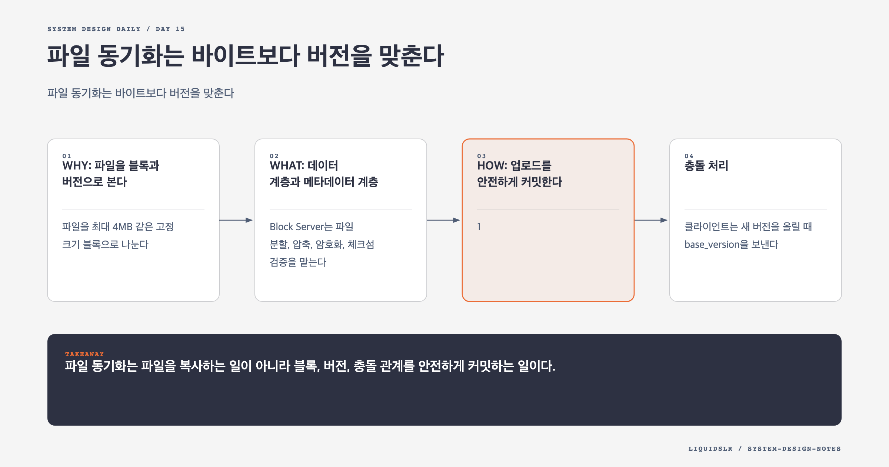

# Day 15. 파일 동기화는 바이트보다 버전을 맞춘다



클라우드 드라이브는 파일을 보관하는 시스템인 동시에 여러 기기의 상태를 맞추는 시스템이다. 10GB 파일에서 4KB가 바뀌었는데 전체를 다시 보내면 대역폭과 시간이 낭비된다. 두 기기가 오프라인에서 같은 파일을 수정했는데 마지막 업로드만 남기면 사용자의 작업이 사라진다.

## WHY: 파일을 블록과 버전으로 본다

파일을 최대 4MB 같은 고정 크기 블록으로 나눈다. 각 블록에 콘텐츠 해시를 붙이고 객체 저장소에 독립적으로 저장한다. 파일 버전은 블록 해시의 순서를 기록한다.

```text
version 42 = [hash_a, hash_b, hash_c]
version 43 = [hash_a, hash_d, hash_c]
```

두 번째 블록만 바뀌면 `hash_d`만 업로드한다. 나머지는 기존 블록을 다시 참조한다. 이 구조로 delta sync, 재개 업로드, 계정 범위 중복 제거를 구현할 수 있다.

## WHAT: 데이터 계층과 메타데이터 계층

Block Server는 파일 분할, 압축, 암호화, 체크섬 검증을 맡는다. 실제 바이트는 S3 같은 객체 저장소에 둔다.

Metadata DB는 사용자, 파일 경로, 소유권, 버전, 블록 순서, 업로드 상태를 관리한다. 자주 읽는 메타데이터는 캐시하지만 정합성의 기준은 DB다.

Notification Service는 파일 추가, 수정, 삭제를 다른 기기에 알린다. 알림 자체에 파일을 넣지 않는다. 변경 버전과 파일 ID를 보내고 클라이언트가 메타데이터와 필요한 블록을 가져오게 한다.

## HOW: 업로드를 안전하게 커밋한다

1. 클라이언트가 업로드 세션과 기준 버전을 선언한다.
2. 서버가 이미 가진 블록 해시를 알려준다.
3. 클라이언트가 누락되거나 바뀐 블록만 올린다.
4. Metadata DB에 새 버전을 `pending`으로 기록한다.
5. 모든 블록의 존재와 체크섬을 확인한다.
6. 파일 버전을 `uploaded`로 원자적으로 전환한다.
7. 변경 이벤트를 발행한다.

메타데이터를 먼저 공개하면 없는 블록을 참조하는 파일이 생긴다. 블록 업로드 뒤 커밋이 실패하면 고아 블록이 남는다. 고아 블록은 즉시 지우지 않고 유예 기간 뒤 참조 수를 확인해 정리한다.

## 충돌 처리

클라이언트는 새 버전을 올릴 때 `base_version`을 보낸다. 서버의 현재 버전과 다르면 같은 기준에서 갈라진 변경이다.

마지막 쓰기 승리로 덮어쓰지 말고 충돌 사본을 보존한다. 텍스트는 자동 병합을 시도할 수 있지만 이미지와 압축 파일은 사용자가 선택하게 해야 한다. 어떤 전략이든 원본 변경을 조용히 잃지 않는 것이 우선이다.

## 오프라인 동기화

온라인 기기는 long polling이나 지속 연결로 변경 알림을 받는다. 오프라인 기기는 복귀할 때 마지막 동기화 커서 이후의 변경 목록을 가져온다. 알림은 빠른 반응을 위한 최적화이고 변경 로그가 복구 기준이다.

다운로드는 먼저 새 메타데이터를 읽고 로컬에 없는 블록만 받는다. 조립과 체크섬 검증이 끝난 뒤 로컬 파일을 교체한다. 중간 실패가 기존 정상 파일을 망가뜨리지 않게 임시 경로를 사용한다.

## 실패 모드

- 파일 전체 업로드로 작은 수정도 큰 네트워크 비용을 만든다.
- 블록 확인 전에 버전을 공개해 깨진 파일을 노출한다.
- 마지막 쓰기 승리로 오프라인 변경을 잃는다.
- 알림을 변경 기록으로 취급해 장기 오프라인 복구를 놓친다.

## 오늘의 한 문장

> 파일 동기화는 파일을 복사하는 일이 아니라 블록, 버전, 충돌 관계를 안전하게 커밋하는 일이다.

## 30초 확인 문제

모든 블록 업로드 뒤 메타데이터 커밋 전에 연결이 끊겼다. 재시도는 어떻게 해야 하는가?

## 정답과 해설

업로드 세션과 블록 해시를 조회해 이미 저장된 블록은 재사용한다. 누락 블록만 올리고 같은 멱등 키로 메타데이터 커밋을 다시 요청한다. 커밋되지 않은 고아 블록은 유예 기간 뒤 참조 여부를 확인해 정리한다.

원문: [Chapter 15: Design Google Drive](https://github.com/liquidslr/system-design-notes/tree/main/15.%20Google%20Drive)
