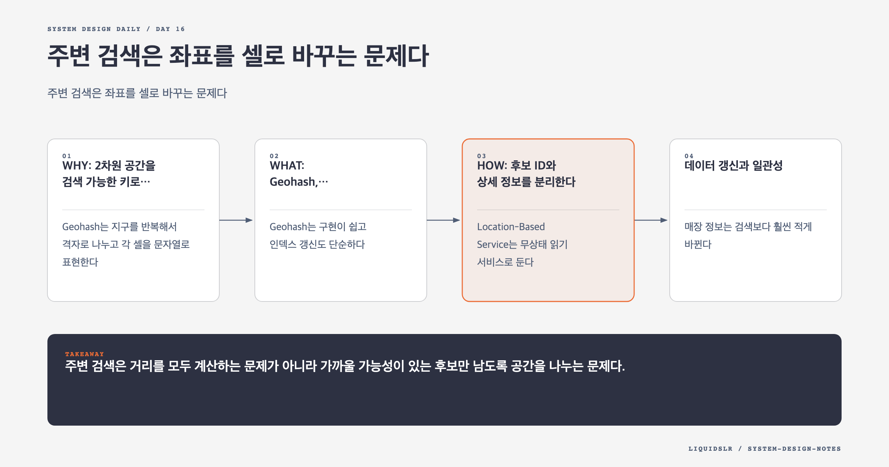

# Day 16. 주변 검색은 좌표를 셀로 바꾸는 문제다



주변 매장 검색은 위도, 경도, 반경을 받아 가까운 장소를 반환한다. 위도와 경도에 각각 인덱스를 걸어 범위 검색을 할 수 있지만, 1차원 인덱스 두 개는 원형 거리 검색을 직접 해결하지 못한다. 도심에서는 넓은 사각형 후보를 읽고 대부분을 버리게 된다.

## WHY: 2차원 공간을 검색 가능한 키로 바꾼다

Geohash는 지구를 반복해서 격자로 나누고 각 셀을 문자열로 표현한다. 접두사가 길수록 셀이 작다. 검색 반경에 맞는 정밀도를 선택하면 전체 매장 대신 현재 셀과 주변 셀의 매장만 후보로 읽을 수 있다.

```text
요청: lat, lng, radius=500m
정밀도 선택: geohash length 6
후보 셀: current + neighbors
후보 ID 조회
실제 거리 계산
반경 안의 결과 정렬
```

마지막 실제 거리 계산은 여전히 필요하다. 셀은 후보를 줄이는 장치이지 원형 반경을 정확히 표현하지 않는다.

## WHAT: Geohash, Quadtree, S2

Geohash는 구현이 쉽고 인덱스 갱신도 단순하다. 하지만 고정 격자라 밀집도에 맞춰 크기를 바꾸지 못하고 경계 문제가 있다. 가까운 두 지점이 다른 접두사를 가질 수 있으므로 이웃 셀을 함께 읽어야 한다.

Quadtree는 한 영역의 매장 수가 기준을 넘으면 네 구역으로 재귀 분할한다. 도심은 작은 셀, 교외는 큰 셀이 된다. 최근접 K개 검색에 유리하지만 트리 생성, 실시간 갱신, 잠금, 캐시 무효화가 복잡하다.

S2는 구면을 셀로 나누고 여러 레벨의 셀을 조합한다. 임의 모양의 geofence를 표현하기 좋지만 구현과 운영 난도가 높다.

## HOW: 후보 ID와 상세 정보를 분리한다

Location-Based Service는 무상태 읽기 서비스로 둔다. 공간 인덱스 캐시에서 후보 `business_id`를 얻고 Business Info Cache에서 상세 정보를 묶어 읽는다. 그다음 정확한 거리를 계산해 반경 밖 후보를 제거한다.

```text
geohash -> [business_id...]
business_id -> name, category, address, rating
```

GPS 좌표를 그대로 캐시 키로 쓰면 사용자가 조금 움직일 때마다 새 키가 생긴다. 좌표 오차도 있어 같은 장소의 요청이 캐시를 공유하지 못한다. Geohash 셀을 키로 쓰면 지역 단위로 결과를 재사용할 수 있다.

## 데이터 갱신과 일관성

매장 정보는 검색보다 훨씬 적게 바뀐다. Primary DB에 변경을 기록하고 Replica, 공간 인덱스, 캐시에 비동기로 반영할 수 있다. 몇 분의 지연을 허용한다면 이 구조가 읽기 처리량을 크게 높인다.

새 매장이 즉시 검색돼야 하거나 폐업 매장을 즉시 숨겨야 한다면 요구가 다르다. 삭제 tombstone을 빠른 경로로 전파하거나 조회 시 상태를 다시 확인해야 한다.

Quadtree를 서버 시작 때 만들면 준비 시간이 길다. 새 인스턴스가 트리를 모두 만든 뒤 health check를 통과하게 하고 점진적으로 트래픽을 넘긴다.

## 관측 지표

반경별 후보 수, Redis 호출 수, 상세 정보 cache hit rate, 거리 필터 탈락률, p95 지연을 본다. Geohash 정밀도가 낮으면 후보가 많고, 너무 높으면 조회 셀 수가 늘어난다. 실제 분포로 기준을 조정한다.

## 실패 모드

- 위도와 경도 범위만 사용해 불필요한 후보를 대량 조회한다.
- 현재 Geohash만 읽어 경계 밖의 가까운 매장을 놓친다.
- GPS 좌표를 캐시 키로 사용해 적중률이 낮아진다.
- 낮은 갱신 빈도에도 실시간 트리 수정을 도입해 운영 복잡도를 키운다.

## 오늘의 한 문장

> 주변 검색은 거리를 모두 계산하는 문제가 아니라 가까울 가능성이 있는 후보만 남도록 공간을 나누는 문제다.

## 30초 확인 문제

셀 경계 건너 20m 떨어진 매장이 검색되지 않는다. Geohash 계산은 정상이다. 무엇을 고쳐야 하는가?

## 정답과 해설

현재 셀뿐 아니라 인접 셀을 함께 조회해야 한다. 후보를 합친 뒤 실제 거리를 계산해 반경 안의 매장만 남긴다. Geohash 접두사는 물리적으로 가까운 두 지점이 같은 셀에 있다는 보장을 하지 않는다.

원문: [Chapter 16: Proximity Service](https://github.com/liquidslr/system-design-notes/tree/main/16.%20Proximity%20Service)
