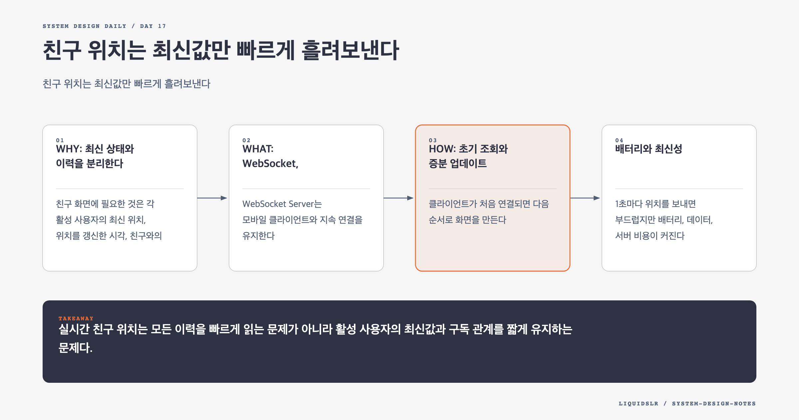

# Day 17. 친구 위치는 최신값만 빠르게 흘려보낸다



주변 친구 기능은 주변 매장 검색과 닮았지만 데이터 수명이 다르다. 매장 위치는 거의 고정이고 친구 위치는 계속 변한다. 1천만 명이 30초마다 갱신하면 초당 약 33만 건이 들어온다. 모든 이력을 실시간 조회 경로에 넣으면 쓰기와 읽기가 서로 방해한다.

## WHY: 최신 상태와 이력을 분리한다

친구 화면에 필요한 것은 각 활성 사용자의 최신 위치, 위치를 갱신한 시각, 친구와의 거리다. 과거 위치는 분석과 모델 학습에 필요하지만 화면을 그릴 때 매번 읽을 필요는 없다.

Redis Location Cache에는 다음 최신값만 둔다.

```text
user_id -> latitude, longitude, timestamp, sequence
```

Location History DB에는 모든 위치 이벤트를 비동기로 쌓는다. 이력 저장이 잠시 느려져도 최신 위치 전달 경로를 막지 않게 큐나 스트림으로 분리한다.

## WHAT: WebSocket, TTL, 사용자 채널

WebSocket Server는 모바일 클라이언트와 지속 연결을 유지한다. 위치 업데이트를 받으면 최신 위치 캐시를 갱신하고, 이력 스트림에 기록하며, 해당 사용자 채널에 이벤트를 발행한다.

친구가 연결된 WebSocket Server는 채널을 구독한다. 이벤트를 받으면 담당 사용자와의 거리를 계산하고 설정된 반경 안일 때만 전달한다.

Location Cache 항목에는 TTL을 둔다. 예를 들어 10분 동안 새 위치가 없으면 비활성 사용자로 보고 제거한다. 연결 종료 이벤트만 믿으면 앱 강제 종료와 네트워크 단절을 놓칠 수 있다.

## HOW: 초기 조회와 증분 업데이트

클라이언트가 처음 연결되면 다음 순서로 화면을 만든다.

1. Friend Service에서 현재 친구 목록과 공유 권한을 읽는다.
2. 활성 친구 채널을 구독한다.
3. Location Cache에서 친구들의 최신 위치를 묶어서 읽는다.
4. 반경 안의 친구와 timestamp를 클라이언트에 보낸다.
5. 이후 Pub/Sub 이벤트로 변경분만 전달한다.

초기 조회와 실시간 이벤트가 겹칠 수 있다. 이벤트의 `sequence`나 timestamp를 비교해 오래된 값을 버린다. 네트워크에서 30초 전 이벤트가 3초 전 이벤트보다 늦게 도착해도 최신 위치를 덮지 못하게 해야 한다.

클라이언트 시계가 크게 틀릴 수 있으므로 timestamp 정책이 필요하다. 서버 수신 순서를 sequence로 부여하거나, 클라이언트 시각에 허용 오차를 두고 비정상 값을 교정한다.

## 배터리와 최신성

1초마다 위치를 보내면 부드럽지만 배터리, 데이터, 서버 비용이 커진다. 걷는 사용자는 30초 간격으로도 충분할 수 있고, 차량 이동 중에는 더 짧은 간격이 필요하다.

앱 상태와 이동 속도에 따라 갱신 주기를 조정할 수 있다. 분석용 이력은 짧게 배치해 보내더라도 친구 화면용 최신 이벤트는 사용자 경험 목표에 맞춰 별도로 처리한다.

## 권한 변경

위치는 민감한 데이터다. 친구 ID만 안다고 채널 구독을 허용하면 안 된다. 서버가 현재 친구 관계와 위치 공유 설정을 확인한다. 친구 삭제나 공유 중단 이벤트가 오면 WebSocket Server는 구독을 해제하고 클라이언트에도 제거 이벤트를 보낸다.

## 실패 모드

- 이력 DB를 최신 위치 조회에 사용해 높은 쓰기 부하가 읽기를 막는다.
- 도착 순서대로 저장해 과거 위치가 최신값을 덮는다.
- TTL이 없어 떠난 사용자가 계속 근처로 표시된다.
- 권한 변경을 다음 재연결까지 미뤄 위치가 오래 노출된다.

## 오늘의 한 문장

> 실시간 친구 위치는 모든 이력을 빠르게 읽는 문제가 아니라 활성 사용자의 최신값과 구독 관계를 짧게 유지하는 문제다.

## 30초 확인 문제

앱을 강제 종료한 사용자가 25분 동안 계속 주변 친구에 보인다. 무엇을 확인해야 하는가?

## 정답과 해설

Location Cache TTL과 클라이언트의 표시 만료 정책을 확인한다. 위치나 heartbeat가 일정 시간 없으면 서버 캐시에서 활성 상태를 제거하고, 클라이언트도 오래된 timestamp를 숨겨야 한다.

원문: [Chapter 17: Nearby Friends](https://github.com/liquidslr/system-design-notes/tree/main/17.%20Nearby%20Friends)
