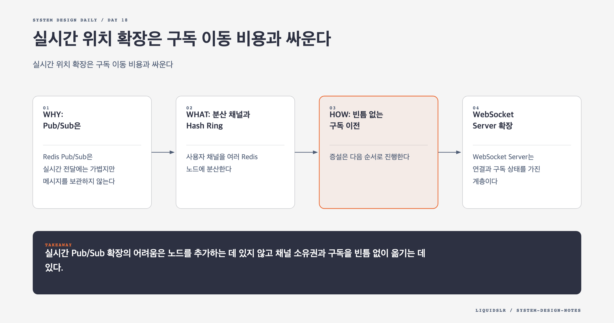

# Day 18. 실시간 위치 확장은 구독 이동 비용과 싸운다



주변 친구 시스템의 채널 메타데이터는 몇 대 Redis 서버 메모리에 들어갈 수 있다. 하지만 병목은 메모리가 아니다. 초당 약 33만 위치 업데이트가 온라인 친구들에게 평균 수십 번씩 전달되면 publish와 subscriber 전달량은 초당 천만 건을 넘는다.

## WHY: Pub/Sub은 보관소가 아니다

Redis Pub/Sub은 실시간 전달에는 가볍지만 메시지를 보관하지 않는다. 구독자가 잠시 끊겼거나 채널이 다른 노드로 이동하는 동안 이벤트가 발생하면 다시 읽을 수 없다.

따라서 노드를 추가하는 순간 처리량은 늘어도, 채널 소유권과 구독을 잘못 옮기면 위치 업데이트를 놓친다. 확장의 핵심은 서버 수보다 전환 절차다.

## WHAT: 분산 채널과 Hash Ring

사용자 채널을 여러 Redis 노드에 분산한다. Service Discovery는 살아 있는 노드와 Hash Ring 버전을 관리한다. WebSocket Server는 이 정보를 메모리에 캐시하고 친구 채널이 있는 노드에 구독한다.

```text
user channel
  -> consistent hash
  -> Redis node
  -> subscribed WebSocket Servers
```

단순한 `hash % node_count`는 노드 수가 바뀔 때 대부분의 채널을 이동시킨다. Consistent Hashing은 일부 채널만 옮긴다. 가상 노드로 분포를 고르게 하되 실제 publish QPS와 구독자 수를 측정해 핫스팟을 확인한다.

## HOW: 빈틈 없는 구독 이전

증설은 다음 순서로 진행한다.

1. 새 Redis 노드를 올리고 상태를 확인한다.
2. 다음 Hash Ring 버전을 WebSocket Server에 배포한다.
3. 이동 대상 채널을 새 노드에서 먼저 구독한다.
4. 새 구독 확인 뒤 라우팅을 전환한다.
5. 잠시 겹침 기간을 둔 뒤 기존 구독을 제거한다.

기존 구독을 먼저 끊으면 이벤트 공백이 생긴다. 새 구독을 먼저 만들면 잠시 중복 이벤트가 올 수 있다. 위치 이벤트에 `user_id`, `timestamp`, `sequence`를 넣고 최신 이벤트만 적용한다.

이 시스템은 일부 위치 이벤트 유실을 허용할 수 있다. 그래도 현재 상태는 복구해야 한다. 새 WebSocket Server나 재구독한 서버는 Location Cache에서 최신 위치를 다시 읽어 화면을 초기화한다. Pub/Sub은 변화 전달 최적화이고 최신값 캐시가 현재 상태의 기준이다.

## WebSocket Server 확장

WebSocket Server는 연결과 구독 상태를 가진 계층이다. 서버를 종료할 때 Load Balancer에서 `draining`으로 바꾸고 새 연결을 막는다. 기존 클라이언트가 재연결한 뒤 프로세스를 내린다.

재연결한 서버는 친구 목록을 읽고 채널을 다시 구독한다. 이때 수많은 사용자가 한꺼번에 이동하면 Redis와 Friend Service에 부하가 몰린다. 재연결에 jitter와 rate limit을 적용한다.

## 핫 사용자와 용량 계획

연결 수만 균등하게 나눠서는 부족하다. 친구가 수천 명인 사용자는 구독 수와 거리 계산량이 크다. 서버당 연결 수, 총 구독 수, 초당 수신 이벤트, 거리 계산 CPU를 함께 제한한다.

자동 확장이 채널 재배치를 반복하면 이동 자체가 부하를 만든다. 예측 가능한 일일 패턴에는 사전 증설과 여유 용량이 더 안전할 수 있다.

## 실패 모드

- Pub/Sub을 durable queue로 생각해 재구독 중 누락을 복구하지 못한다.
- Service Discovery 정보가 오래돼 죽은 노드나 이전 노드를 구독한다.
- 기존 구독을 먼저 끊어 채널 이동 중 공백이 생긴다.
- 연결 수만 보고 분배해 친구가 많은 사용자가 CPU 핫스팟을 만든다.

## 오늘의 한 문장

> 실시간 Pub/Sub 확장의 어려움은 노드를 추가하는 데 있지 않고 채널 소유권과 구독을 빈틈 없이 옮기는 데 있다.

## 30초 확인 문제

증설 직후 어떤 사용자는 같은 위치를 두 번 받고 어떤 사용자는 받지 못했다. 어떤 전환 방식이 필요한가?

## 정답과 해설

새 구독을 먼저 만들고 확인한 뒤 기존 구독을 제거하는 겹침 전환이 필요하다. 겹침 중 중복은 sequence나 timestamp로 제거한다. 누락된 현재 상태는 Location Cache에서 다시 읽어 복구한다.

원문: [Chapter 17: Nearby Friends](https://github.com/liquidslr/system-design-notes/tree/main/17.%20Nearby%20Friends)
