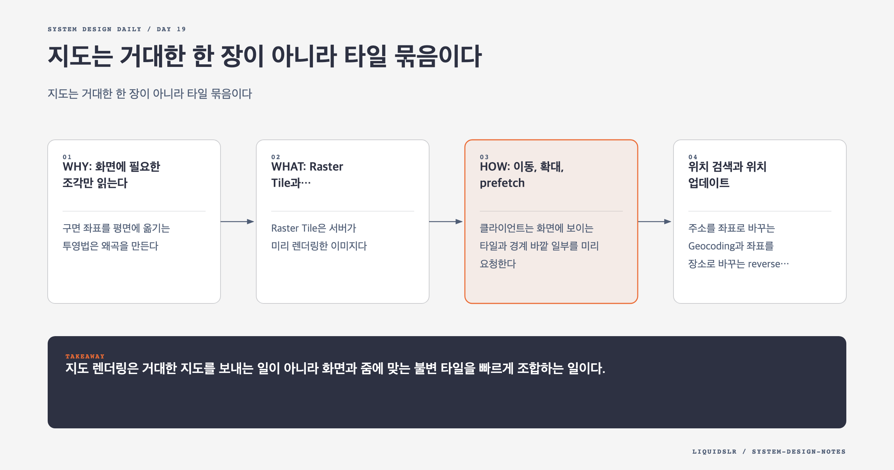

# Day 19. 지도는 거대한 한 장이 아니라 타일 묶음이다



세계 지도 전체는 휴대폰에 담을 수 없을 만큼 크다. 사용자는 한 순간에 현재 화면과 가까운 영역만 본다. 지도 시스템은 거대한 이미지를 보내는 대신 위치와 줌 레벨에 맞는 작은 타일만 전송한다.

## WHY: 화면에 필요한 조각만 읽는다

구면 좌표를 평면에 옮기는 투영법은 왜곡을 만든다. Google Maps 계열 서비스는 Web Mercator를 사용해 위도와 경도를 평면 좌표로 바꾼다.

평면 지도는 줌 레벨마다 격자로 나뉜다. 가장 낮은 줌에서는 세계가 하나의 256x256 타일에 들어갈 수 있다. 줌이 한 단계 높아질 때 격자가 가로와 세로로 두 배가 되어 타일 수는 네 배가 된다.

클라이언트는 현재 중심 좌표, 화면 크기, 줌에서 필요한 타일 좌표만 계산한다. 이 구조 덕분에 지도 전체 크기와 무관하게 화면에 필요한 데이터만 받는다.

## WHAT: Raster Tile과 Vector Tile

Raster Tile은 서버가 미리 렌더링한 이미지다. 클라이언트가 그대로 붙이면 되어 단순하지만 스타일마다 새 이미지를 만들고 네트워크 전송량도 크다.

Vector Tile은 도로, 경계, 라벨을 경로와 속성 데이터로 보낸다. 클라이언트가 직접 그리므로 스타일을 바꾸기 쉽고 대역폭을 줄일 수 있다. 대신 낮은 사양 기기에서 렌더링 비용이 생긴다.

타일은 객체 저장소에 불변 파일로 저장하고 CDN에서 제공한다.

```text
/maps/{schema_version}/{zoom}/{x}/{y}.pbf
```

같은 지역을 많은 사용자가 보므로 CDN cache hit rate가 높다. 매 요청마다 서버가 타일을 동적으로 그리면 CPU 비용과 응답 변동이 커진다.

## HOW: 이동, 확대, prefetch

클라이언트는 화면에 보이는 타일과 경계 바깥 일부를 미리 요청한다. 사용자가 이동할 때 빈 화면을 줄일 수 있다. 하지만 너무 멀리 prefetch하면 데이터와 배터리를 낭비한다. 현재 이동 방향, 속도, 네트워크 상태를 반영해 범위를 조정한다.

타일 좌표 계산을 클라이언트에 넣으면 API 호출을 줄인다. 반면 계산 규칙을 바꾸기 어렵다. 서버가 URL 목록을 반환하면 버전 전환은 쉽지만 호출이 하나 늘어난다. 어느 쪽이든 URL에 스키마 버전을 넣어 장기 호환성을 확보한다.

## 위치 검색과 위치 업데이트

주소를 좌표로 바꾸는 Geocoding과 좌표를 장소로 바꾸는 reverse geocoding은 타일 제공과 다른 문제다. 장소 인덱스는 읽기가 많고 갱신이 적으므로 빠른 캐시를 둘 수 있다.

사용자 위치 업데이트는 일정 간격으로 배치 전송한다. 이력은 Cassandra 같은 write-heavy 저장소에 두고 Kafka로 교통 분석과 지도 개선 파이프라인에 전달한다. 위치 수집 장애가 정적 타일 제공으로 전파되지 않게 서비스와 저장소를 분리한다.

## 타일 배포와 캐시 일관성

같은 타일 URL의 내용을 덮어쓰면 CDN과 클라이언트마다 다른 버전을 볼 수 있다. 새 버전 경로에 전체 타일을 생성하고 검증한 뒤 manifest를 전환한다. 이전 버전은 진행 중인 세션을 위해 유예 기간 동안 남긴다.

클라이언트 디스크 캐시에는 크기 상한과 만료 정책을 둔다. 도로 변경이 잦은 지역과 거의 변하지 않는 지형 타일의 TTL을 다르게 설정할 수 있다.

## 실패 모드

- 요청마다 타일을 동적으로 그려 origin CPU가 병목이 된다.
- 줌별 데이터를 나누지 않아 정보 밀도와 라벨 품질이 무너진다.
- 같은 URL을 덮어써 캐시마다 다른 내용을 제공한다.
- 위치 수집 파이프라인 장애가 지도 렌더링까지 막는다.

## 오늘의 한 문장

> 지도 렌더링은 거대한 지도를 보내는 일이 아니라 화면과 줌에 맞는 불변 타일을 빠르게 조합하는 일이다.

## 30초 확인 문제

도로 갱신 뒤 같은 URL을 덮어썼더니 사용자마다 다른 타일을 본다. 어떻게 배포해야 하는가?

## 정답과 해설

새 버전 URL에 타일을 생성하고 검증한 뒤 manifest나 API 포인터를 전환한다. 불변 URL을 쓰면 CDN과 클라이언트 캐시가 같은 키로 다른 내용을 보관하지 않는다.

원문: [Chapter 18: Google Maps](https://github.com/liquidslr/system-design-notes/tree/main/18.%20Google%20Maps)
