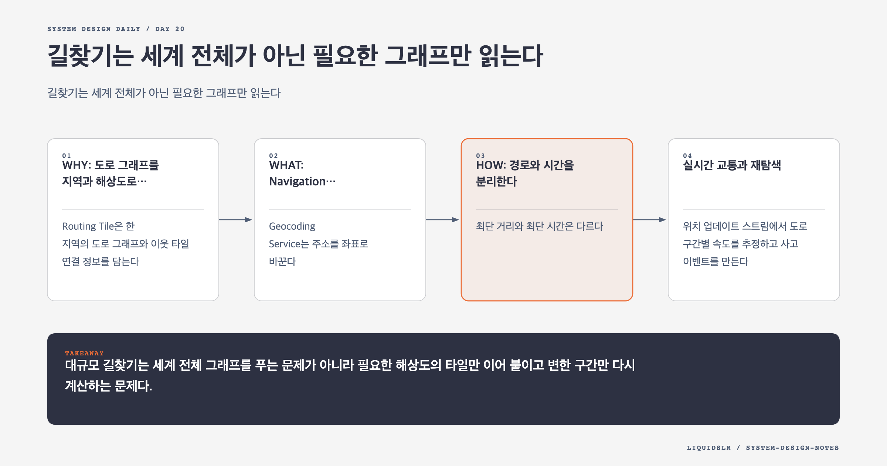

# Day 20. 길찾기는 세계 전체가 아닌 필요한 그래프만 읽는다



길찾기는 교차로를 노드, 도로를 간선으로 표현한 그래프 문제다. Dijkstra나 A*로 경로를 찾을 수 있지만 세계 전체 도로 그래프를 한 번에 읽으면 메모리와 탐색 시간이 감당되지 않는다.

서울의 골목에서 출발할 때는 상세 도로가 필요하다. 고속도로를 달리는 동안 전국의 모든 골목을 같은 정밀도로 볼 필요는 없다. 목적지 근처에서 다시 상세 그래프를 읽으면 된다.

## WHY: 도로 그래프를 지역과 해상도로 나눈다

Routing Tile은 한 지역의 도로 그래프와 이웃 타일 연결 정보를 담는다. 가까운 구간은 상세 타일을 사용하고 장거리 구간은 주요 도로만 남긴 상위 타일을 사용한다.

원시 도로 데이터는 여러 소스에서 들어오므로 온라인 요청에서 직접 다루지 않는다. 오프라인 파이프라인이 정규화, 연결 검증, 계층 생성을 수행해 불변 Routing Tile을 만든다. 결과는 객체 저장소에 두고 적극적으로 캐시한다.

## WHAT: Navigation Service의 구성

Geocoding Service는 주소를 좌표로 바꾼다. Route Planner는 이동 수단과 사용자 조건을 받아 후보 경로 계산을 조정한다.

Shortest Path Service는 출발지와 목적지에 필요한 Routing Tile을 선택하고 A* 변형으로 후보를 찾는다. ETA Service는 실시간 교통과 과거 패턴으로 각 후보의 시간을 예측한다. Ranker는 통행료 회피, 고속도로 회피 같은 조건을 반영해 결과를 정렬한다.

```text
origin, destination
  -> geocoding
  -> routing tile 선택
  -> 후보 경로 탐색
  -> 교통 기반 ETA
  -> 사용자 조건 ranking
  -> polyline과 안내 반환
```

## HOW: 경로와 시간을 분리한다

최단 거리와 최단 시간은 다르다. 도로 길이와 연결은 비교적 안정적이지만 속도는 시간대, 사고, 공사에 따라 바뀐다. 기본 그래프가 후보 경로를 만들고 ETA Service가 동적인 가중치를 적용한다.

정확한 최적해를 찾느라 응답이 오래 걸리는 것보다 제한 시간 안에 합리적인 경로를 주는 편이 나을 수 있다. 탐색 상한을 두고 좋은 후보를 먼저 반환한 뒤 대체 경로를 추가할 수 있다. 단, 일방통행과 도로 폐쇄 같은 안전 제약은 근사하면 안 된다.

## 실시간 교통과 재탐색

위치 업데이트 스트림에서 도로 구간별 속도를 추정하고 사고 이벤트를 만든다. 사고가 발생할 때 모든 사용자의 경로를 다시 계산하면 재탐색 폭주가 생긴다.

현재 안내 중인 경로가 지나는 Routing Tile에서 사용자로 이어지는 역인덱스를 둔다. 사고 타일과 겹치는 사용자만 골라 새 ETA와 대체 경로를 계산한다.

장거리 경로의 모든 상세 타일을 저장하면 데이터가 크다. 출발지 상세 타일과 상위 계층 타일을 함께 기록해 영향 범위를 적은 키로 좁힐 수 있다.

## 전달과 복구

WebSocket은 서버가 새 경로를 밀어주고 클라이언트가 위치를 보내는 양방향 흐름에 맞는다. 연결이 끊기면 클라이언트는 마지막 경로를 계속 사용할 수 있어야 한다. 재연결 후 현재 위치를 기준으로 새 경로를 요청한다.

실시간 교통 데이터가 늦으면 ETA 품질은 낮아질 수 있다. 경로 유효성과 ETA 정확도를 분리한다. 확정된 폐쇄 도로는 최신 기준 데이터로 막고, 교통 스트림이 없을 때는 과거 평균 속도로 ETA를 계산한다.

## 버전 일관성

서로 다른 버전의 Routing Tile을 한 탐색에 섞으면 타일 경계의 도로 연결이 맞지 않을 수 있다. 한 요청은 하나의 그래프 버전을 사용한다. 새 타일 세트를 불변 경로에 배포하고 manifest를 원자적으로 전환한다.

## 실패 모드

- 세계 전체 그래프를 읽어 메모리와 탐색 시간을 낭비한다.
- 최단 거리만 최적화해 교통과 사용자 조건을 놓친다.
- 사고 하나에 모든 사용자의 경로를 다시 계산한다.
- 다른 버전의 타일을 섞어 경계 연결을 깨뜨린다.

## 오늘의 한 문장

> 대규모 길찾기는 세계 전체 그래프를 푸는 문제가 아니라 필요한 해상도의 타일만 이어 붙이고 변한 구간만 다시 계산하는 문제다.

## 30초 확인 문제

사고 이벤트 하나가 들어올 때 모든 안내 중 사용자의 경로를 재계산한다. 무엇을 추가해야 하는가?

## 정답과 해설

Routing Tile에서 현재 경로를 지나는 사용자로 이어지는 역인덱스를 둔다. 사고 타일과 겹치는 사용자만 후보로 고른다. 계층형 타일 범위를 저장하면 장거리 경로도 적은 키로 영향 여부를 좁힐 수 있다.

원문: [Chapter 18: Google Maps](https://github.com/liquidslr/system-design-notes/tree/main/18.%20Google%20Maps)
