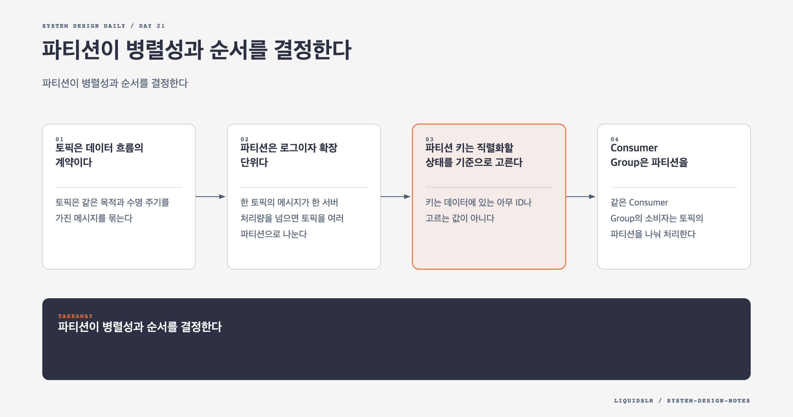

# Day 21. 파티션이 병렬성과 순서를 결정한다



분산 메시지 큐는 생산자와 소비자의 시간 축을 분리한다. 생산자는 소비자의 처리 완료를 기다리지 않고 메시지를 기록하며, 소비자는 자기 속도로 따라간다. 이 완충 구간 덕분에 두 시스템을 독립적으로 배포하고 확장할 수 있다.

대신 큐를 도입하면 새로운 질문이 생긴다. 메시지를 어디에 나눠 저장할지, 어떤 범위의 순서를 보장할지, 여러 소비자가 일을 어떻게 나눌지 정해야 한다. 이 질문의 중심에 토픽, 파티션, Consumer Group이 있다.

## 토픽은 데이터 흐름의 계약이다

토픽은 같은 목적과 수명 주기를 가진 메시지를 묶는다. `order-events`, `payment-events`처럼 업무 흐름을 나타내는 이름을 쓸 수 있다.

토픽을 소비자마다 만들면 생산자가 모든 소비자 요구를 알아야 한다. 같은 메시지를 여러 토픽에 복사해 저장 비용도 커진다. 반대로 모든 이벤트를 한 토픽에 넣으면 스키마 변경, 접근 제어, 보존 기간, 장애 격리가 어려워진다.

좋은 토픽 경계는 조직도가 아니라 데이터 계약에서 나온다. 스키마, 보존 기간, 보안 수준, 처리 특성이 같다면 함께 두고, 서로 다르면 나눈다.

## 파티션은 로그이자 확장 단위다

한 토픽의 메시지가 한 서버 처리량을 넘으면 토픽을 여러 파티션으로 나눈다. 각 파티션은 끝에만 데이터를 붙이는 append-only log로 볼 수 있다. 파티션 안의 메시지 위치를 offset이라고 한다.

```text
topic: order-events
partition 0: offset 0, 1, 2, ...
partition 1: offset 0, 1, 2, ...
partition 2: offset 0, 1, 2, ...
```

각 파티션을 다른 broker에 배치하면 읽기와 쓰기를 병렬화할 수 있다. 이때 전체 토픽의 전역 순서는 포기한다. 일반적인 분산 큐가 보장하는 순서는 파티션 내부 순서다.

같은 주문의 상태 변경 순서가 중요하다면 `order_id`를 파티션 키로 사용한다.

```text
partition = hash(order_id) % partition_count
```

`ORDER_CREATED`, `PAYMENT_APPROVED`, `ORDER_SHIPPED`가 같은 파티션으로 들어가므로 한 소비자가 순서대로 읽을 수 있다. 서로 다른 주문 사이에는 순서를 요구하지 않아 여러 파티션에서 동시에 처리한다.

## 파티션 키는 직렬화할 상태를 기준으로 고른다

키는 데이터에 있는 아무 ID나 고르는 값이 아니다. 어떤 상태 변경을 한 줄로 세워야 하는지 먼저 정해야 한다.

주문 상태를 보호하려면 `order_id`, 고객별 잔액을 보호하려면 `account_id`, 상품 재고 변화를 직렬화하려면 `product_id`가 후보가 된다. 키를 너무 넓게 잡으면 병렬성이 줄고, 너무 잘게 나누면 필요한 순서가 깨진다.

트래픽 편차도 봐야 한다. 유명 판매자나 인기 상품 하나에 이벤트가 몰리면 해당 키가 배정된 파티션만 밀린다. 이를 핫 파티션이라고 한다. 순서를 유지하면서 키 하나를 여러 파티션에 나누기는 어렵다. 업무 상태를 더 작은 단위로 분리할 수 있는지, 특정 키만 별도 흐름으로 격리할지 검토해야 한다.

## Consumer Group은 파티션을 나눠 맡는다

같은 Consumer Group의 소비자는 토픽의 파티션을 나눠 처리한다. 한 그룹 안에서 한 파티션은 한 소비자에게만 배정한다. 그래야 파티션 내부 순서를 유지할 수 있다.

파티션이 6개이고 소비자가 3개면 각 소비자가 2개씩 맡을 수 있다. 소비자를 8개로 늘려도 동시에 일하는 소비자는 최대 6개다. 파티션 수가 그룹의 최대 병렬성을 정한다.

서로 다른 Consumer Group은 같은 메시지를 독립적으로 읽는다. 주문 집계 그룹과 사기 탐지 그룹은 각자 offset을 유지하므로 한 그룹의 지연이 다른 그룹을 막지 않는다.

이 구조는 메시지를 소비자별로 복제하는 것과 다르다. 메시지는 토픽 파티션에 한 번 기록하고, 그룹별 소비 위치만 별도로 저장한다.

## Offset은 그룹의 진행 상태다

Consumer Group은 각 파티션에서 어디까지 처리했는지 offset으로 기록한다. 소비자가 죽으면 새 소비자가 마지막으로 commit한 offset부터 이어받는다.

offset은 메시지 자체의 상태가 아니다. 그룹 A가 offset 100까지 처리해도 그룹 B는 offset 40에 있을 수 있다. 장기 보존한 메시지는 offset을 과거로 되돌려 다시 읽을 수도 있다.

이 기능은 배포 버그 복구와 새 소비자 추가에 유용하다. 다만 재처리하면 같은 결과가 다시 반영될 수 있으므로 소비자는 멱등하게 설계해야 한다.

## Rebalance가 확장과 복구를 연결한다

소비자가 가입하거나 떠나고 파티션 수가 바뀌면 coordinator가 파티션을 다시 배정한다. 이 과정을 rebalance라고 한다.

Rebalance는 장애 난 소비자의 일을 다른 소비자에게 넘기고 새 소비자에게 작업을 배분한다. 하지만 공짜는 아니다. 배정이 바뀌는 동안 처리가 멈출 수 있고, 처리 중이던 메시지가 offset commit 여부에 따라 다시 전달될 수 있다.

처리 시간이 긴 작업은 heartbeat timeout을 넘겨 살아 있는 소비자가 죽은 것으로 판정될 수 있다. 불필요한 rebalance가 반복되면 정상 처리보다 재배치에 더 많은 시간을 쓴다. heartbeat, 처리 batch 크기, 최대 처리 시간을 함께 조정해야 한다.

## 파티션 수를 정할 때 볼 것

파티션 수는 현재 소비자 수만 보고 정하지 않는다.

- 목표 처리량과 파티션당 측정 처리량
- 향후 늘릴 Consumer Group과 소비자 수
- broker가 감당할 파일, connection, replica 수
- 파티션 키의 분포와 hotspot 가능성
- 파티션 증가 시 키 배치가 바뀌는 영향

파티션을 많이 만들면 병렬성 여유가 생기지만 metadata, replica, open file, rebalance 비용이 늘어난다. 나중에 줄이는 작업은 더 까다롭다. 비활성 파티션도 보존 기간 동안 소비 대상에 남을 수 있기 때문이다.

## 실무 예: 주문 이벤트

주문 이벤트를 전역 순서로 처리하려고 파티션 하나만 두면 이해하기 쉽지만 처리량이 한 consumer의 속도에 묶인다. 실제 요구가 주문별 순서라면 `order_id`로 나누는 편이 낫다.

반면 한 주문 안에서도 배송 알림과 분석 이벤트는 강한 순서를 공유할 필요가 없을 수 있다. 모든 후속 작업을 한 consumer에서 동기로 처리하지 말고, 필요한 상태 전이만 직렬화하고 파생 작업은 별도 Consumer Group으로 분리한다.

## 함정 체크

- 토픽 전체 순서와 파티션 내부 순서를 혼동하지 않는다.
- 소비자만 늘리면 처리량이 계속 늘어난다고 가정하지 않는다.
- 파티션 키 변경과 파티션 수 변경이 기존 키 배치에 미치는 영향을 확인한다.
- Rebalance 중 중단과 중복 처리를 정상 실패 경로로 다룬다.
- Consumer Group을 broker replica와 혼동하지 않는다.

## 오늘의 한 문장

**분산 큐의 처리량은 파티션이 만들고, 보장할 수 있는 순서의 범위도 파티션이 제한한다.**

## 30초 확인 문제

파티션 12개인 토픽을 같은 Consumer Group의 소비자 20개가 읽는다. 동시에 일할 수 있는 소비자는 최대 몇 개이며, 같은 고객의 이벤트 순서를 지키려면 무엇을 해야 하는가?

## 정답과 해설

최대 12개가 일한다. 한 그룹 안에서 한 파티션은 한 소비자만 맡기 때문이다. 같은 고객의 이벤트에는 `customer_id` 같은 안정적인 파티션 키를 사용해 모두 같은 파티션으로 보내야 한다. 고객별 트래픽 편차가 크다면 핫 파티션 위험도 함께 검토한다.

원문: [Chapter 19: Distributed Message Queue](https://github.com/liquidslr/system-design-notes/tree/main/19.%20Distributed%20Message%20Queue)
