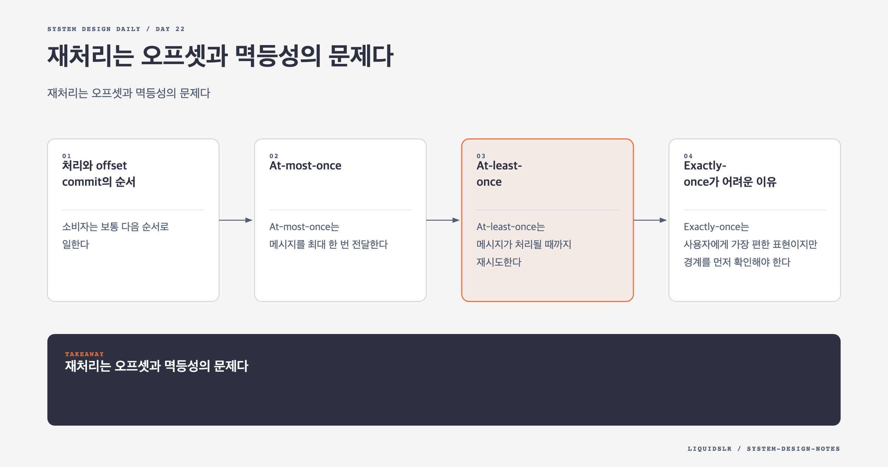

# Day 22. 재처리는 오프셋과 멱등성의 문제다



메시지 큐의 전달 보장은 브로커 설명만으로 결정되지 않는다. 생산자가 성공을 언제 인정하는지, 소비자가 업무를 언제 처리하는지, offset을 언제 commit하는지, 외부 저장소가 중복 쓰기를 어떻게 막는지가 함께 결과를 만든다.

핵심 질문은 하나다. 소비자가 결과를 저장한 직후 죽고 offset은 저장하지 못했을 때 어떻게 할 것인가. 메시지를 다시 읽으면 중복 결과가 생기고, 다시 읽지 않으면 유실 가능성이 생긴다.

## 처리와 offset commit의 순서

소비자는 보통 다음 순서로 일한다.

```text
1. 메시지를 읽는다.
2. 업무 로직을 실행한다.
3. 처리한 offset을 commit한다.
```

2번 이후 3번 전에 죽으면 업무 결과는 이미 반영됐지만 offset은 과거에 남는다. 새 소비자는 같은 메시지를 다시 읽는다.

순서를 바꿔 offset을 먼저 commit하면 중복은 줄지만, commit 직후 업무 처리 전에 죽었을 때 메시지를 영원히 놓친다. 순서 선택이 at-most-once와 at-least-once의 차이를 만든다.

## At-most-once

At-most-once는 메시지를 최대 한 번 전달한다. 생산자는 실패해도 재시도하지 않고, 소비자는 처리 전에 offset을 commit한다.

중복을 피하지만 메시지를 잃을 수 있다. 곧 새 값이 들어오는 비핵심 metric, 일부 손실을 허용하는 telemetry처럼 유실 비용이 낮을 때 쓸 수 있다. 결제나 재고처럼 한 건의 누락도 상태를 깨뜨리는 업무에는 맞지 않는다.

## At-least-once

At-least-once는 메시지가 처리될 때까지 재시도한다. 생산자는 확인 응답을 못 받으면 다시 보내고, 소비자는 업무가 끝난 뒤 offset을 commit한다.

유실 가능성을 낮추는 대신 같은 메시지가 여러 번 도착할 수 있다. 분산 시스템에서 네트워크 timeout은 상대가 실패했다는 뜻이 아니라 결과를 모른다는 뜻이다. 실제 쓰기는 성공했지만 응답만 잃었을 수 있으므로 재시도는 중복을 만든다.

대부분의 업무 시스템은 at-least-once와 멱등 처리를 조합한다. 재처리를 없애려 하기보다 재처리해도 결과가 바뀌지 않게 만든다.

## Exactly-once가 어려운 이유

Exactly-once는 사용자에게 가장 편한 표현이지만 경계를 먼저 확인해야 한다. Kafka 내부 transaction이 한 번만 commit되어도 외부 데이터베이스 update가 두 번 실행되면 업무 결과는 중복이다.

Queue offset과 외부 결과를 같은 원자적 transaction에 넣을 수 있다면 강한 보장을 만들 수 있다. 하지만 서로 다른 저장소와 외부 API를 하나로 묶는 분산 transaction은 지연과 장애 결합을 키운다.

그래서 현실적인 목표는 보통 다음과 같다.

- 메시지는 at-least-once로 전달한다.
- 업무 결과는 idempotency key로 한 번만 반영한다.
- 실패한 작업은 안전하게 재시도한다.
- 원본과 처리 이력으로 결과를 감사할 수 있게 한다.

## 멱등 소비자 만들기

이벤트에 전역적으로 안정적인 `event_id`를 넣고, 소비자가 처리 이력을 남긴다. 같은 데이터베이스 안에서 업무 결과와 처리 이력을 함께 commit해야 한다.

```sql
BEGIN;

INSERT INTO processed_event(event_id)
VALUES (:event_id);

UPDATE payment
SET status = 'APPROVED'
WHERE payment_id = :payment_id;

COMMIT;
```

`processed_event.event_id`에 unique constraint가 있으면 두 번째 처리는 insert에서 막힌다. 이미 처리된 이벤트라는 결과를 확인하고 offset을 commit하면 된다.

상태 변경 자체를 멱등하게 만들 수도 있다.

```sql
UPDATE payment
SET status = 'APPROVED'
WHERE payment_id = :payment_id
  AND status = 'PENDING';
```

영향받은 행이 0개라면 이미 승인됐거나 허용하지 않는 상태다. 단, 서로 다른 이벤트가 같은 상태를 만들 수 있다면 event ID와 상태 version을 함께 확인해야 한다.

## 외부 API와 Outbox

메일 발송이나 결제 API 호출은 로컬 데이터베이스 transaction에 직접 넣기 어렵다. Transaction 안에서 외부 호출을 기다리면 lock 시간이 길어지고, 외부 호출 성공 후 로컬 commit이 실패하는 문제도 남는다.

Outbox pattern은 로컬 상태 변경과 전송할 작업을 같은 DB transaction에 기록한다.

```text
business table update + outbox insert -> commit
outbox relay -> external API with idempotency key
```

Relay가 죽어 같은 outbox를 다시 보내도 외부 API가 같은 idempotency key를 인식하면 결과가 한 번만 반영된다.

## 순서 보장과 retry

파티션 안에 기록된 순서와 업무 완료 순서는 다를 수 있다. 소비자가 여러 메시지를 병렬 처리하면 뒤 메시지가 먼저 끝난다. 실패 메시지만 retry topic으로 옮겨도 후속 메시지가 앞서간다.

주문 생성 이벤트가 retry 중인데 주문 취소 이벤트가 먼저 반영되면 상태 머신이 깨질 수 있다. 해결 방법은 요구에 따라 다르다.

- 같은 key는 한 worker에서 직렬 처리한다.
- 상태에 version을 두고 이전 version 이벤트를 거부한다.
- 실패한 key의 후속 메시지만 잠시 보류한다.
- Retry topic에서도 원래 partition key를 유지한다.

모든 메시지를 멈추면 한 poison message가 파티션 전체를 막는다. 순서가 필요한 key와 실패 범위를 좁혀야 한다.

## Retry와 DLQ

네트워크 timeout 같은 일시 오류는 지수 backoff와 jitter로 재시도한다. 스키마 불일치, 존재하지 않는 참조, 손상된 payload는 반복해도 성공하지 않는다.

```text
main topic
-> retry after 10s
-> retry after 1m
-> retry after 10m
-> dead-letter queue
```

DLQ에는 원본 message와 함께 topic, partition, offset, exception, retry count, 첫 실패 시각, 마지막 실패 시각을 남긴다. 운영자는 원인을 고친 뒤 메시지를 재투입할 수 있어야 한다. 재투입할 때도 원래 event ID를 유지해야 멱등성이 이어진다.

DLQ 크기가 늘어나는 동안 main consumer가 정상이라고 안심하면 안 된다. DLQ age와 유형별 실패율을 alerting 대상으로 둔다.

## 생산자 ACK와 내구성

생산자도 언제 성공으로 볼지 선택한다.

- `ACK=0`은 broker 응답을 기다리지 않는다. 가장 빠르지만 기록 성공을 알 수 없다.
- `ACK=1`은 leader 기록을 기다린다. 복제 전에 leader가 죽으면 잃을 수 있다.
- `ACK=all`은 in-sync replica의 확인을 기다린다. 내구성이 높지만 느린 replica가 지연과 가용성에 영향을 준다.

모든 토픽에 같은 값을 쓸 필요는 없다. 결제 이벤트와 디버그 이벤트의 손실 비용이 다르기 때문이다.

## 관찰해야 할 지표

- Consumer Group의 partition별 lag
- 가장 오래된 미처리 메시지의 나이
- retry 횟수와 DLQ 유입률
- 중복으로 거부한 event 수
- 처리 시간과 offset commit 실패율
- rebalance 횟수와 중단 시간

Queue length 하나만 보면 오래된 메시지가 계속 갇혀 있는지 알 수 없다. 처리 지연의 나이를 함께 봐야 한다.

## 함정 체크

- Exactly-once를 broker 설정 하나로 해결했다고 말하지 않는다.
- Offset commit과 업무 결과 저장을 같은 성공으로 보지 않는다.
- 무한 retry로 영구 오류를 숨기지 않는다.
- Retry topic에서도 순서가 자동 보장된다고 가정하지 않는다.
- DLQ를 관찰과 복구 절차 없는 쓰레기통으로 두지 않는다.

## 오늘의 한 문장

**유실을 막으려면 재처리를 받아들이고, 중복 결과를 막으려면 업무 처리를 멱등하게 만들어야 한다.**

## 30초 확인 문제

소비자가 재고를 1개 차감한 뒤 offset commit 전에 죽었다. 재시작 후 같은 메시지가 다시 오면 어떤 문제가 생기며, 가장 현실적인 방어는 무엇인가?

## 정답과 해설

그대로 다시 처리하면 재고가 2개 차감된다. `event_id` 처리 이력과 재고 갱신을 같은 데이터베이스 transaction에 넣거나, 재고 갱신을 event version에 대한 조건부 연산으로 만든다. Queue는 at-least-once로 운용하되 결과 반영을 멱등하게 만드는 방식이 현실적이다.

원문: [Chapter 19: Distributed Message Queue](https://github.com/liquidslr/system-design-notes/tree/main/19.%20Distributed%20Message%20Queue)
