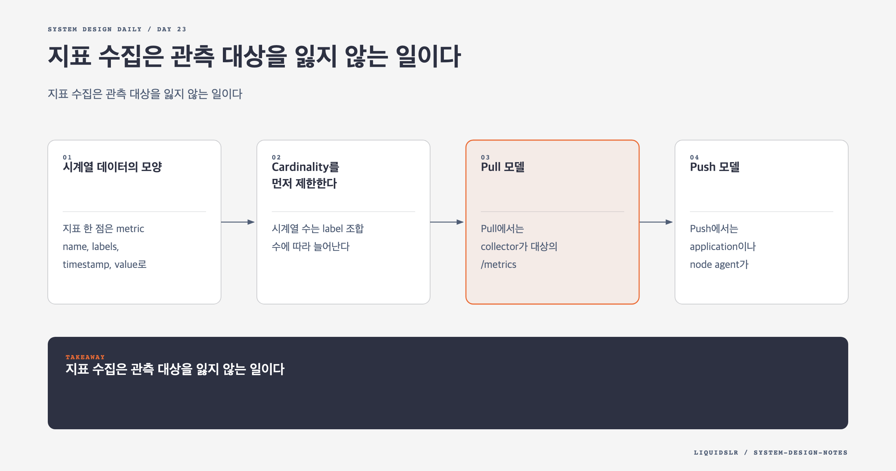

# Day 23. 지표 수집은 관측 대상을 잃지 않는 일이다



대규모 모니터링 시스템의 첫 문제는 저장소가 아니다. 어떤 대상에서 어떤 지표를 언제 가져올지, 여러 수집자가 대상을 어떻게 나눠 맡을지 정하는 일이다. 수집 책임이 흔들리면 뒤의 저장과 알림이 아무리 좋아도 숫자를 믿을 수 없다.

## 시계열 데이터의 모양

지표 한 점은 metric name, labels, timestamp, value로 표현할 수 있다.

```text
http_requests_total service=checkout,region=ap-northeast-2 1710000000 1842
cpu_usage host=web-17,region=ap-northeast-2 1710000000 73.4
```

같은 metric name과 label 조합이 하나의 time series를 만든다. 운영 질의는 보통 특정 시계열을 고르고 시간 범위에서 rate, sum, average, percentile을 계산한다.

지표는 로그와 목적이 다르다. 로그는 한 사건의 세부 문맥을 담고, 지표는 반복되는 상태를 숫자로 압축한다. 모든 request ID와 user ID를 label에 넣으면 지표가 로그처럼 변하고 비용이 급증한다.

## Cardinality를 먼저 제한한다

시계열 수는 label 조합 수에 따라 늘어난다.

```text
10 services x 5 regions x 20 endpoints x 5 status codes = 5,000 series
```

여기에 수백만 user ID를 붙이면 series 수가 폭발한다. Time-series database는 label index와 최근 series 상태를 메모리에 유지하므로 높은 cardinality가 저장량뿐 아니라 메모리와 query 성능도 해친다.

수집 SDK와 gateway에서 다음을 제한할 수 있다.

- 허용하는 label key 목록
- label value 길이와 형식
- metric별 최대 series 수
- 사용자 입력을 그대로 label로 쓰는 패턴
- 새 배포 전 예상 cardinality

세부 식별이 필요하면 log나 trace에 넣고 metric에는 집계 가능한 낮은 cardinality만 남긴다.

## Pull 모델

Pull에서는 collector가 대상의 `/metrics` endpoint를 주기적으로 호출한다. Service discovery가 endpoint 목록과 수집 주기, timeout, retry 설정을 제공한다.

```text
service discovery -> collector -> /metrics endpoints
```

장점은 원본 확인이 쉽다는 점이다. 개발자가 endpoint를 직접 열어 지표를 볼 수 있고, collector가 endpoint에 접근하지 못한 사실 자체를 health signal로 사용할 수 있다. 대상이 미리 등록되어 있으므로 인증하지 않은 client의 임의 metric 유입도 줄일 수 있다.

단점도 분명하다. 20초만 실행되는 batch job은 1분 주기의 pull 사이에 사라진다. 여러 data center와 보안 zone에서 모든 endpoint를 collector가 접근하게 만들기도 어렵다.

## Push 모델

Push에서는 application이나 node agent가 collector로 metric을 보낸다. 짧은 작업이 종료 전에 결과를 전송할 수 있고, 내부 endpoint를 외부 collector에 열지 않아도 된다.

Agent가 1초 sample을 10초 단위로 미리 합치면 네트워크와 collector 부하를 줄일 수 있다. 하지만 원본 해상도를 잃고 client마다 다른 집계 로직이 생길 수 있다.

Push endpoint는 누구나 값을 만들 수 있으므로 인증과 tenant quota가 필요하다. Metric이 오지 않을 때 application이 죽은 것인지, network가 끊긴 것인지, agent가 실패한 것인지 구분하기도 어렵다.

큰 조직에서는 한 모델만 고집하지 않는다. 장기 실행 service는 pull, short-lived job은 push gateway처럼 환경에 맞춰 조합할 수 있다.

## 수집자를 수평 확장한다

Collector 한 대가 모든 endpoint를 담당하면 처리량 한계와 단일 장애점이 생긴다. 여러 collector가 같은 endpoint를 읽으면 duplicate point가 생긴다.

Pull 대상과 collector를 consistent hash ring에 배치하면 각 대상을 한 collector에 안정적으로 할당할 수 있다. Collector가 늘거나 줄 때 일부 대상만 이동하므로 전체 재배치를 피한다.

그래도 collector 장애 직후에는 이전 owner와 새 owner가 잠시 겹칠 수 있다. Sample에 source identity와 timestamp를 포함하고 저장 단계에서 허용 가능한 중복을 처리해야 한다.

Push collector는 load balancer 뒤에서 수평 확장하기 쉽다. 다만 한 client의 순서가 여러 collector로 흩어져도 문제가 없는지 확인한다. Counter delta를 client에서 계산해 보내면 out-of-order가 값을 깨뜨릴 수 있으므로 누적 counter와 timestamp를 보내는 편이 안전하다.

## 수집과 저장을 Queue로 분리한다

Collector가 TSDB에 직접 쓰면 구조가 단순하고 지연이 짧다. 하지만 TSDB가 느려지면 collector buffer가 차고 source의 metric을 받지 못한다.

```text
metric source
-> collector
-> durable queue
-> stream processor
-> time-series database
```

Queue는 순간 부하와 저장소 장애를 흡수하고 수집과 가공을 독립적으로 확장하게 한다. Processor는 validation, routing, pre-aggregation을 수행할 수 있다.

Queue의 대가도 있다. 운영할 cluster가 늘고 end-to-end 지연이 생긴다. Queue가 데이터를 보관한다는 이유로 문제를 늦게 발견할 수 있다. Consumer lag와 oldest event age를 alerting해야 한다.

규모가 작고 TSDB가 충분히 버틴다면 직접 쓰기가 더 낫다. Queue는 습관이 아니라 장애 격리와 burst 흡수가 필요한 근거가 있을 때 넣는다.

## 집계 위치의 선택

**Agent 집계**는 전송량을 가장 일찍 줄인다. 단순 counter와 gauge에 적합하지만 client 배포를 바꿔야 하고 원본을 잃는다.

**Ingestion 집계**는 중앙에서 정책을 통제한다. Stream processor가 필요하고 처리 상태와 복구가 복잡해진다.

**Query 집계**는 원본을 보존한다. 대신 장애 중 많은 사용자가 같은 넓은 범위를 조회하면 TSDB CPU를 빠르게 소모한다.

최근 원본은 보존하고 오래된 값은 rollup하는 혼합 정책이 일반적이다. 어느 지점에서 정확도를 버리는지 문서화해야 한다.

## 실패 모드

- Service discovery의 오래된 endpoint를 계속 수집해 실패 요청이 쌓인다.
- 두 collector가 같은 대상을 맡아 counter가 두 배로 보인다.
- Client clock이 틀려 point가 미래 partition에 기록된다.
- 새 label 하나가 series 수를 수백 배 늘린다.
- Queue lag가 늘어 장애 alert가 늦게 도착한다.
- Collector 자체가 죽었는데 metric이 0으로 보이지 않고 그냥 사라진다.

마지막 경우를 막으려면 외부 위치에서 collector heartbeat와 수집 성공 시각을 확인해야 한다.

## 운영 지표

모니터링 수집 계층도 다음을 측정한다.

- Target discovery 수와 scrape 성공률
- 수집 시각에서 저장 시각까지의 지연
- Collector별 대상 수와 처리 시간
- Queue lag와 oldest event age
- 거부한 series와 cardinality 증가율
- Sample drop 수와 원인

## 함정 체크

- Metric이 안 온다는 사실을 값이 0인 것과 구분한다.
- Pull과 push의 선택을 유행하는 제품 하나로 결정하지 않는다.
- Source timestamp를 무조건 신뢰하지 않는다.
- 일부 sample loss를 허용해도 수집 시스템 전체의 침묵은 감지한다.
- Metric schema와 label 정책을 중앙에서 관리한다.

## 오늘의 한 문장

**지표 수집의 핵심은 숫자를 많이 받는 일이 아니라, 관측 대상과 수집 책임을 안정적으로 연결하는 일이다.**

## 30초 확인 문제

수명이 20초인 batch job의 성공 횟수를 1분마다 pull하는 collector로 모은다. 어떤 문제가 생기며 무엇을 바꾸는 편이 나은가?

## 정답과 해설

Job이 수집 주기 사이에 시작하고 끝나면 지표를 한 번도 읽지 못한다. Job이 push gateway나 collector로 결과를 보내게 하거나 node agent가 종료 전에 전달하게 한다. Pull을 유지하려면 job보다 짧은 주기가 필요하지만 대상 수가 많을수록 비용이 커진다.

원문: [Chapter 20: Metrics Monitoring and Alerting System](https://github.com/liquidslr/system-design-notes/tree/main/20.%20Metrics%20Monitoring%20and%20Alerting%20System)
