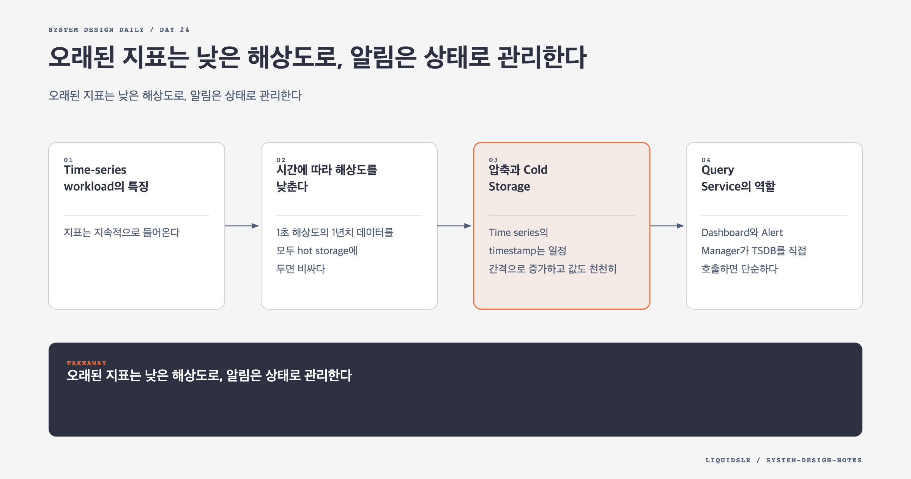

# Day 24. 오래된 지표는 낮은 해상도로, 알림은 상태로 관리한다



모니터링 시스템에는 서로 다른 두 시간 문제가 있다. 저장 계층은 최근 데이터와 오래된 데이터를 다른 해상도로 다뤄야 한다. 알림 계층은 한순간의 조건이 아니라 시간에 따라 이어지는 상태를 다뤄야 한다.

## Time-series workload의 특징

지표는 지속적으로 들어온다. 읽기는 평소보다 장애 때 몰리고, 대부분 최근 구간을 조회한다. 질의는 metric name과 label로 series를 고른 뒤 시간 범위에서 집계한다.

이 패턴에는 append와 시간 범위 압축, label index, rollup이 중요하다. 관계형 데이터베이스도 충분히 작은 규모에서는 쓸 수 있지만, 규모가 커지면 이 기능을 직접 만들고 운영해야 한다. InfluxDB, Prometheus 계열 저장소 같은 TSDB는 이 접근 패턴에 맞춰 설계되어 있다.

제품 이름보다 확인할 계약은 다음과 같다.

- 초당 write와 active series 수를 감당하는가
- 최근 query latency가 목표를 만족하는가
- Retention과 downsampling을 지원하는가
- 고가용성과 backup 방식이 요구에 맞는가
- Label cardinality 제한과 관측 기능이 있는가

## 시간에 따라 해상도를 낮춘다

1초 해상도의 1년치 데이터를 모두 hot storage에 두면 비싸다. 대부분의 운영 query는 최근 데이터에 집중하므로 계층별 보존 정책을 둔다.

```text
최근 7일: 원본 해상도
8일에서 30일: 1분 해상도
31일에서 1년: 1시간 해상도
그 이후: cold storage 또는 삭제
```

Downsampling은 저장 비용을 줄이는 대신 정보를 버린다. 무엇을 남길지 신중해야 한다.

평균만 남기면 짧은 spike가 사라진다. `avg`, `min`, `max`, `count`를 함께 저장하면 범위와 표본 수를 보존할 수 있다. Latency percentile은 p99 값을 다시 평균 내면 정확하지 않다. Histogram bucket이나 merge 가능한 sketch를 저장해야 장기 구간의 percentile을 다시 계산할 수 있다.

## 압축과 Cold Storage

Time series의 timestamp는 일정 간격으로 증가하고 값도 천천히 변하는 경우가 많다. 전체 값을 반복 저장하는 대신 delta와 delta-of-delta encoding을 쓰면 크기를 줄일 수 있다.

오래된 block은 object storage로 옮길 수 있다. 비용은 낮아지지만 query latency가 길고 restore가 필요하다. 감사와 capacity planning처럼 느려도 되는 질의에 적합하다.

Cold storage를 backup으로 오해하면 안 된다. 실수로 삭제한 데이터 복구, 지역 장애 복구, 장기 query는 서로 다른 요구다. 복구 시간과 복구 범위를 따로 검증한다.

## Query Service의 역할

Dashboard와 Alert Manager가 TSDB를 직접 호출하면 단순하다. TSDB의 query language와 plugin이 충분하면 별도 service를 두지 않아도 된다.

별도 Query Service는 다음 기능이 필요할 때 가치가 있다.

- 인증과 tenant별 query quota
- 여러 TSDB와 cold storage 통합
- API version과 저장소 교체 은닉
- 반복 query cache와 동시 요청 합치기
- 위험한 넓은 query 제한

하지만 TSDB의 질의 엔진을 다시 만드는 계층이 되면 유지 비용만 늘어난다. 얇은 governance layer로 남길지, 직접 query engine을 만들지 경계를 분명히 한다.

장애가 나면 많은 사용자가 같은 최근 1시간을 새로 고친다. 짧은 TTL cache는 TSDB를 보호한다. Alert query는 stale cache 때문에 탐지가 늦을 수 있으므로 dashboard query와 cache 정책을 분리한다.

## 알림 규칙은 지속 시간을 포함한다

`cpu > 90`이 한 번 참이라고 곧바로 page하면 순간 spike에도 사람을 깨운다. 조건이 일정 시간 유지될 때 상태를 바꾸는 규칙이 필요하다.

```yaml
alert: instance_down
expr: up == 0
for: 5m
severity: page
```

Alert instance는 보통 다음 상태를 가진다.

```text
OK -> PENDING -> FIRING -> RESOLVED
```

조건이 처음 참이 되면 PENDING으로 들어가고 5분 동안 유지되면 FIRING이 된다. 중간에 회복하면 OK로 돌아간다. FIRING 후 회복하면 RESOLVED notification을 보낼 수 있다.

상태를 저장하지 않고 매 평가 결과만 보면 같은 장애로 매분 새 알림을 보낸다. Rule ID와 대상 label을 정규화해 fingerprint를 만들고, 같은 fingerprint의 alert를 합친다.

## Deduplication, Grouping, Inhibition

인스턴스 500개가 같은 database 장애 때문에 실패할 수 있다. 500개 page를 보내면 원인 파악보다 알림 확인에 시간을 쓴다.

- Deduplication은 같은 alert instance의 반복을 하나로 만든다.
- Grouping은 같은 service와 region의 alert를 한 notification으로 묶는다.
- Inhibition은 상위 원인 alert가 firing일 때 파생 alert 전송을 억제한다.
- Silence는 계획된 maintenance 동안 특정 matcher의 알림을 잠시 막는다.

억제 규칙이 너무 넓으면 실제 별도 장애를 숨길 수 있다. 알림 자체의 변경도 review와 audit 대상이어야 한다.

## 알림 전송은 비동기로 분리한다

```text
rule evaluator
-> alert state store
-> alert queue
-> email, SMS, PagerDuty, webhook workers
```

Rule evaluator는 query 결과로 상태를 갱신한다. FIRING이나 RESOLVED event를 durable queue에 넣고 channel worker가 전송한다. 외부 notification API가 느려도 다음 rule evaluation을 막지 않는다.

전송은 보통 at-least-once다. Worker는 alert event ID로 중복 전송을 줄이고 지수 backoff와 최대 retry 횟수를 둔다. 영구 실패는 DLQ와 운영 화면에 남긴다.

## 모니터링 시스템의 자기 관측

서비스와 모니터링이 함께 죽으면 dashboard가 조용하다는 이유로 정상이라고 오해할 수 있다. 외부 위치의 dead man's switch가 주기적으로 살아 있다는 signal을 확인해야 한다.

다음 지표를 별도로 수집한다.

- 마지막으로 저장된 sample의 나이
- Ingestion queue lag
- Rule evaluation 지연과 실패율
- Alert state store write 실패
- Notification channel 성공률과 latency
- 전체 alert 수가 비정상적으로 0인 시간

모니터링의 모니터링이 같은 장애 domain에만 있으면 함께 실패한다. 최소한 핵심 heartbeat는 별도 경로에서 확인한다.

## 기성 도구를 선택할 근거

Visualization과 alerting은 edge case가 많다. Grafana와 검증된 Alert Manager는 dashboard, grouping, silence, channel integration을 이미 다룬다. 사내 요구가 특별하지 않다면 직접 만드는 것보다 data collection과 schema governance에 집중하는 편이 낫다.

직접 구현할 이유는 규모가 크다는 말만으로 부족하다. 기존 도구가 충족하지 못하는 latency, multi-tenancy, 규제, query contract가 있어야 한다.

## 함정 체크

- 평균 하나만 rollup해 spike와 분포를 잃지 않는다.
- Alert 조건이 참일 때마다 새 notification을 만들지 않는다.
- Dashboard cache와 alert query cache를 같은 정책으로 두지 않는다.
- Alert queue만 durable하게 만들고 상태 저장을 빼먹지 않는다.
- 모니터링 시스템이 침묵하는 실패를 외부에서 확인한다.

## 오늘의 한 문장

**지표 저장은 시간에 따라 정확도와 비용을 교환하고, 알림은 조건의 참과 거짓이 아니라 지속되는 상태를 관리한다.**

## 30초 확인 문제

CPU 사용률을 1분 평균으로만 1년 보관한다. 10초 동안 100%였던 spike를 나중에 찾을 수 있는가? 알림 중복은 무엇으로 묶어야 하는가?

## 정답과 해설

평균만 남겼다면 짧은 spike가 희석되어 찾기 어렵다. Rollup에 min, max, count 또는 분포 정보를 함께 저장해야 한다. 알림은 rule과 대상 label을 정규화한 fingerprint로 묶고 상태 저장소에서 FIRING 여부를 관리한다.

원문: [Chapter 20: Metrics Monitoring and Alerting System](https://github.com/liquidslr/system-design-notes/tree/main/20.%20Metrics%20Monitoring%20and%20Alerting%20System)
