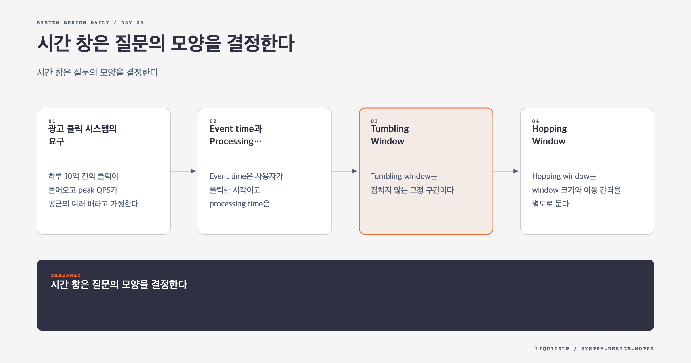

# Day 25. 시간 창은 질문의 모양을 결정한다



광고 클릭은 끝이 없는 stream이다. "광고 A의 클릭 수"를 계산하려면 어느 시간부터 어느 시간까지를 한 결과로 볼지 정해야 한다. Window는 무한한 이벤트를 계산 가능한 유한 구간으로 자르는 규칙이다.

Window 선택은 stream processor의 구현 세부가 아니다. 사용자에게 어떤 숫자를 보여 줄지 정하는 API와 제품 계약이다. 크기, 이동 간격, 시간 기준, 경계 포함 규칙이 달라지면 같은 이벤트에서도 다른 답이 나온다.

## 광고 클릭 시스템의 요구

하루 10억 건의 클릭이 들어오고 peak QPS가 평균의 여러 배라고 가정한다. 대표 질의는 다음과 같다.

- 특정 광고의 최근 Y분 클릭 수
- 매분 직전 M분의 Top N 광고
- 국가, IP 대역, 사용자 유형에 따른 필터

원본 이벤트를 매 query마다 스캔하면 느리고 비싸다. Stream processor가 window별 count와 Top N을 미리 계산해 serving store에 저장한다. 원본은 backfill과 감사에 쓴다.

```text
AdClickEvent
-> message queue
-> map by ad_id
-> window aggregation
-> aggregate queue
-> serving database
```

## Event time과 Processing time

Event time은 사용자가 클릭한 시각이고 processing time은 집계 시스템이 이벤트를 처리한 시각이다. Queue, network, retry 때문에 둘은 달라진다.

과금과 보고에는 event time이 더 맞다. 12:00:59 클릭이 12:01:03에 도착해도 실제 발생 구간은 12:00이다. Processing time으로 집계하면 시스템 지연이 업무 숫자를 바꾼다.

Event time도 완벽하지 않다. Client clock이 틀리거나 악의적으로 조작될 수 있다. Server 수신 시각을 함께 기록하고 지나치게 먼 과거와 미래 timestamp를 검증한다. Event source를 신뢰할 수 있는 server에서 timestamp를 부여하는 방법도 있다.

## Tumbling Window

Tumbling window는 겹치지 않는 고정 구간이다.

```text
[12:00:00, 12:01:00)
[12:01:00, 12:02:00)
[12:02:00, 12:03:00)
```

각 이벤트는 정확히 한 window에 속한다. 광고별 분당 클릭 수처럼 고정 bucket을 만들 때 적합하다. 구현과 저장이 단순하고 여러 작은 bucket을 합쳐 큰 구간을 계산하기 쉽다.

단점은 경계다. 12:00:59와 12:01:01의 클릭은 2초 차이지만 서로 다른 bucket에 들어간다. 사용자가 "지금 직전 1분"을 원한다면 tumbling 결과 하나로는 정확하지 않다.

## Hopping Window

Hopping window는 window 크기와 이동 간격을 별도로 둔다.

```text
size = 5m, hop = 1m
12:00 result: [11:55, 12:00)
12:01 result: [11:56, 12:01)
```

매분 직전 5분의 Top N을 보여 주는 요구에 맞는다. Window가 겹치므로 한 이벤트가 여러 결과에 기여한다.

매 결과마다 5분 원본을 다시 계산할 필요는 없다. 1분 tumbling bucket을 먼저 만들고 최근 5개 bucket을 더한다. 새 bucket이 들어오면 더하고 5분을 벗어난 bucket을 뺀다.

광고별 count를 incremental하게 유지한 뒤 heap으로 Top N을 관리할 수 있다. 여러 shard가 있다면 각 shard가 local Top N을 만들고 reducer가 global Top N을 계산한다. Local 후보 수를 너무 작게 잡으면 global Top N을 놓칠 수 있으므로 오차와 비용을 검토한다.

## Sliding Window

Sliding window는 새 이벤트나 query 시점에 맞춰 경계가 연속적으로 움직인다. 정확한 최근 60초처럼 임의 시점의 구간을 표현할 수 있다.

각 key별 timestamp queue를 유지하고 window 밖 이벤트를 제거하는 방식이 있다. 정확하지만 이벤트 수가 많을수록 상태와 정리 비용이 커진다. 근사 알고리즘이나 작은 bucket 합산으로 비용을 줄일 수 있다.

Hopping과 sliding은 문헌과 제품마다 용어를 조금 다르게 쓰기도 한다. 설계에서는 이름보다 window size, slide interval, trigger 조건을 수치로 말하는 편이 안전하다.

## Session Window

Session window는 고정된 시계 경계가 아니라 활동 사이의 gap으로 묶는다.

```text
same user events with inactivity gap < 30m -> one session
```

광고별 분당 과금에는 맞지 않지만, 한 사용자의 캠페인 유입 후 행동이나 연속 클릭 패턴을 분석할 때 유용하다. Session이 언제 끝날지 미리 알 수 없어 상태를 더 오래 유지해야 한다.

## Window 결과를 언제 내보낼까

Window end가 되었다고 모든 이벤트가 도착한 것은 아니다. Event time 기준 집계는 늦은 이벤트를 기다릴 기준이 필요하다. Trigger는 중간 결과를 언제 내보낼지 정하고, watermark는 어느 시점 이전 이벤트가 대부분 도착했다고 볼지 정한다.

빠른 dashboard에는 중간 결과를 갱신하고, 과금에는 window가 닫힌 후 보정된 결과를 쓸 수 있다. 결과에 `provisional`과 `final` 상태 또는 revision을 두면 사용자가 숫자의 성격을 알 수 있다.

## Dimension별 사전 집계

국가별 count처럼 자주 쓰는 낮은 cardinality dimension은 미리 집계하면 query가 빠르다.

```text
(ad_id, window_start, country) -> count
```

하지만 country, device, user segment, campaign 조합을 모두 만들면 bucket 수가 곱으로 늘어난다. `user_id`처럼 값이 많은 dimension은 사전 집계에 맞지 않는다.

자주 쓰는 정해진 filter만 materialized view로 만들고, 드문 분석은 raw data를 columnar cold storage에서 계산하는 식으로 나눈다.

## Hotspot

광고 ID로 partition하면 인기 광고 하나가 특정 aggregation node에 몰린다. 임시 salt로 한 광고의 이벤트를 여러 subkey에 나눠 local count를 만든 뒤 합산할 수 있다.

```text
(ad_id, shard_0) -> partial count
(ad_id, shard_1) -> partial count
reduce -> ad_id total
```

순서가 중요하지 않은 count이므로 이런 분할이 가능하다. 반면 사용자별 순서가 필요한 상태 처리에는 같은 방법을 바로 적용할 수 없다.

## API 계약

`GET /ads/{id}/count?from=...&to=...` 같은 API는 다음을 명확히 해야 한다.

- Timestamp timezone
- Start와 end의 포함 여부
- 결과 해상도
- 잠정값인지 확정값인지
- Filter 조합과 cardinality 제한
- 늦은 이벤트 반영 시 결과 revision 방식

## 함정 체크

- "최근 5분"만 말하고 계산 주기와 slide interval을 빼먹지 않는다.
- Processing time으로 과금 window를 만들지 않는다.
- Top N을 원본 전체 정렬로 매분 다시 계산하지 않는다.
- 모든 filter 조합을 미리 집계하지 않는다.
- Window 경계와 timezone을 client마다 다르게 해석하게 두지 않는다.

## 오늘의 한 문장

**시간 창은 구현 세부가 아니라, 어떤 이벤트를 같은 답으로 묶을지 정하는 제품 계약이다.**

## 30초 확인 문제

매분 "직전 10분간 클릭이 많은 광고 100개"를 보여 줘야 한다. 어떤 window를 쓰고, 매번 10분 원본을 다시 읽지 않으려면 어떻게 계산하는가?

## 정답과 해설

크기 10분, 이동 간격 1분인 hopping window를 쓴다. 1분 tumbling bucket별 광고 count를 먼저 만들고 최근 10개 bucket을 합친다. 새 bucket을 더하고 만료된 bucket을 빼는 incremental 방식과 shard별 local Top N 후 global reduce를 조합한다.

원문: [Chapter 21: Ad Click Event Aggregation](https://github.com/liquidslr/system-design-notes/tree/main/21.%20Ad%20Click%20Event%20Aggregation)
