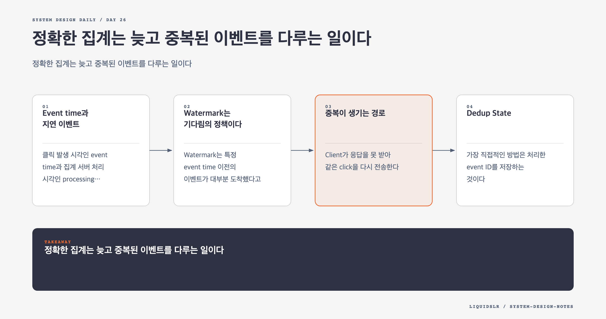

# Day 26. 정확한 집계는 늦고 중복된 이벤트를 다루는 일이다



광고 클릭 집계는 빠른 숫자와 맞는 숫자를 동시에 요구한다. Dashboard는 몇 분 안에 갱신되어야 하고, 과금 결과는 작은 오차도 큰 금액 차이로 이어질 수 있다.

분산 환경에서는 이벤트가 늦게 오고 같은 이벤트가 여러 번 온다. 일부 node는 처리 중 죽고, network timeout 때문에 성공한 요청도 재시도된다. 정확한 집계는 이런 상황을 예외가 아닌 정상 경로로 다룬다.

## Event time과 지연 이벤트

클릭 발생 시각인 event time과 집계 서버 처리 시각인 processing time은 다르다. Queue backlog, network 재전송, offline client 때문에 수분 이상 벌어질 수 있다.

과금 window는 event time을 기준으로 잡는 편이 정확하다. 하지만 window end가 지났다고 모든 이벤트가 도착한 것은 아니다. 결과를 언제 확정할지 기준이 필요하다.

## Watermark는 기다림의 정책이다

Watermark는 특정 event time 이전의 이벤트가 대부분 도착했다고 판단하는 기준이다.

```text
window: [12:00, 12:01)
allowed lateness: 2m
finalize around processing time 12:03
```

2분을 기다리면 12:03까지 들어온 12:00대 클릭을 반영한다. Watermark가 짧을수록 결과는 빠르지만 누락이 늘고, 길수록 정확도는 높아지지만 상태와 latency가 늘어난다.

값은 실제 지연 분포로 정한다. Region, client 종류, network 상태별 p95와 p99 event delay를 측정한다. 모든 이벤트를 기다리는 완벽한 watermark는 없다. 하루 뒤 도착한 이벤트까지 실시간 상태에 붙잡아 둘 수는 없다.

Watermark 뒤에 온 이벤트는 버리지 않고 late-event stream에 기록할 수 있다. 해당 window의 revision을 올려 보정하거나 일 마감 batch reconciliation에 반영한다.

## 중복이 생기는 경로

- Client가 응답을 못 받아 같은 click을 다시 전송한다.
- Producer가 broker ACK를 못 받아 재시도한다.
- Consumer가 결과를 저장한 뒤 offset commit 전에 죽는다.
- Backfill job이 실시간 구간과 겹친다.

At-least-once 전달을 사용하면 이런 중복은 자연스럽다. Click event에 안정적인 `event_id`가 필요하다. 재시도할 때 새 ID를 만들면 dedup할 수 없다.

## Dedup State

가장 직접적인 방법은 처리한 event ID를 저장하는 것이다.

```text
if event_id exists:
    skip
else:
    update aggregate
    save event_id
```

조회와 aggregate update, event ID 저장이 원자적이어야 한다. 따로 수행하면 둘 사이 장애가 다시 중복이나 누락을 만든다.

하루 10억 ID를 영원히 hot storage에 둘 수는 없다. TTL은 다음을 포함해야 한다.

- Producer 최대 retry 기간
- Consumer retry와 DLQ 재투입 기간
- 허용한 late-event 범위
- Backfill이 실시간 경로와 겹칠 수 있는 기간

Bloom filter는 메모리를 줄이지만 false positive 때문에 정상 event를 중복으로 오판할 수 있다. 과금 최종 원장에서 사용하려면 허용 오차와 원본 재검증 경로가 필요하다.

## 멱등 집계 결과

모든 event ID를 별도 저장하는 대신 결과 write를 멱등하게 만들 수 있다. Aggregate key를 고정한다.

```text
key = (ad_id, window_start, filter_id)
value = count, source_offset, revision
```

같은 source offset이나 낮은 revision의 write를 거부하면 재시도와 out-of-order update가 과거 값으로 되돌리는 일을 막을 수 있다.

단순히 `count = count + 1`을 다시 실행하면 멱등하지 않다. 특정 input range에서 계산한 전체 count를 `revision`과 함께 overwrite하거나, source offset range별 partial result를 한 번만 등록하는 방법을 쓸 수 있다.

## Offset과 결과의 원자성

다음 흐름에서 4번이 실패하면 offset 100을 다시 처리한다.

```text
1. offset 100 읽기
2. 메모리 count 갱신
3. 결과 저장
4. offset commit
```

Queue와 sink가 같은 transaction을 지원하면 result와 offset을 함께 commit할 수 있다. 외부 database라면 source offset을 결과 table에 기록하고 조건부 upsert한다. "Exactly-once"라는 제품 기능 이름보다 queue, processor, sink 중 어디까지 원자적인지 확인해야 한다.

## Raw Data와 Aggregate Data

Aggregate data는 빠른 query에 적합하지만 계산 버그를 복구할 근거가 없다. Raw click event를 object storage나 write-heavy store에 보관한다.

```text
raw events -> immutable storage
realtime stream -> aggregate store
recalculation job -> aggregate store with higher revision
```

버그를 발견하면 전용 recalculation job이 raw data를 읽는다. 실시간 processor와 resource를 분리해 현재 처리를 방해하지 않게 한다. Backfill result는 동일 key와 더 높은 revision으로 write하고, 오래된 job이 최신 result를 덮지 못하게 한다.

## Reconciliation

하루 마감에 raw data를 batch로 집계하고 realtime result와 비교한다. 차이가 threshold를 넘으면 광고와 window를 다시 계산한다.

Reconciliation은 단순 장애 복구가 아니라 correctness monitoring이다. 다음을 추적한다.

- 실시간 집계와 batch 집계의 차이
- Late-event 비율과 지연 분포
- Dedup으로 제거한 event 수
- Consumer lag와 oldest event age
- Backfill이 수정한 row 수
- Aggregate revision 충돌 수

## Fault Tolerance와 Snapshot

Top N 같은 stateful aggregation은 메모리에 큰 상태를 가진다. Node가 죽었을 때 queue offset만 있으면 처음부터 다시 계산해야 할 수 있다.

주기적으로 aggregation state와 그 state가 반영한 source offset을 같은 checkpoint에 저장한다. 새 node는 최신 checkpoint를 읽고 다음 offset부터 재생한다. State와 offset이 다른 시점이면 일부 event를 두 번 더하거나 놓친다.

Checkpoint를 자주 만들면 복구가 빠르지만 정상 처리 I/O가 늘어난다. Recovery time 목표에 맞춰 주기를 정한다.

## Hotspot 처리

인기 광고 하나가 `ad_id` partition에 트래픽을 몰 수 있다. Count는 결합 가능한 연산이므로 하나의 광고를 임시 shard로 나눠 partial count를 만든 뒤 합산할 수 있다.

```text
(ad_123, shard_0) -> 401
(ad_123, shard_1) -> 387
(ad_123, shard_2) -> 420
reduce -> 1,208
```

Top N도 각 node의 local 후보를 reducer가 합칠 수 있다. Resource manager가 hotspot key를 감지하고 shard 수를 늘리는 방식도 가능하다.

## 함정 체크

- Watermark를 길게 잡으면 모든 late event를 처리한다고 가정하지 않는다.
- Dedup TTL을 watermark만 보고 정하지 않는다.
- Queue transaction이 외부 database까지 exactly-once를 보장한다고 말하지 않는다.
- Backfill과 realtime write의 revision 순서를 관리한다.
- Snapshot과 source offset을 같은 기준으로 저장한다.

## 오늘의 한 문장

**정확한 stream 집계는 중복을 멱등하게 흡수하고, 늦은 이벤트를 보정하며, 원본으로 결과를 다시 만들 수 있어야 한다.**

## 30초 확인 문제

허용 지연 5분, 재시도 최대 기간 24시간인 시스템에서 dedup ID를 10분만 보관하면 어떤 문제가 생기는가?

## 정답과 해설

10분 뒤 재전송된 같은 이벤트를 새 이벤트로 보고 다시 집계한다. Dedup 보존 기간은 허용 지연뿐 아니라 생산자와 소비자의 최대 재시도 기간을 포함해야 한다. 저장 비용이 크다면 계층별 dedup state와 멱등 upsert를 함께 쓰고 최종 결과는 reconciliation으로 검증한다.

원문: [Chapter 21: Ad Click Event Aggregation](https://github.com/liquidslr/system-design-notes/tree/main/21.%20Ad%20Click%20Event%20Aggregation)
