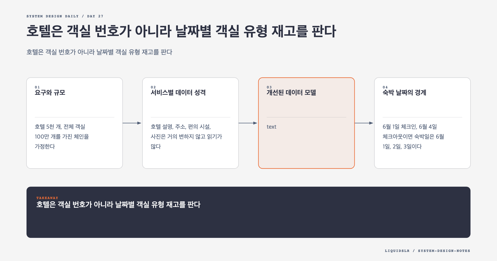

# Day 27. 호텔은 객실 번호가 아니라 날짜별 객실 유형 재고를 판다



호텔 예약 모델의 첫 질문은 "무엇을 예약하는가"다. 고객은 보통 1203호를 고르지 않는다. 디럭스룸이라는 객실 유형과 날짜 범위를 고른다. 실제 객실 번호는 체크인 전후에 배정된다.

따라서 예약 시스템의 핵심 재고는 객실 한 행이 아니라 `(hotel_id, room_type_id, date)`별 판매 가능 수량이다. 이 단위를 잘못 잡으면 가용성 검색, 여러 박 예약, 취소, overbooking이 모두 복잡해진다.

## 요구와 규모

호텔 5천 개, 전체 객실 100만 개를 가진 체인을 가정한다. 평균 점유율 70%, 평균 숙박 3일이면 평균 예약 TPS는 높지 않다. 하지만 성수기 특정 호텔과 객실 유형에는 요청이 동시에 몰린다.

이 시스템의 난점은 전체 QPS보다 hotspot과 일관성이다. 같은 재고 행에 여러 예약이 경쟁할 때 판매 한도를 넘지 않아야 한다.

핵심 기능은 다음과 같다.

- 호텔과 객실 유형 조회
- 날짜 범위의 가격과 가용 수량 조회
- 여러 객실 예약과 취소
- 결제
- 호텔별 overbooking 정책
- 운영자용 재고와 예약 관리

## 서비스별 데이터 성격

호텔 설명, 주소, 편의 시설, 사진은 거의 변하지 않고 읽기가 많다. CDN과 cache에 오래 둘 수 있다.

객실 가격은 날짜, 요일, 수요, 남은 재고에 따라 바뀐다. Rate Service가 날짜별 quote를 만든다.

재고와 예약은 함께 바뀌어야 한다. Reservation Service가 둘을 같은 database와 transaction 경계에서 처리하면 단순하다.

Payment Service는 외부 결제와 예약 상태 전이를 다룬다. 결제 호출이 느리므로 재고 row lock을 잡은 채 동기 호출하지 않는다.

Microservice 원칙만 보고 재고와 예약을 별도 database로 나누면 분산 transaction과 보상 로직이 필요해진다. 함께 지켜야 하는 불변식이 먼저고 service 수는 그다음이다.

## 개선된 데이터 모델

```text
hotel
- hotel_id
- name
- address

room_type
- room_type_id
- hotel_id
- name
- capacity

room_type_rate
- hotel_id
- room_type_id
- date
- price
- currency

room_type_inventory
- hotel_id
- room_type_id
- date
- total_inventory
- total_reserved
- sell_limit

reservation
- reservation_id
- user_id
- hotel_id
- room_type_id
- start_date
- end_date
- room_count
- status
- quoted_total
```

`room_type_inventory`는 호텔, 객실 유형, 날짜마다 한 행을 둔다. `total_inventory`는 물리 객실 수에서 공사나 운영 사유로 판매 중지한 객실을 뺀 값이다. `sell_limit`은 overbooking 정책을 반영한 실제 판매 상한이다.

행은 매일 batch job으로 향후 일정 기간까지 미리 만들 수 있다. 호텔 5천 개, 호텔당 객실 유형 20개, 2년치를 만들면 약 7천3백만 행이다. 단일 관계형 cluster로 시작할 수 있고 read replica로 조회를 분산할 수 있는 규모다.

## 숙박 날짜의 경계

6월 1일 체크인, 6월 4일 체크아웃이면 숙박일은 6월 1일, 2일, 3일이다. 체크아웃 날짜 재고는 차감하지 않는다.

```sql
SELECT date, total_inventory, total_reserved, sell_limit
FROM room_type_inventory
WHERE hotel_id = :hotel_id
  AND room_type_id = :room_type_id
  AND date >= :start_date
  AND date < :end_date
ORDER BY date;
```

각 날짜에 요청 객실 수를 더해도 `sell_limit` 이하인지 확인한다. 한 날짜라도 부족하면 예약 전체를 실패시킨다. 일부 날짜만 예약하는 결과를 남기면 안 된다.

## Overbooking

호텔은 취소와 no-show를 예상해 물리 객실보다 더 팔 수 있다.

```text
sell_limit = floor(total_inventory * 1.10)
```

10%라는 숫자를 모든 호텔에 고정할 필요는 없다. Hotel, room type, season, 행사에 따라 정책이 다를 수 있다. Model에는 정책 값과 version을 남겨 어떤 기준으로 예약을 받았는지 감사할 수 있게 한다.

Overbooking은 재고 부족을 기술로 숨기는 기능이 아니다. 판매 수익과 고객 보상 비용의 trade-off다. 운영자가 한도를 조정할 권한과 audit log가 필요하다.

## 가격 Snapshot

현재 `room_type_rate`만 참조하면 가격이 바뀐 뒤 과거 예약 금액을 재현할 수 없다. Reservation에 날짜별 적용 가격, 세금, 할인, 통화, quote version을 snapshot으로 저장한다.

가격 조회와 예약 확정 사이에는 시간이 흐른다. Quote에 만료 시각을 넣고 확정 시 다시 검증한다. 사용자가 본 가격이 만료됐다면 새 가격을 명확히 보여 주고 재동의를 받는다.

## 관계형 Database를 선택하는 이유

예약과 재고에는 transaction, unique constraint, conditional update가 중요하다. 데이터 구조도 명확하고 join과 운영 query가 필요하다. 평균 write TPS가 낮고 읽기가 많다는 점도 관계형 database에 맞는다.

NoSQL을 쓰지 못하는 것은 아니다. 다만 여러 날짜 재고를 원자적으로 차감하고 reservation과 함께 일관성을 지키는 모델을 별도로 설계해야 한다. 필요가 증명되지 않았다면 ACID database가 단순하다.

## 검색과 확정의 일관성

가용성 검색은 read replica나 Redis cache를 사용할 수 있다. Cache key는 다음처럼 만들 수 있다.

```text
hotel_id:room_type_id:date -> available_count
```

CDC로 database 변경을 cache에 반영하면 잠시 오래된 값이 보일 수 있다. 사용자가 선택 화면에서 객실을 봤지만 마지막 확인에서 품절될 수 있다.

이 불편을 완전히 없애기 어렵다. 중요한 원칙은 cache를 확정 판단에 쓰지 않는 것이다. Reservation transaction이 source of truth에서 재고를 다시 확인하고 잘못된 판매를 막아야 한다.

## Sharding

한 database를 넘는 규모가 되면 `hotel_id`로 shard할 수 있다. 주요 query가 hotel ID를 포함하고, 같은 호텔의 inventory와 reservation을 한 shard에 모을 수 있기 때문이다.

```text
shard = hash(hotel_id) % shard_count
```

유명 호텔은 특정 shard에 hotspot을 만들 수 있다. Virtual shard와 재배치 계획, 호텔별 rate limit을 함께 고려한다. 과거 예약은 cold storage로 옮겨 operational set을 줄일 수 있다.

## 실패 모드

- 특정 객실 번호를 예약 모델의 중심으로 잡아 객실 배정 변경이 어렵다.
- 체크아웃 날짜까지 재고를 차감한다.
- 여러 숙박일 중 일부만 갱신한다.
- 취소 시 모든 날짜 재고를 복구하지 않는다.
- 가격을 snapshot하지 않아 과거 청구 근거를 잃는다.
- Cache 가용 수량을 최종 확정값으로 믿는다.

## 함정 체크

- 평균 TPS와 hotspot 동시성을 구분한다.
- 물리 객실 수, 판매 가능 수량, overbooking 한도를 따로 모델링한다.
- 예약과 재고를 같은 강한 일관성 경계에 둔다.
- 객실 검색 결과가 예약 보장이 아님을 API와 UI에 반영한다.
- 취소와 운영자 수정도 같은 재고 불변식을 지키게 한다.

## 오늘의 한 문장

**호텔 예약의 재고 단위는 객실 번호가 아니라 호텔, 객실 유형, 숙박 날짜의 조합이다.**

## 30초 확인 문제

6월 1일 체크인, 6월 4일 체크아웃으로 디럭스룸 2개를 예약한다. 어떤 재고 행을 확인하고 차감해야 하는가?

## 정답과 해설

6월 1일, 2일, 3일의 `(hotel_id, deluxe_room_type_id, date)` 행을 모두 확인하고 각 행의 `total_reserved`를 2씩 늘린다. 6월 4일은 체크아웃 날짜이므로 차감하지 않는다. 세 날짜 중 하나라도 판매 한도를 넘으면 전체 transaction을 rollback한다.

원문: [Chapter 22: Hotel Reservation System](https://github.com/liquidslr/system-design-notes/tree/main/22.%20Hotel%20Reservation%20System)
