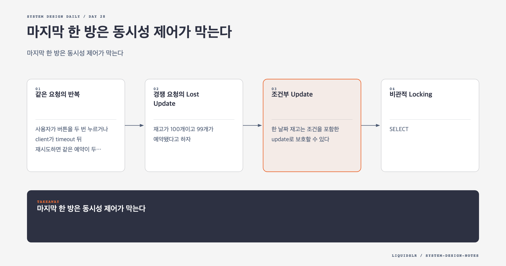

# Day 28. 마지막 한 방은 동시성 제어가 막는다



예약 시스템에서 재고 조회는 안내이고 예약 transaction이 확정이다. 남은 객실이 하나일 때 두 사용자가 동시에 같은 값을 읽을 수 있다. 둘 다 "재고 있음"을 봤다는 사실은 둘 다 예약할 수 있다는 뜻이 아니다.

동시성 문제는 두 가지로 나뉜다. 같은 사용자가 같은 요청을 반복하는 문제와 서로 다른 사용자가 같은 재고를 경쟁하는 문제다. 첫 문제는 idempotency, 둘째 문제는 atomic update와 locking으로 푼다.

## 같은 요청의 반복

사용자가 버튼을 두 번 누르거나 client가 timeout 뒤 재시도하면 같은 예약이 두 번 들어올 수 있다. Frontend에서 버튼을 비활성화해도 network retry와 직접 API 호출을 막지 못한다.

예약 시도마다 `reservation_id`를 만들고 같은 시도에는 같은 값을 보낸다. Database에 unique constraint를 둔다.

```sql
ALTER TABLE reservation
ADD CONSTRAINT uq_reservation_id UNIQUE (reservation_id);
```

두 번째 요청은 오류만 반환하지 말고 첫 처리 상태와 응답을 돌려준다. Client는 timeout 뒤에도 예약과 결제 결과를 안전하게 확인할 수 있다.

Idempotency record에는 request hash를 저장할 수 있다. 같은 key로 다른 날짜나 객실을 보내면 거부해야 한다. Key만 같다고 서로 다른 요청을 같은 예약으로 처리하면 안 된다.

## 경쟁 요청의 Lost Update

재고가 100개이고 99개가 예약됐다고 하자. 두 transaction이 동시에 99를 읽는다.

```text
T1 reads 99
T2 reads 99
T1 writes 100
T2 writes 100 or increments again
```

애플리케이션에서 읽고 조건을 검사한 뒤 나중에 update하면 읽은 값이 이미 오래됐을 수 있다. Check와 write를 database의 원자적 연산으로 묶어야 한다.

## 조건부 Update

한 날짜 재고는 조건을 포함한 update로 보호할 수 있다.

```sql
UPDATE room_type_inventory
SET total_reserved = total_reserved + :count
WHERE hotel_id = :hotel_id
  AND room_type_id = :room_type_id
  AND date = :date
  AND total_reserved + :count <= sell_limit;
```

Affected row가 0이면 재고 부족이나 동시성 충돌이다. 여러 날짜를 예약하면 모든 날짜 update를 한 transaction에서 실행하고 하나라도 실패할 때 rollback한다.

날짜 update 순서를 항상 오름차순으로 통일하면 lock 순서가 달라 생기는 deadlock 가능성을 줄일 수 있다.

## 비관적 Locking

`SELECT ... FOR UPDATE`는 읽은 row를 transaction 종료까지 잠근다.

```sql
BEGIN;
SELECT *
FROM room_type_inventory
WHERE hotel_id = :hotel_id
  AND room_type_id = :room_type_id
  AND date >= :start_date
  AND date < :end_date
ORDER BY date
FOR UPDATE;

COMMIT;
```

충돌이 잦고 transaction이 짧다면 이해하기 쉽고 확실하다. 다른 예약은 lock을 기다린다.

단점은 lock wait와 deadlock이다. 숙박 기간이 길수록 많은 row를 잠근다. Lock을 잡은 채 payment API를 호출하면 외부 지연 동안 인기 호텔의 모든 예약이 줄을 선다. Transaction 안에는 database 연산만 짧게 둔다.

## 낙관적 Locking

재고 row에 version을 두고 읽은 version이 아직 같을 때만 update한다.

```sql
UPDATE room_type_inventory
SET total_reserved = total_reserved + :count,
    version = version + 1
WHERE inventory_id = :inventory_id
  AND version = :expected_version
  AND total_reserved + :count <= sell_limit;
```

충돌이 적으면 lock 대기 없이 빠르다. 충돌하면 최신 값을 읽고 다시 시도한다. 인기 행사처럼 경합이 높으면 rollback과 retry가 늘어 성능이 나빠진다.

Retry에는 최대 횟수, backoff, jitter를 둔다. 무한 즉시 retry는 database에 더 큰 부하를 만든다.

## Database Constraint

```sql
CHECK (total_reserved <= sell_limit)
```

Constraint는 다른 code path나 운영 도구가 잘못된 값을 써도 불변식을 지키는 마지막 안전망이다. Application 검증을 대체하기보다 함께 쓴다.

Database 종류와 version에 따라 constraint 지원과 동작이 다르므로 실제 enforcement를 확인한다. Migration과 schema review로 version control한다.

## 결제 때문에 Transaction을 늘리지 않는다

재고 확인, 외부 결제, 예약 확정을 하나의 database lock 안에서 처리할 수 없다. 결제는 느리고 실패 방식도 다양하다.

재고를 짧은 transaction으로 hold하고 결제 후 확정하는 상태 machine을 쓸 수 있다.

```text
PENDING -> HELD -> CONFIRMED
                -> PAYMENT_FAILED
                -> EXPIRED
                -> CANCELLED
```

Hold에는 만료 시각을 둔다. Expiry worker는 만료된 hold를 찾아 재고를 되돌린다. 같은 hold를 여러 번 해제해도 한 번만 반영되게 멱등해야 한다.

결제는 성공했지만 예약 확정 event가 늦을 수 있다. Payment status와 reservation status를 비교하는 reconciliation job이 필요하다. 사용자가 결과를 모를 때 idempotency key로 상태를 다시 조회할 수 있어야 한다.

## Saga와 보상

Payment와 Reservation이 별도 service와 database를 가진다면 한 ACID transaction으로 묶기 어렵다. Saga는 local transaction과 compensating action을 연결한다.

```text
create hold
-> charge payment
-> confirm reservation

failure after payment
-> refund payment
-> release hold
```

보상도 실패할 수 있으므로 재시도와 수동 처리 queue가 필요하다. Two-phase commit은 강한 atomicity를 제공하지만 participant 하나가 느릴 때 전체가 block될 수 있다.

분산 일관성 기법을 쓰기 전에 reservation과 inventory를 같은 service에 둘 수 없는지 검토한다. 복잡성을 피하는 것도 설계다.

## Cache의 역할

Redis는 가용성 검색을 빠르게 한다. CDC로 source database 변경을 반영하면 cache가 잠시 stale할 수 있다.

Cache에 객실이 있다고 보여도 최종 예약 transaction은 database에서 다시 확인한다. Cache miss와 stale data는 사용자 경험 문제지만, source database의 constraint가 overselling을 막으면 금전적 불일치는 피할 수 있다.

Cache에서 먼저 차감하고 database에 나중에 쓰는 모델은 cache 장애, duplicate write, 복구 순서 문제를 추가한다. 필요한 처리량을 source database가 감당하지 못한다는 증거가 있을 때 검토한다.

## 운영 지표

- Inventory update conflict와 retry 비율
- Row lock wait와 deadlock 수
- Hold 만료 수와 평균 hold 시간
- Payment 성공 후 reservation 미확정 수
- Idempotency duplicate 요청 수
- Cache와 source inventory 차이

Conflict가 늘면 단순히 application instance를 늘리는 것으로 해결되지 않는다. 같은 database row 경합이므로 key 분포와 예약 정책을 봐야 한다.

## 함정 체크

- Frontend 버튼 비활성화를 중복 방지의 전부로 보지 않는다.
- `SELECT` 결과가 `UPDATE`까지 유효하다고 가정하지 않는다.
- 외부 API를 row lock 안에서 호출하지 않는다.
- 여러 날짜 update를 하나의 transaction으로 묶는다.
- Retry와 보상 작업도 멱등하게 만든다.

## 오늘의 한 문장

**예약 시스템은 중복 요청을 멱등하게 만들고, 재고 불변식을 database의 원자적 갱신으로 지켜야 한다.**

## 30초 확인 문제

3박 예약에서 첫째 날과 둘째 날 재고 갱신은 성공했지만 셋째 날은 품절로 실패했다. 어떤 처리가 필요하며 결제 호출은 언제 해야 하는가?

## 정답과 해설

세 날짜 update를 한 database transaction으로 묶어 전체 rollback한다. 부분 성공을 남기면 실제 예약 없이 재고만 줄어든다. 결제를 위해 row lock을 오래 잡지 말고 짧은 transaction으로 inventory hold를 만든 뒤 결제를 호출하고 성공 시 확정한다.

원문: [Chapter 22: Hotel Reservation System](https://github.com/liquidslr/system-design-notes/tree/main/22.%20Hotel%20Reservation%20System)
