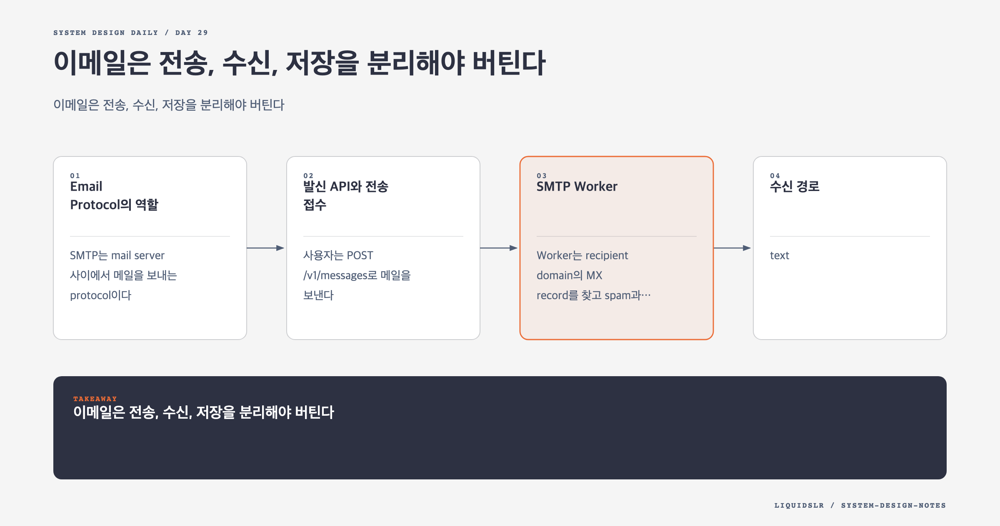

# Day 29. 이메일은 전송, 수신, 저장을 분리해야 버틴다



사용자가 보내기 버튼을 누른 순간부터 상대가 메일을 읽기까지 여러 독립 단계가 있다. 발신 요청 접수, 첨부 저장, 스팸 검사, MX 조회, SMTP 전송, 수신 정책 검사, mailbox 저장, 검색 색인, 실시간 알림이 이어진다.

이 단계를 한 동기 요청으로 묶으면 상대 서버와 검색 cluster의 장애가 발신 API까지 전파된다. 분산 이메일의 핵심은 메일을 잃지 않는 내구성 경계를 정하고, 그 이후 작업을 queue로 분리하는 것이다.

## Email Protocol의 역할

SMTP는 mail server 사이에서 메일을 보내는 protocol이다. 발신 server는 DNS의 MX record를 조회해 수신 domain의 mail server를 찾는다.

IMAP과 POP는 client가 server의 메일을 가져오는 protocol이다. POP는 전통적으로 local download 중심이고, IMAP은 server 상태와 folder를 동기화한다.

Webmail은 풍부한 UI와 계정 기능을 위해 HTTPS API를 쓴다. 새 메일 notification은 WebSocket을 사용하고 오래된 client에는 long polling을 제공할 수 있다.

## 발신 API와 전송 접수

사용자는 `POST /v1/messages`로 메일을 보낸다. Web server는 다음을 빠르게 검사한다.

- 사용자 인증과 발신 권한
- 수신자 형식과 수신자 수
- 본문과 첨부 크기
- 계정별 rate limit
- 기본 spam policy

큰 첨부는 object storage에 먼저 저장하고 message에는 object key, size, checksum을 넣는다. Queue payload에 binary를 직접 넣으면 broker storage와 network 비용이 커진다.

검증이 끝난 message를 durable outgoing queue에 기록한다. Queue write 성공 후 API는 "전송 접수"를 반환한다. 이는 상대 mailbox 도착이 아니다.

```text
Webmail
-> Load Balancer
-> Web Server
-> Outgoing Queue
-> SMTP Worker
-> Recipient Mail Server
```

## SMTP Worker

Worker는 recipient domain의 MX record를 찾고 spam과 virus policy를 적용한 뒤 SMTP로 전달한다. Destination별 connection pool과 동시성 제한을 둘 수 있다.

SMTP 응답은 일시 오류와 영구 오류를 구분한다. 일시 오류는 exponential backoff로 재시도하고 영구 오류는 bounce 처리한다. 모든 실패를 같은 속도로 재시도하면 응답하지 않는 domain 하나가 worker와 queue를 점유한다.

같은 provider 내부 recipient라면 외부 SMTP를 거치지 않고 내부 delivery pipeline으로 보낼 수 있다. 다만 spam 검사, audit, quota를 건너뛰지 않는다.

발신자의 Sent folder 저장도 멱등해야 한다. API retry와 SMTP retry가 같은 message를 여러 번 만들지 않도록 stable message ID를 쓴다.

## 수신 경로

```text
Internet SMTP
-> SMTP Load Balancer
-> SMTP Server
-> Incoming Queue
-> Mail Processing Worker
-> Metadata Store
-> Search Index
-> Realtime Notification
```

SMTP Server는 우리 domain인지, recipient가 존재하는지, size와 기본 정책을 통과하는지 검사한다. 수락하기 전에 message를 재처리 가능한 durable storage나 queue에 넣어야 한다.

상대 server에 성공을 응답한 뒤 local memory에만 있던 message를 잃으면 발신자는 재시도하지 않는다. 반대로 검색 색인과 WebSocket notification까지 동기로 기다리면 부가 기능 장애가 SMTP 수신을 막는다.

Mail Processing Worker는 MIME을 parsing하고 header를 정규화하며 attachment와 URL을 검사한다. Metadata와 attachment reference를 저장한 뒤 search indexing과 notification event를 비동기로 발행한다.

## Metadata Store

Email metadata의 특징은 다음과 같다.

- Header는 작고 자주 읽는다.
- Body는 크기가 다양하고 보통 최근 메일을 더 자주 읽는다.
- Folder, read 상태, 삭제 같은 작업은 한 사용자 mailbox 안에서 일어난다.
- Data loss를 허용할 수 없다.

`user_id`를 partition key로 쓰면 한 사용자의 mailbox query를 한 shard에서 처리하기 쉽다. `email_id`에 time ordering이 있으면 folder 목록을 최신순으로 읽기 좋다.

```text
partition key: user_id
clustering key: folder_id, received_at, email_id
```

한 사용자의 mailbox가 매우 커지는 경우 partition size를 제한하기 위해 month나 bucket을 추가할 수 있다.

## Attachment Store

Attachment는 object storage에 둔다. Metadata DB에는 object key, file name, MIME type, size, checksum을 저장한다.

Object는 immutable하게 다루면 cache와 복제가 단순해진다. Upload가 끝나지 않은 attachment를 참조하는 message가 전송되지 않게 상태를 검증한다.

같은 파일의 deduplication은 저장 비용을 줄일 수 있지만 보안과 삭제 의미가 복잡해진다. 한 사용자가 삭제했을 때 다른 사용자의 참조가 남아 있는지, checksum 기반 추측으로 정보가 새지 않는지 고려해야 한다.

## 사용자별 Mailbox Entry

같은 message를 여러 recipient가 받아도 folder와 read 상태는 사용자별이다. 공통 message content와 사용자별 mailbox entry를 분리할 수 있다.

```text
message_content(message_id, body_ref, attachment_refs)
mailbox_entry(user_id, message_id, folder, is_read, received_at)
```

이 모델은 content 복제를 줄이지만 reference 관리가 필요하다. 단순성을 우선하면 recipient마다 metadata를 복제할 수도 있다. Storage 비용과 삭제 요구를 측정한 뒤 선택한다.

## Realtime Notification과 Offline Client

Online user에게는 WebSocket으로 새 메일 event를 보낸다. Notification 실패는 메일 저장 실패가 아니다. Client는 reconnect 후 HTTP API로 마지막 sync token 이후 변경을 다시 가져와야 한다.

WebSocket message를 유일한 source로 쓰면 disconnect 중 변경을 잃는다. Notification은 "새 데이터가 있으니 동기화하라"는 hint로 다루고 원본은 mailbox API에 둔다.

## Queue 운영

Outgoing queue가 커지는 원인은 recipient server 장애와 worker 부족으로 나뉜다. Queue length 하나만 보면 구분할 수 없다.

- Destination domain별 SMTP response code
- Retry count와 next attempt time
- Oldest queued message age
- Worker 처리율과 connection 사용량
- Incoming에서 metadata commit까지 latency
- Bounce와 permanent failure 비율

특정 domain의 장애가 전체 전송을 막지 않게 destination별 rate limit과 circuit breaker를 둔다. Priority queue로 password reset 같은 거래 메일을 bulk mail과 분리할 수도 있다.

## 일관성과 복구

Metadata 저장 후 search indexing event 발행이 실패하면 메일은 있지만 검색되지 않는다. Transactional outbox로 metadata와 index event를 같은 local transaction에 기록할 수 있다.

Indexer와 notifier는 at-least-once event를 멱등하게 처리한다. Search index와 cache는 원본에서 rebuild할 수 있어야 한다.

## 함정 체크

- API 접수, SMTP 전달, inbox placement를 같은 "성공"으로 부르지 않는다.
- Attachment binary를 queue와 metadata DB에 반복 저장하지 않는다.
- Search와 notification 실패를 핵심 mail 저장 실패로 확대하지 않는다.
- SMTP 성공 응답 전에 durable copy를 확보한다.
- WebSocket event를 mailbox 원본으로 쓰지 않는다.

## 오늘의 한 문장

**분산 이메일은 메일을 안전하게 접수하는 경로와 전송, 저장, 색인, 알림 경로를 queue로 분리해야 버틴다.**

## 30초 확인 문제

수신 메일 metadata 저장은 성공했지만 search indexing과 WebSocket notification이 실패했다. SMTP 수신 전체를 실패시켜야 하는가?

## 정답과 해설

메일 원본과 재처리 event가 durable하게 저장됐다면 SMTP 수신은 성공 처리할 수 있다. Search와 notification은 비동기 consumer가 재시도한다. Client는 HTTP sync로 새 메일을 다시 찾을 수 있고 index는 잠시 늦을 수 있다.

원문: [Chapter 23: Distributed Email Service](https://github.com/liquidslr/system-design-notes/tree/main/23.%20Distributed%20Email%20Service)
