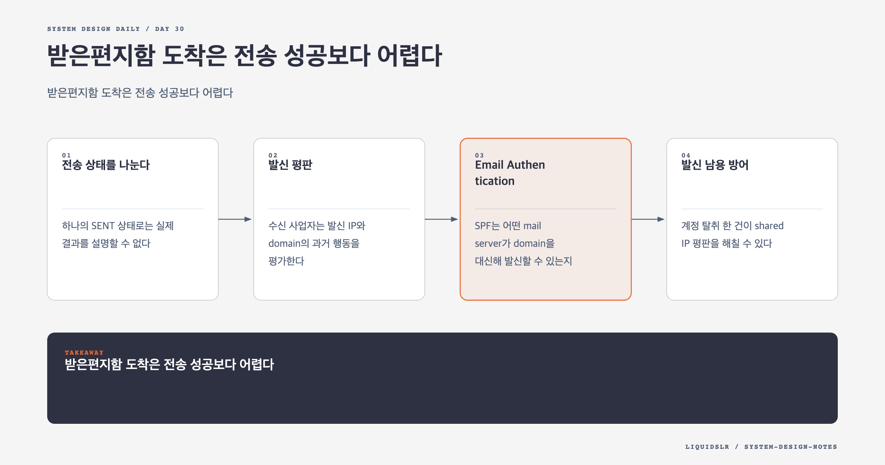

# Day 30. 받은편지함 도착은 전송 성공보다 어렵다



SMTP server를 띄우고 메일을 보내는 일은 어렵지 않다. 정상 메일을 꾸준히 받은편지함에 도착시키는 일은 어렵다. 수신 사업자는 발신 IP와 domain의 평판, 인증, 내용, 사용자 반응을 함께 본다.

이메일 service는 network 전달 성공만 측정하면 안 된다. 발신 평판과 남용 방어, feedback 처리, 사용자별 검색 index까지 운영해야 한다.

## 전송 상태를 나눈다

하나의 `SENT` 상태로는 실제 결과를 설명할 수 없다.

```text
ACCEPTED -> QUEUED -> SMTP_DELIVERED
                    -> TEMP_FAILED -> RETRYING
                    -> BOUNCED
SMTP_DELIVERED -> INBOX or SPAM or later BOUNCE
```

**Accepted**는 우리 service가 요청을 durable하게 접수했다는 뜻이다. **SMTP delivered**는 상대 server가 메시지를 받았다는 뜻이다. **Inbox placement**는 상대 service가 받은편지함에 배치했다는 뜻이다.

SMTP `250 OK`는 보통 inbox placement를 보장하지 않는다. 이후 spam folder로 분류되거나 asynchronous bounce가 올 수 있다. 사용자 UI와 운영 dashboard에서 이 상태를 구분한다.

## 발신 평판

수신 사업자는 발신 IP와 domain의 과거 행동을 평가한다. 새 IP가 갑자기 대량 전송하면 spammer와 구분하기 어렵다.

새 IP는 2주에서 6주 동안 전송량을 서서히 늘리는 warm-up이 필요하다. 초기에는 engagement가 높은 정상 수신자에게 적은 양을 보내고 bounce와 complaint를 관찰한다.

Dedicated IP는 다른 발신자의 평판과 분리하지만 비용과 운영이 늘어난다. 모든 tenant에 dedicated IP를 주기보다 다음 pool을 나눌 수 있다.

- 비밀번호 재설정, 영수증 같은 transactional pool
- Marketing campaign pool
- 신규 또는 위험 tenant pool
- 큰 고객의 dedicated pool

한 pool의 complaint가 다른 중요한 메일에 번지지 않게 격리한다.

## Email Authentication

SPF는 어떤 mail server가 domain을 대신해 발신할 수 있는지 DNS에 선언한다.

DKIM은 발신 domain의 private key로 header와 body 일부에 서명한다. 수신 server는 DNS의 public key로 검증한다.

DMARC는 SPF와 DKIM 결과가 사용자가 보는 From domain과 정렬되는지 확인하고 실패 메시지를 어떻게 처리할지 정책을 제공한다. Aggregate report로 인증 실패 현황도 받을 수 있다.

인증은 발신 권한과 변조 여부를 증명하지만 좋은 내용을 보장하지 않는다. SPF, DKIM, DMARC가 모두 통과해도 complaint가 많고 평판이 나쁘면 spam folder로 간다.

Key rotation은 순서를 지켜야 한다. 새 public key를 DNS에 먼저 배포하고 전파를 기다린 뒤 signer를 전환한다. 이전 key는 기존 mail 검증 기간 동안 유지한다.

## 발신 남용 방어

계정 탈취 한 건이 shared IP 평판을 해칠 수 있다. 발신 path에 risk control을 둔다.

- User와 tenant별 rate limit
- 새 recipient 비율과 짧은 시간의 recipient 증가
- Hard bounce와 complaint 급증
- 비정상 login 위치와 device
- URL과 attachment 위험도
- 동일 content의 대량 전송

위험 계정은 속도를 줄이거나 별도 pool로 격리하고 추가 인증을 요구한다. 정상 bulk sender와 spammer를 단순 건수만으로 구분하기 어려우므로 consent와 unsubscribe 처리도 본다.

## Feedback Loop

ISP feedback loop는 사용자가 spam으로 신고한 정보를 발신자에게 돌려준다. Complaint recipient에게 계속 보내면 평판이 더 나빠진다.

Hard bounce 주소도 suppression list에 넣는다. 존재하지 않는 주소에 무한 retry하지 않는다. Soft bounce는 일시 오류일 수 있어 제한된 횟수로 backoff한다.

운영 지표는 domain과 IP pool별로 나눈다.

- Delivery rate
- Hard bounce와 soft bounce
- Complaint rate
- Unsubscribe rate
- Retry queue age
- Authentication failure
- Spam placement 추정

전체 평균만 보면 특정 domain이나 tenant의 문제가 숨는다.

## 수신 Spam 방어

수신 경로는 위조 header, 악성 URL, attachment, 발신 평판, 전송 패턴을 본다. 빠른 검사와 무거운 검사를 나눌 수 있다.

SMTP 연결 단계에서는 명백한 invalid recipient, 차단 IP, size 초과를 빠르게 거부한다. 수락 후 worker가 content scan과 machine learning 분류를 수행해 inbox, spam, quarantine을 결정한다.

무거운 검사 결과가 늦더라도 user에게 악성 attachment를 먼저 노출하면 안 된다. Attachment 상태를 `SCANNING`, `SAFE`, `BLOCKED`로 관리하고 download를 제한할 수 있다.

## Email Search의 특징

Email search는 web search와 다르다.

- 범위는 한 사용자의 mailbox다.
- 새 메일과 mutation이 빠르게 반영되어야 한다.
- 시간, sender, recipient, subject, unread, attachment filter가 중요하다.
- 검색 요청보다 새 메일과 상태 변경에 따른 index write가 많을 수 있다.

Elasticsearch 같은 search engine을 사용하면 full-text와 filter를 빠르게 구현할 수 있다. `user_id`를 routing key로 쓰면 한 사용자의 query가 관련 shard로 향한다.

```text
metadata outbox
-> Kafka
-> indexer
-> search cluster
```

Search index는 derived data다. Index write 실패가 mail 저장을 rollback시키지 않게 비동기로 분리한다. Indexer는 message ID와 version으로 멱등하게 upsert한다.

## Index Consistency

메일 삭제와 folder 이동도 index event로 반영해야 한다. Event 순서가 뒤집히면 삭제된 메일이 다시 나타날 수 있다.

Metadata row에 version을 두고 search document도 최신 version만 받게 한다.

```text
update v12 arrives -> index v12
late update v11 arrives -> reject
```

Index lag를 측정하고 사용자나 시간 범위별 reindex API를 준비한다. Search result에서 원본 metadata를 다시 확인해 이미 삭제된 항목을 걸러낼 수도 있지만 query 비용이 늘어난다.

## 기성 Search Engine과 Custom Index

기성 search engine은 tokenizer, inverted index, ranking, filter, shard 기능을 제공한다. 개발이 빠르지만 metadata store와 별도 cluster를 운영하고 eventual consistency를 감수한다.

Custom index는 email의 user-local, write-heavy workload에 맞출 수 있다. LSM tree는 write를 memory에 모아 sequential disk file로 flush하고 background compaction으로 merge한다. Random write를 줄여 대량 index update에 유리하다.

대신 compaction, tombstone, tokenizer, query planner, shard recovery를 직접 만들어야 한다. 특수한 규모와 요구가 없다면 기성 engine이 현실적이다.

## Data별 일관성 선택

메일 원본과 folder 상태는 높은 내구성과 일관성이 필요하다. Network partition에서 stale replica에 write를 허용해 충돌시키기보다 일부 update를 잠시 막을 수 있다.

Search index와 cache는 rebuild할 수 있으므로 eventual consistency를 허용한다. Notification도 hint일 뿐 원본이 아니다.

같은 system이라고 모든 data에 같은 일관성 모델을 적용할 필요는 없다. 재생성 가능성과 사용자 피해를 기준으로 정한다.

## 실패 모드

- Marketing complaint가 transactional mail의 shared IP 평판을 떨어뜨린다.
- DKIM rotation 순서가 틀려 인증이 실패한다.
- Hard bounce 주소를 계속 retry한다.
- Search consumer lag로 방금 받은 메일이 검색되지 않는다.
- Delete event가 누락돼 검색 결과에 삭제 메일이 남는다.
- 위험 account를 늦게 차단해 IP pool 전체가 blocklist에 오른다.

## 함정 체크

- SMTP 성공을 inbox placement로 표현하지 않는다.
- Authentication을 spam 방어의 충분조건으로 보지 않는다.
- Marketing과 transactional traffic의 평판을 격리한다.
- Search index를 mail 원본으로 취급하지 않는다.
- Complaint와 bounce feedback을 단순 통계가 아니라 발신 제어에 반영한다.

## 오늘의 한 문장

**이메일 품질은 SMTP 연결보다 발신 평판, 인증, 남용 통제, 재생성 가능한 검색 색인에서 결정된다.**

## 30초 확인 문제

Marketing campaign 이후 complaint rate가 급증했고 password reset mail까지 spam folder에 들어간다. 가장 먼저 바꿔야 할 구조는 무엇인가?

## 정답과 해설

Transactional mail과 marketing mail의 발신 domain과 IP pool을 분리해 평판 장애를 격리한다. 동시에 campaign 발신을 줄이고 complaint feedback으로 신고 recipient를 차단하며 SPF, DKIM, DMARC 정합성을 확인한다. 전송 retry만 늘리면 complaint와 평판 손상이 더 커진다.

원문: [Chapter 23: Distributed Email Service](https://github.com/liquidslr/system-design-notes/tree/main/23.%20Distributed%20Email%20Service)
