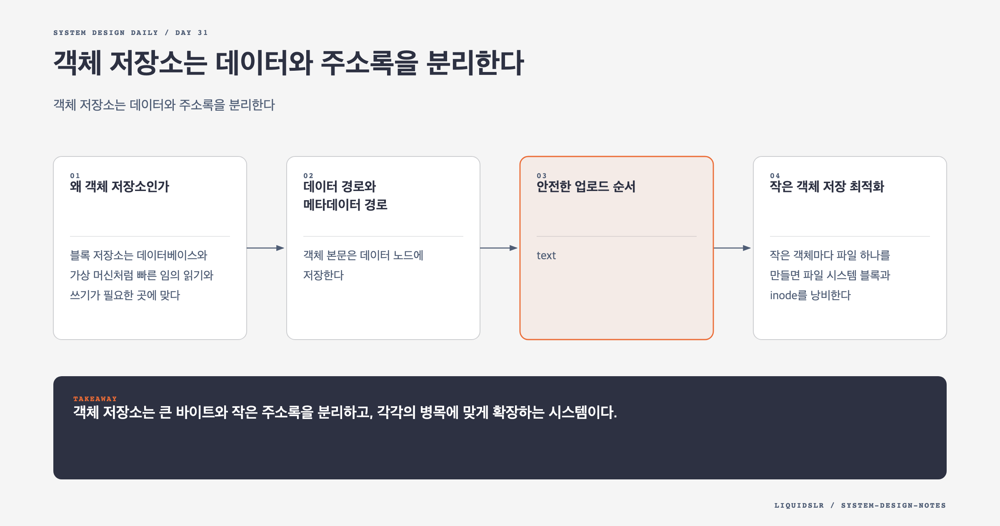

# Day 31. 객체 저장소는 데이터와 주소록을 분리한다



객체 저장소의 핵심은 디스크를 많이 붙이는 데 있지 않다. **크고 느리게 변하는 객체 본문과 작고 자주 찾는 메타데이터를 분리하는 것**에서 시작한다. 두 데이터는 크기, 접근 패턴, 확장 방식이 다르다.

## 왜 객체 저장소인가

블록 저장소는 데이터베이스와 가상 머신처럼 빠른 임의 읽기와 쓰기가 필요한 곳에 맞다. 파일 저장소는 디렉터리와 파일 공유를 제공한다. 객체 저장소는 제자리 수정을 포기하고 높은 내구성, 큰 규모, 낮은 저장 단가를 택한다.

객체는 한 번 쓴 뒤 여러 번 읽는 경우가 많다. `bucket/object_name`은 파일 경로처럼 보이지만 실제 디렉터리가 아니다. 평평한 키 공간에서 슬래시를 이름의 일부로 사용할 뿐이다.

## 데이터 경로와 메타데이터 경로

객체 본문은 데이터 노드에 저장한다. 메타데이터 저장소에는 버킷, 객체 이름, 크기, 체크섬, 권한, 버전, 본문을 가리키는 객체 ID를 둔다. 사용자가 이름으로 요청하면 메타데이터에서 객체 ID를 찾고, 데이터 노드가 그 ID로 본문을 읽는다.

분리하면 저장 용량과 이름 조회량을 독립적으로 확장할 수 있다. 데이터 노드는 용량과 순차 I/O에 맞춰 늘리고, 메타데이터 저장소는 이름 조회와 목록 쿼리에 맞춰 샤딩한다.

## 안전한 업로드 순서

```text
권한 확인
-> 저장 위치 선택
-> 본문 저장과 복제
-> 객체 ID 발급
-> 메타데이터 연결
-> 성공 응답
```

본문보다 메타데이터를 먼저 공개하면 본문이 없는 객체가 사용자에게 보인다. 본문을 먼저 저장한 뒤 메타데이터 쓰기가 실패하면 고아 데이터가 남지만, Garbage Collector가 회수할 수 있다. 사용자에게 깨진 객체를 보여 주지 않는 쪽이 더 안전하다.

다운로드는 권한 확인, 객체 이름 조회, 객체 ID로 본문 조회 순서로 진행한다. API 서비스는 무상태로 두고 IAM, 메타데이터 저장소, 데이터 저장소를 조율한다.

## 작은 객체 저장 최적화

작은 객체마다 파일 하나를 만들면 파일 시스템 블록과 inode를 낭비한다. 데이터 노드는 작은 객체를 큰 append-only 파일에 연속으로 붙이고 다음 로컬 색인을 유지할 수 있다.

```text
object_id -> file_name, offset, size, checksum
```

색인은 데이터 노드마다 로컬 SQLite나 RocksDB에 둔다. 중앙 색인 클러스터는 모든 읽기에 네트워크 왕복을 추가하고 트래픽이 몰리는 병목이 된다. 로컬 색인은 장애 시 본문 파일을 스캔해 재구축할 수 있도록 포맷과 복구 절차를 함께 설계해야 한다.

## 복제와 Erasure Coding

세 복제본은 읽기와 복구가 단순하지만 원본 외에 두 배의 저장 공간을 더 쓴다. Erasure Coding은 데이터와 패리티 조각을 여러 노드에 나눠 저장해 공간 비용을 낮춘다. 대신 읽을 때 여러 조각을 모으고 복원 계산을 하므로 지연과 구현 복잡도가 늘어난다.

복제본이나 조각은 같은 랙에 몰아두면 안 된다. 랙, 가용 영역, 전원, 네트워크 같은 장애 영역을 가로질러 배치해야 실제 내구성을 얻는다. 자주 읽는 객체에는 복제, 장기 보관 객체에는 Erasure Coding을 적용하는 정책도 가능하다.

디스크 일부가 조용히 손상되는 경우를 찾으려면 체크섬이 필요하다. 쓰기 때 객체 체크섬을 저장하고 읽기와 백그라운드 스크럽 때 다시 계산한다. 불일치가 나오면 정상 복제본이나 패리티로 복구한다.

## 실패 모드와 운영 기준

- 데이터 저장은 성공했지만 메타데이터 쓰기가 실패하면 객체를 노출하지 않고 고아 데이터로 회수한다.
- 메타데이터 저장소가 지연되면 본문 노드가 멀쩡해도 전체 요청이 느려진다. 두 경로를 따로 모니터링한다.
- 작은 파일 수가 급증하면 남은 용량보다 inode, 파일 핸들, 임의 I/O를 먼저 확인한다.
- 복제 성공 응답은 필요한 장애 영역의 복제가 끝난 뒤 반환한다. 빠른 응답을 위해 복제를 뒤로 미루면 인정한 데이터 손실 범위를 명시해야 한다.

## 오늘의 한 문장

> 객체 저장소는 큰 바이트와 작은 주소록을 분리하고, 각각의 병목에 맞게 확장하는 시스템이다.

## 30초 확인 문제

본문 저장과 복제는 성공했지만 객체 이름을 메타데이터에 기록하지 못했다. 성공을 반환해도 되는가?

## 정답과 해설

안 된다. 사용자가 객체 이름으로 본문을 찾을 수 없으므로 업로드 실패를 반환한다. 남은 본문은 참조되지 않은 객체 ID를 찾는 Garbage Collector가 회수한다. 고아 데이터는 저장 공간 문제지만, 본문 없는 메타데이터는 사용자에게 잘못된 성공과 깨진 조회를 노출한다.

원문: [Chapter 24, S3-like Object Storage](https://github.com/liquidslr/system-design-notes/tree/main/24.%20S3-like%20Object%20Storage)
