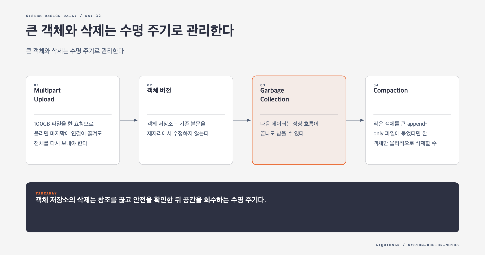

# Day 32. 큰 객체와 삭제는 수명 주기로 관리한다



큰 객체 저장에서 어려운 부분은 바이트를 받는 일이 아니다. 실패한 업로드를 재개하고, 덮어쓰기와 삭제의 의미를 보존하고, 더는 쓰지 않는 공간을 안전하게 회수하는 일이다. 이 문제를 한 번의 PUT과 DELETE로 표현하면 장애 순간의 상태를 잃는다.

## Multipart Upload

100GB 파일을 한 요청으로 올리면 마지막에 연결이 끊겨도 전체를 다시 보내야 한다. Multipart Upload는 객체를 독립적인 part로 나눠 실패한 part만 재시도하고 병렬로 전송하게 한다.

```text
INITIATED -> UPLOADING -> COMPLETING -> COMPLETED
                         -> ABORTED
```

클라이언트는 먼저 `upload_id`를 받는다. 각 part를 `part_number`와 함께 올리고 ETag를 저장한다. 마지막에는 part 번호와 ETag 목록을 보내 완료를 요청한다. 서버는 누락과 중복, 순서, 체크섬을 확인한 뒤 객체를 공개한다.

완료 요청은 멱등해야 한다. 조립은 끝났지만 응답만 사라질 수 있다. 같은 `upload_id`와 같은 part 목록이 다시 오면 기존 객체 버전을 반환해야 한다. 새 버전을 만들면 네트워크 재시도가 사용자 데이터 변경으로 바뀐다.

## 객체 버전

객체 저장소는 기존 본문을 제자리에서 수정하지 않는다. 같은 키에 다시 업로드하면 새 `object_id`와 `version_id`를 만든다.

```text
(bucket, key, version_id) -> object_id, checksum, state
```

삭제도 delete marker라는 새 버전을 추가해 표현할 수 있다. 기본 조회는 404를 반환하지만 이전 버전은 정책에 따라 복구할 수 있다. 쓰기 경로와 감사는 단순해지지만 저장 비용이 쌓이므로 보존 기간, 최대 버전 수, 법적 보존 잠금을 함께 설계해야 한다.

## Garbage Collection

다음 데이터는 정상 흐름이 끝나도 남을 수 있다.

- 완료하지 않은 Multipart part
- 메타데이터 쓰기에 실패한 고아 본문
- 보존 기간을 넘긴 이전 버전
- 손상으로 교체한 데이터 조각
- 재복제 뒤에 남은 이전 복제본

GC는 참조되지 않는 데이터를 찾되 즉시 지우지 않는다. 최근 생성 데이터에는 유예 기간을 두고, 진행 중인 업로드와 복제, 법적 보존 상태를 다시 확인한다. 메타데이터가 지연되거나 일시적으로 읽히지 않는 상황도 고려해야 한다.

## Compaction

작은 객체를 큰 append-only 파일에 묶었다면 한 객체만 물리적으로 삭제할 수 없다. 살아 있는 객체를 새 파일로 복사하고 색인을 원자적으로 교체한 뒤 이전 파일을 지운다.

```text
live 객체 복사
-> 새 파일 검증
-> object_mapping 원자 교체
-> 이전 독자 종료 확인
-> 이전 파일 삭제
```

Compaction은 공간을 회수하는 대신 디스크 대역폭을 쓴다. 사용자 읽기와 업로드의 꼬리 지연을 높일 수 있으므로 garbage ratio가 높은 파일부터 처리하고, I/O 속도와 동시 실행 수를 제한한다.

## 실패 모드

- ETag를 전체 객체 MD5로 고정 해석하면 Multipart 객체 검증이 틀릴 수 있다.
- 완료 재시도가 중복 버전을 만들면 저장 비용과 목록 결과가 달라진다.
- delete marker만 만들고 용량 회수를 추적하지 않으면 논리 삭제와 물리 사용량이 벌어진다.
- GC가 너무 빠르면 지연된 메타데이터 커밋이나 진행 중 업로드의 part를 지운다.
- Compaction에서 색인과 파일 삭제 순서가 어긋나면 존재하는 객체가 읽히지 않는다.

## 운영 지표

미완료 업로드 수와 총 바이트, 고아 객체 추정량, 버전별 저장량, GC 회수량, Compaction 대기량과 I/O, 완료 요청 재시도율을 본다. 객체 API 성공률만 보면 저장 공간 누수와 백그라운드 작업의 지연 영향을 놓친다.

## 오늘의 한 문장

> 객체 저장소의 삭제는 참조를 끊고 안전을 확인한 뒤 공간을 회수하는 수명 주기다.

## 30초 확인 문제

완료된 Multipart Upload의 응답이 사라져 클라이언트가 완료 요청을 재시도했다. 어떤 결과를 반환해야 하는가?

## 정답과 해설

기존 완료 결과의 객체 ID와 버전을 그대로 반환한다. `upload_id`와 part 목록을 멱등성 기준으로 저장해야 한다. 다시 조립하거나 새 버전을 만들면 전송 장애가 중복 데이터와 추가 비용으로 이어진다.

원문: [Chapter 24, S3-like Object Storage](https://github.com/liquidslr/system-design-notes/tree/main/24.%20S3-like%20Object%20Storage)
