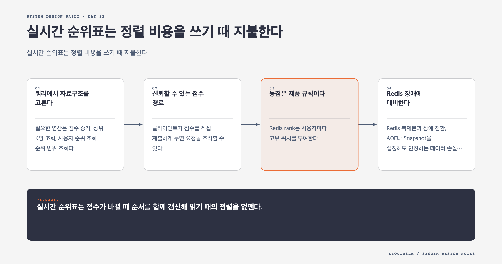

# Day 33. 실시간 순위표는 정렬 비용을 쓰기 때 지불한다



실시간 순위표는 상위 10명만 찾는 문제가 아니다. 점수를 자주 갱신하면서 상위 K명, 내 순위, 내 주변 사용자를 모두 빠르게 찾아야 한다. 관계형 데이터베이스의 정렬 쿼리만으로 시작할 수는 있지만 참여자가 수천만 명이 되면 임의 사용자의 순위 계산이 비싸진다.

## 쿼리에서 자료구조를 고른다

필요한 연산은 점수 증가, 상위 K명 조회, 사용자 순위 조회, 순위 범위 조회다. Redis Sorted Set은 해시 테이블과 Skip List를 이용해 사용자를 점수 순서로 유지한다. 추가와 검색에 `O(log N)`을 쓰지만 조회할 때 전체 집합을 다시 정렬하지 않는다.

```redis
ZINCRBY leaderboard:2026-08 1 user:1934
ZREVRANGE leaderboard:2026-08 0 9 WITHSCORES
ZREVRANK leaderboard:2026-08 user:1934
ZREVRANGE leaderboard:2026-08 356 364 WITHSCORES
```

점수 갱신에는 `ZINCRBY` 같은 원자 연산을 써야 한다. 애플리케이션이 점수를 읽고 계산한 뒤 다시 쓰면 동시 요청이 서로를 덮어써 갱신을 잃는다.

## 신뢰할 수 있는 점수 경로

클라이언트가 점수를 직접 제출하게 두면 요청을 조작할 수 있다. 게임 서버가 경기 결과를 검증한 뒤 순위표를 갱신한다.

```text
클라이언트 -> 게임 서버 -> 경기 검증 -> 순위표 서비스 -> Redis
```

여러 서비스가 경기 결과를 소비해야 할 때만 내구성 있는 이벤트 스트림을 추가한다. 순위표 하나만 필요한 단계에서 큐를 넣으면 운영 복잡도만 커질 수 있다.

## 동점은 제품 규칙이다

Redis rank는 사용자마다 고유 위치를 부여한다. 같은 점수에 같은 순위를 보여 줄지, 먼저 달성한 사용자를 앞세울지, 사용자 ID로 안정적인 순서를 만들지 먼저 정해야 한다. 보상 경계에 동점자가 걸리면 이 차이가 금전이나 아이템 분쟁으로 이어진다.

점수와 달성 시각을 하나의 부동소수점 score에 무리하게 압축하면 정밀도를 잃을 수 있다. 정렬용 값의 범위를 검증하거나 동점 정보를 별도 저장하고 표시 계층에서 공식 순위를 계산한다.

## Redis 장애에 대비한다

Redis 복제본과 장애 전환, AOF나 Snapshot을 설정해도 인정하는 데이터 손실 범위는 남는다. 검증된 경기 결과를 관계형 데이터베이스나 로그에 기록하면 순위표를 다시 만들 수 있다. 사용자 프로필도 별도 저장소에 두고 상위 사용자의 프로필만 캐시한다.

월간 참여자 2,500만 명의 원시 ID와 점수가 약 650MB여도 Redis 내부 오버헤드와 복제, Snapshot 중 Copy-on-Write 메모리를 포함하면 더 커진다. 샤딩 전 실제 데이터로 메모리와 QPS를 측정한다.

## 실패 모드

- 일반 테이블의 상위 10명 쿼리만 검증하고 내 순위 쿼리를 빠뜨린다.
- 원자 증가 대신 읽기 후 쓰기를 사용해 승리 기록을 잃는다.
- 경기 결과 ID를 중복 제거하지 않아 재시도 때 점수가 두 번 오른다.
- 동점 규칙이 저장소 기본 정렬에 우연히 의존한다.
- Redis만 남기고 재구축할 원본 경기 기록을 보관하지 않는다.

## 오늘의 한 문장

> 실시간 순위표는 점수가 바뀔 때 순서를 함께 갱신해 읽기 때의 정렬을 없앤다.

## 30초 확인 문제

게임 서버가 같은 승리 결과를 네트워크 재시도로 두 번 보냈다. `ZINCRBY`만 사용하면 안전한가?

## 정답과 해설

안전하지 않다. `ZINCRBY`는 한 번의 증가를 원자적으로 처리하지만 두 요청이 같은 경기인지 알지 못한다. 경기 결과에 고유 ID를 두고 이미 반영한 ID인지 원자적으로 확인한 뒤 점수를 올려야 한다. 원자성은 동시 갱신 유실을 막고, 멱등성은 같은 사건의 재처리를 막는다.

원문: [Chapter 25, Real-time Gaming Leaderboard](https://github.com/liquidslr/system-design-notes/tree/main/25.%20Real-time%20Gaming%20Leaderboard)
