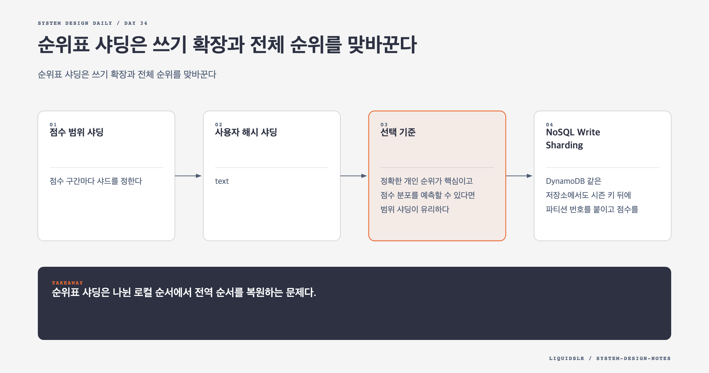

# Day 34. 순위표 샤딩은 쓰기 확장과 전체 순위를 맞바꾼다



단일 Redis Sorted Set은 모든 사용자를 한 순서로 유지한다. 샤딩하는 순간 전역 순서는 여러 로컬 순서로 갈라진다. 쓰기와 메모리는 분산되지만 상위 K명과 개인 순위를 다시 조합해야 한다.

## 점수 범위 샤딩

점수 구간마다 샤드를 정한다.

```text
0..99, 100..199, 200..299, ...
```

상위 K는 높은 점수 구간부터 읽는다. 개인 순위는 자기 샤드 안의 순위에 더 높은 구간의 사용자 수를 더한다. 전역 순위 계산이 단순한 대신 점수 분포가 치우치면 핫샤드가 생긴다. 시즌 초에는 낮은 구간, 시즌 후반에는 특정 높은 구간에 쓰기가 몰릴 수 있다.

사용자가 점수 경계를 넘을 때 이전 샤드에서 제거하고 새 샤드에 추가하는 작업도 필요하다. 중간 실패로 두 샤드에 모두 있거나 어디에도 없는 상태가 생기지 않도록 멱등한 이동과 복구 작업을 둔다.

## 사용자 해시 샤딩

```text
shard = hash(user_id) % N
```

사용자를 고르게 나눠 쓰기와 메모리 균형을 얻는다. 상위 K는 모든 샤드에서 K명씩 받아 병합한다. 개인 전역 순위는 각 샤드에서 기준 점수보다 높은 사용자 수를 합쳐야 하므로 더 어렵다.

Scatter-Gather는 샤드 수만큼 네트워크 요청을 만들고 가장 느린 샤드의 지연을 기다린다. 샤드가 늘수록 일부 실패와 꼬리 지연이 전체 조회에 미치는 영향이 커진다.

## 선택 기준

정확한 개인 순위가 핵심이고 점수 분포를 예측할 수 있다면 범위 샤딩이 유리하다. 쓰기 균형이 더 중요하고 상위 K 조회가 작거나 드물다면 해시 샤딩이 단순하다. 정확한 순위가 너무 비싸면 백분위로 요구를 바꾸는 선택도 제품 계약에 포함한다.

혼합 설계도 가능하다. 본체는 해시 샤딩하고 상위 100명 전용 전역 Sorted Set을 파생 데이터로 유지할 수 있다. 다만 원본과 전역 집합이 어긋날 때 다시 만드는 절차가 필요하다.

## NoSQL Write Sharding

DynamoDB 같은 저장소에서도 시즌 키 뒤에 파티션 번호를 붙이고 점수를 정렬 키로 둘 수 있다.

```text
partition_key = tournament_id + hash(user_id) % P
sort_key = score
```

파티션 수가 많을수록 쓰기는 분산되지만 상위 K 조회가 읽어야 할 파티션도 늘어난다. 파티션 수는 트래픽과 조회 지연을 함께 측정해 고른다.

## 운영과 복구

샤드별 메모리, QPS, 사용자 수, 점수 분포를 관찰한다. 전체 조회 지연만 보지 말고 Scatter-Gather에서 느린 샤드를 찾는다. 라우팅 버전을 저장하고 재샤딩 중 구버전과 신버전 요청을 구분한다. 시즌 종료 결과는 불변 스냅샷으로 보관하고 경기 로그에서 온라인 순위표를 다시 만들 수 있게 한다.

## 오늘의 한 문장

> 순위표 샤딩은 나뉜 로컬 순서에서 전역 순서를 복원하는 문제다.

## 30초 확인 문제

8개 해시 샤드에서 상위 10명을 찾을 때 각 샤드의 1위만 모아도 되는가?

## 정답과 해설

안 된다. 전역 상위 10명이 한 샤드에 모두 있을 수 있다. 각 샤드에서 최대 10명씩 받아 점수와 동점 규칙으로 병합해야 한다. 비용은 후보 수 `K x shard_count`와 가장 느린 샤드의 응답 시간에 영향을 받는다.

원문: [Chapter 25, Real-time Gaming Leaderboard](https://github.com/liquidslr/system-design-notes/tree/main/25.%20Real-time%20Gaming%20Leaderboard)
