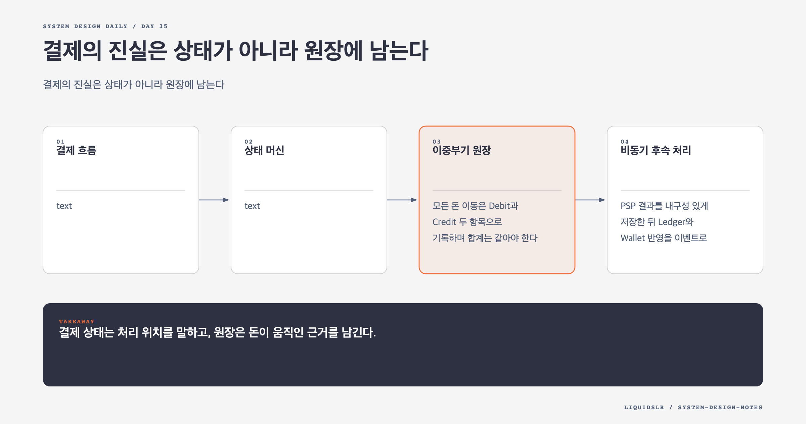

# Day 35. 결제의 진실은 상태가 아니라 원장에 남는다



결제는 PSP 호출 한 번이 아니다. 주문 등록, 외부 승인, 원장 기록, 판매자 잔액 반영이 서로 다른 시스템에서 진행된다. 어느 호출이든 성공 직후 응답이 사라질 수 있으므로 결제 상태와 돈의 기록을 분리해야 한다.

## 결제 흐름

```text
구매자 -> 결제 서비스 -> Payment Executor -> PSP -> 카드 네트워크
                      -> Ledger
                      -> Seller Wallet
```

결제 서비스는 Checkout과 Payment Order를 저장한다. Payment Executor는 Order 하나를 PSP에서 실행한다. PSP가 성공하면 결제 서비스는 Ledger에 금융 기록을 남기고 Wallet에 판매자 잔액을 반영한다.

Checkout 하나가 여러 판매자 주문을 포함할 수 있으므로 Payment Event와 Payment Order를 나눈다. Order에는 전역 고유 ID, 판매자, 금액, 통화, 상태, PSP 참조, Ledger와 Wallet 반영 상태를 둔다.

금액은 부동소수점으로 저장하지 않는다. 통화 최소 단위 정수와 통화 코드를 쓰거나 정확한 Decimal 타입을 쓴다. 카드 정보는 직접 저장하지 않고 PSP의 Hosted Payment Page와 Token을 사용한다.

## 상태 머신

```text
NOT_STARTED -> EXECUTING -> SUCCEEDED
                         -> FAILED
                         -> PENDING
```

`PENDING`은 최종 실패가 아니다. 추가 인증과 위험 검토, 은행 지연 뒤에 성공할 수 있다. PSP Webhook을 기다리고 필요하면 조회 API를 Polling한다. 사용자에게는 처리 중 상태와 다시 확인할 방법을 제공한다.

Boolean 하나로는 승인, 정산, 원장 반영, Wallet 반영 중 어디에서 멈췄는지 알 수 없다. 상태 전이와 원인, 외부 응답 코드를 기록한다.

## 이중부기 원장

모든 돈 이동은 Debit과 Credit 두 항목으로 기록하며 합계는 같아야 한다.

| Account | Debit | Credit |
|---|---:|---:|
| PSP clearing | 1000 | 0 |
| Seller payable | 0 | 1000 |

원장은 불변 금융 기록이다. Wallet은 빠른 잔액 조회를 위한 현재 상태다. Wallet 갱신이 실패해도 Ledger를 기준으로 다시 반영할 수 있다. 원장 오류를 고칠 때 기존 행을 삭제하지 않고 반대 방향의 보정 거래를 추가해 감사 이력을 남긴다.

## 비동기 후속 처리

PSP 결과를 내구성 있게 저장한 뒤 Ledger와 Wallet 반영을 이벤트로 처리하면 한 서비스 장애가 전체 Checkout 응답을 붙잡지 않는다. 대신 중복 처리 방지, 재시도 상태, Dead Letter Queue, 일시적 불일치를 감당해야 한다.

사용자에게 결제 성공을 보여 줄 시점도 정해야 한다. PSP 승인만으로 충분한지, 내부 원장 기록까지 완료해야 하는지는 제품과 회계 계약에 따라 다르다.

## Reconciliation

PSP 정산 파일과 Payment Order, Ledger, Wallet을 정기적으로 대조한다. 외부만 성공한 결제, 내부만 성공으로 표시된 결제, Ledger와 Wallet의 차이, 금액과 통화 불일치를 찾는다. 알려진 차이는 표준 보정 거래로 처리하고 분류할 수 없는 차이는 원본 근거를 묶어 조사한다.

## 실패 모드

- PSP Redirect만 믿어 브라우저 종료 때 결과를 놓친다.
- PSP 성공 뒤 Wallet 실패를 전체 결제 재시도로 처리해 이중 결제를 만든다.
- Wallet 숫자만 직접 고쳐 원장과 감사 기록이 어긋난다.
- 부동소수점 금액이 반올림 차이를 만든다.
- 동기 호출 사슬이 길어져 내부 서비스 하나의 장애가 사용자 결제에 전파된다.

## 오늘의 한 문장

> 결제 상태는 처리 위치를 말하고, 원장은 돈이 움직인 근거를 남긴다.

## 30초 확인 문제

PSP와 Ledger는 성공했지만 Wallet 반영이 실패했다. 무엇을 재시도해야 하는가?

## 정답과 해설

Wallet 반영만 재시도한다. PSP 결제를 다시 실행하면 고객을 중복 청구할 수 있다. Payment Order ID와 Ledger 거래 ID를 연결하고 Wallet 소비자가 같은 이벤트를 여러 번 받아도 한 번만 반영하도록 만든다. Reconciliation은 남은 차이를 찾아 복구한다.

원문: [Chapter 26, Payment System](https://github.com/liquidslr/system-design-notes/tree/main/26.%20Payment%20System)
