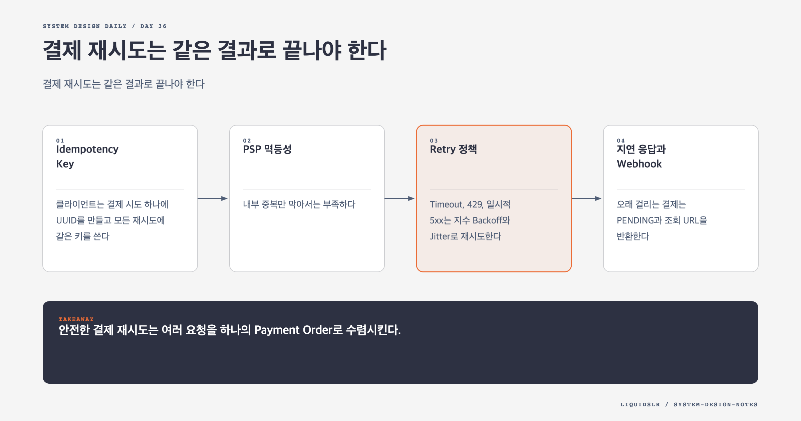

# Day 36. 결제 재시도는 같은 결과로 끝나야 한다



결제 서버가 요청을 못 받았는지, 승인은 끝났지만 응답만 사라졌는지 클라이언트는 알 수 없다. 그래서 재시도는 필요하지만 같은 돈 이동을 두 번 실행하면 안 된다. Exactly-once 처리는 Retry로 At-least-once를, Idempotency로 At-most-once를 만들어 얻는다.

## Idempotency Key

클라이언트는 결제 시도 하나에 UUID를 만들고 모든 재시도에 같은 키를 쓴다.

```http
POST /v1/payments
Idempotency-Key: 6f53e0b4-31a1-4d24-a21d-f40a6f7d56e2
```

서버는 키에 Unique Constraint를 두고 Payment Order와 연결한다. 처음이면 Order를 만들고, 이미 있으면 기존 상태와 응답을 반환한다. 사전 조회만으로는 동시 요청이 모두 빈 결과를 보는 경쟁을 막지 못하므로 데이터베이스 제약이나 원자 연산이 필요하다.

최초 요청의 금액, 통화, 판매자 같은 핵심 필드로 `request_hash`도 저장한다. 같은 키에 다른 본문이 오면 기존 결과를 돌려주지 말고 충돌로 거부한다.

## PSP 멱등성

내부 중복만 막아서는 부족하다. PSP 호출 뒤 응답이 사라지면 내부 Order가 같은 PSP 결제를 다시 요청할 수 있다. 내부 `payment_order_id`를 PSP의 Idempotency Key나 Merchant Reference로 전달한다.

PSP가 이를 지원하지 않으면 기존 승인 조회를 먼저 하고, 결과가 불확실한 작업을 자동 재실행하지 않는 정책이 필요하다. 내부 Order 한 건과 외부 승인 한 건의 연결을 끝까지 유지해야 한다.

## Retry 정책

Timeout, 429, 일시적 5xx는 지수 Backoff와 Jitter로 재시도한다. 카드 정보 오류나 잔액 부족처럼 최종 오류는 재시도하지 않는다. `Retry-After`가 있으면 따르고 최대 횟수를 넘긴 작업은 Dead Letter Queue와 운영 조사로 보낸다.

Jitter 없는 즉시 재시도는 장애 난 외부 시스템에 요청을 한꺼번에 다시 보내 복구를 늦춘다.

## 지연 응답과 Webhook

오래 걸리는 결제는 `PENDING`과 조회 URL을 반환한다.

```http
HTTP/1.1 202 Accepted
Location: /v1/payments/pay_123
```

PSP Webhook은 중복되거나 순서가 바뀔 수 있다. PSP Event ID로 중복을 제거하고 상태 머신이 허용한 전이만 적용한다. 브라우저 Redirect 값은 사용자 안내에 쓰되 금융 상태 확정에는 쓰지 않는다.

## Reconciliation

정산 파일과 내부 상태를 대조해 PSP 성공과 내부 Pending, 금액 불일치, Ledger 누락을 찾는다. 알려진 유형은 멱등한 보정 작업으로 고치고 분류하지 못한 차이는 원본 요청, PSP Reference, 상태 전이 기록과 함께 조사한다.

## 오늘의 한 문장

> 안전한 결제 재시도는 여러 요청을 하나의 Payment Order로 수렴시킨다.

## 30초 확인 문제

같은 Idempotency Key에 다른 금액이 들어오면 어떻게 해야 하는가?

## 정답과 해설

최초 요청의 `request_hash`와 비교해 충돌로 거부한다. 키만 보고 기존 결과를 반환하면 서로 다른 결제를 같은 작업으로 오인한다. 키와 요청 의미가 함께 같을 때만 멱등한 재시도로 취급한다.

원문: [Chapter 26, Payment System](https://github.com/liquidslr/system-design-notes/tree/main/26.%20Payment%20System)
