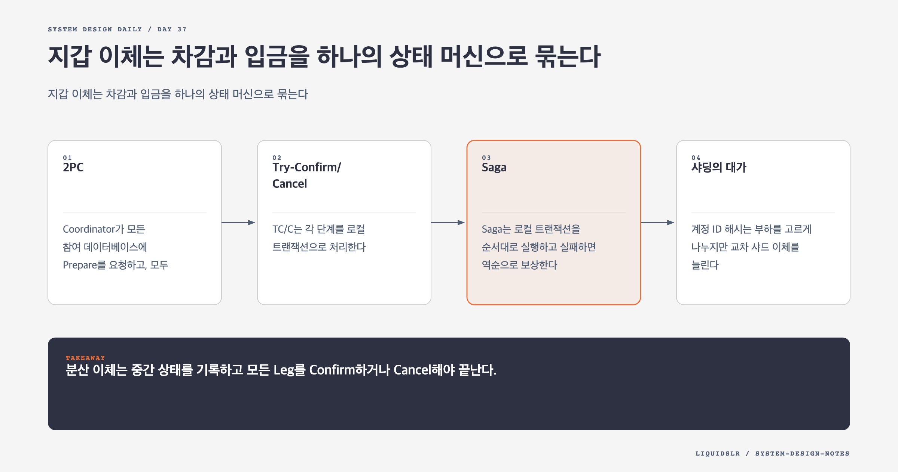

# Day 37. 지갑 이체는 차감과 입금을 하나의 상태 머신으로 묶는다



지갑 이체 한 건은 출금과 입금 두 쓰기다. 두 계정이 같은 데이터베이스에 있으면 로컬 트랜잭션으로 묶을 수 있다. 계정별 샤딩으로 서로 다른 데이터베이스에 놓이면 각 쓰기의 성공만으로 전체 이체 성공을 보장할 수 없다.

## 2PC

Coordinator가 모든 참여 데이터베이스에 Prepare를 요청하고, 모두 준비되면 Commit한다. 하나라도 실패하면 Abort한다. 강한 원자성을 제공하지만 Prepare 동안 Lock을 잡고 Coordinator 장애와 네트워크 지연의 영향을 받는다.

처리량이 크고 참여자가 많을수록 Lock 대기와 장애 복구가 부담이 된다. 모든 저장소가 분산 트랜잭션을 지원해야 한다.

## Try-Confirm/Cancel

TC/C는 각 단계를 로컬 트랜잭션으로 처리한다.

```text
Try: A에서 금액 예약 또는 차감
Confirm: B에 입금
Cancel: A의 예약 해제 또는 보상 입금
```

차감을 먼저 해야 중간 상태에서 없는 돈이 새로 생기지 않는다. 진행 중 차감액은 사용 가능한 잔액에서 제외한다.

Coordinator는 `transaction_id`, Try 상태, Confirm 또는 Cancel 결정, 두 번째 단계 상태를 내구성 있게 기록한다. 재시작하면 중단 지점에서 같은 명령을 재전송한다. 참여자의 모든 명령은 멱등해야 한다.

Cancel이 Try보다 먼저 도착할 수도 있다. 참여자는 선행 Cancel을 기록하고 뒤늦은 Try를 거부하거나 상쇄한다. 중복, 지연, 순서 변경은 분산 이체의 정상적인 실패 모드다.

## Saga

Saga는 로컬 트랜잭션을 순서대로 실행하고 실패하면 역순으로 보상한다. Choreography는 서비스가 이벤트를 이어받고, Orchestration은 중앙 Coordinator가 순서를 관리한다. 지갑은 전체 이체 상태와 복구 지점을 한곳에서 추적하기 쉬운 Orchestration이 유리하다.

TC/C는 Try 단계를 병렬화할 수 있어 지연을 줄이기 쉽고, Saga는 긴 업무 흐름을 표현하기 쉽다. 둘 다 중간 불일치를 허용하므로 보상과 사용자 노출 정책이 필요하다.

## 샤딩의 대가

계정 ID 해시는 부하를 고르게 나누지만 교차 샤드 이체를 늘린다. 관련 계정을 함께 배치하면 로컬 트랜잭션 비율이 높아지지만 큰 고객이나 가맹점에 트래픽이 몰릴 수 있다.

100만 이체 TPS는 최소 200만 잔액 변경을 뜻한다. Coordinator 상태와 이벤트 기록, 복제까지 포함해 용량을 계산해야 한다.

## 실패 모드

- 두 저장소에 순서대로 쓰고 이를 원자적이라고 부른다.
- 보상 명령을 중복 적용해 잔액을 두 번 되돌린다.
- Coordinator 상태를 메모리에만 두어 재시작 후 결정을 잃는다.
- 입금을 먼저 적용해 사용자가 중간 잔액을 다시 쓴다.
- 선행 Cancel과 뒤늦은 Try를 처리하지 못한다.

## 오늘의 한 문장

> 분산 이체는 중간 상태를 기록하고 모든 Leg를 Confirm하거나 Cancel해야 끝난다.

## 30초 확인 문제

A 차감 뒤 Coordinator가 죽었다. 복구 시 무엇이 필요한가?

## 정답과 해설

내구성 있게 저장한 단계 상태와 멱등한 참여자 API가 필요하다. 전체 Try가 성공했다면 B 입금을 Confirm하고, 실패했다면 A 차감을 Cancel한다. 같은 명령을 여러 번 보내도 한 번만 적용되어야 안전하게 복구할 수 있다.

원문: [Chapter 27, Digital Wallet](https://github.com/liquidslr/system-design-notes/tree/main/27.%20%20Digital%20Wallet)
