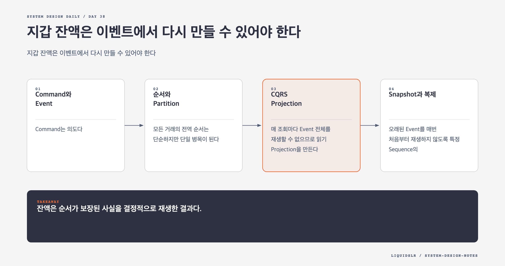

# Day 38. 지갑 잔액은 이벤트에서 다시 만들 수 있어야 한다



현재 잔액만 저장하면 조회는 빠르지만 그 값이 만들어진 이유를 잃는다. Event Sourcing은 상태를 바꾼 사실을 불변 로그로 남기고 현재 잔액을 그 결과로 만든다.

## Command와 Event

Command는 의도다. 잔액 부족이나 계정 정지로 실패할 수 있고 외부 검증 결과에 영향을 받는다. Event는 이미 일어난 사실이다.

```text
Command: A에서 B로 1000원을 보내라
Event: A에서 1000원이 차감됐다
Event: B에 1000원이 입금됐다
State: 현재 잔액
```

State Machine은 Command를 검증해 Event를 만들고 Event를 State에 적용한다. 적용 함수는 같은 입력에 항상 같은 결과를 내야 한다.

```text
new_state = apply(previous_state, event)
```

현재 시각, 난수, 외부 API를 적용 중 읽으면 재생 결과가 달라진다. 필요한 값은 Event를 만들 때 확정해 본문에 저장한다. 잘못된 Event는 지우지 않고 보상 Event를 추가한다.

## 순서와 Partition

모든 거래의 전역 순서는 단순하지만 단일 병목이 된다. 같은 계정에 영향을 주는 Event의 순서를 보장하도록 Partition을 나눈다. 두 계정에 걸친 이체는 Coordinator가 각 Partition 작업을 묶는다. Sequence와 Transaction ID로 누락, 중복, 역순을 감지한다.

## CQRS Projection

매 조회마다 Event 전체를 재생할 수 없으므로 읽기 Projection을 만든다.

```text
Event Log -> Balance Projection
          -> Transaction History
          -> Audit Projection
```

Projection은 Event를 소비해 현재 잔액과 내역을 갱신한다. 소비 지연이 있으면 Command 성공 직후 이전 값이 보일 수 있다. 처리 Sequence를 응답에 넣고 해당 Sequence까지 반영된 읽기를 기다리는 방식으로 Read-your-writes를 제공할 수 있다.

## Snapshot과 복제

오래된 Event를 매번 처음부터 재생하지 않도록 특정 Sequence의 Snapshot을 저장한다. Snapshot 뒤 Event만 적용하면 복구 시간이 줄어든다. Snapshot은 파생 데이터이며 손상되면 Event에서 다시 만든다.

State와 Projection은 재생할 수 있지만 확정된 Event Log는 대체할 수 없다. Command에는 외부 결과가 섞여 같은 Event를 다시 만든다는 보장이 없다. Event Log를 다수 Replica에 순서대로 복제하고 Commit해야 한다.

## 코드와 Schema 변경

새 State Machine을 과거 Event에 실행해 기존 결과와 비교하면 정책 변경과 회귀를 찾을 수 있다. Event는 오래 남으므로 Schema 버전과 Upcaster가 필요하다. 새 Reader가 과거 Event에 없는 필드를 필수로 요구하면 재생이 멈춘다.

## 오늘의 한 문장

> 잔액은 순서가 보장된 사실을 결정적으로 재생한 결과다.

## 30초 확인 문제

Event 적용 함수가 현재 환율 API를 호출하면 왜 안 되는가?

## 정답과 해설

재생 시점마다 환율이 달라 같은 Event가 다른 State를 만든다. Command 처리 때 사용한 환율과 결과를 Event에 기록하고 적용 함수는 Event 안의 값만 사용해야 한다.

원문: [Chapter 27, Digital Wallet](https://github.com/liquidslr/system-design-notes/tree/main/27.%20%20Digital%20Wallet)
