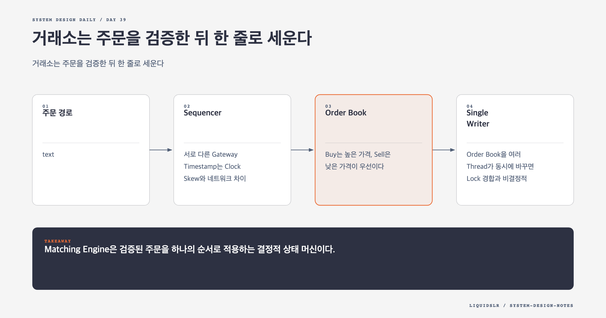

# Day 39. 거래소는 주문을 검증한 뒤 한 줄로 세운다



거래소의 핵심은 주문을 빠르게 받는 것보다 검증된 주문을 공정한 순서로 체결하는 데 있다. 주문 접수와 체결 결과 반환은 Critical Path로 두고 시장 데이터와 리포팅은 분리한다.

## 주문 경로

```text
Broker -> Client Gateway -> Order Manager -> Sequencer
       -> Matching Engine -> Sequencer -> Order Manager -> Broker
```

Gateway는 인증, Rate Limit, 프로토콜 검증을 한다. Order Manager는 위험 한도와 자금을 확인하고 주문 상태를 관리한다. 매수 자금과 매도 가능 수량은 주문이 열려 있는 동안 예약해야 한다. 잔액만 확인하면 같은 돈으로 여러 주문을 넣을 수 있다.

가격과 수량은 부동소수점보다 Tick과 최소 수량 단위의 정수로 표현한다. `client_order_id`로 Broker의 재시도도 중복 제거한다.

## Sequencer

서로 다른 Gateway Timestamp는 Clock Skew와 네트워크 차이 때문에 공정한 순서를 만들지 못한다. Sequencer가 모든 명령에 단조 증가 번호를 붙인다.

```text
10421 NEW order-A
10422 NEW order-B
10423 CANCEL order-A
```

Matching Engine은 Sequence 순서대로 처리한다. 번호 누락과 역순을 감지하고 입력 로그로 장애 뒤 Order Book을 재생한다.

## Order Book

Buy는 높은 가격, Sell은 낮은 가격이 우선이다. 같은 가격에서는 먼저 들어온 주문을 먼저 체결한다. Price Level마다 Doubly Linked List를 두면 추가는 Tail, 체결은 Head에서 `O(1)`로 처리한다. `order_id`에서 List Node로 가는 Hash Map은 취소를 빠르게 만든다.

한 주문은 여러 상대 주문과 부분 체결될 수 있다. 체결마다 매수와 매도 양쪽 Fill을 만들고 남은 수량과 예약 자금을 갱신한다.

## Single Writer

Order Book을 여러 Thread가 동시에 바꾸면 Lock 경합과 비결정적 순서가 생긴다. 종목 Partition마다 Single Writer Event Loop를 두고 한 Core에서 순서대로 처리하면 Lock과 Context Switch를 줄일 수 있다.

확장은 Order Book 하나를 여러 Writer가 공유하는 대신 종목을 여러 Engine Partition에 나누는 방식으로 한다. 인기 종목 하나가 단일 Partition 병목이 될 수 있으므로 평균 종목 수가 아니라 최대 종목 부하로 용량을 잡는다.

## 체결 이후

Fill Stream은 Market Data Publisher와 Reporter가 소비한다. Publisher는 Order Book과 Candlestick을 만들고 Reporter는 규제와 정산 자료를 저장한다. 두 경로가 느려져도 체결을 막지 않게 분리하되 Sequence로 누락을 복구할 수 있어야 한다.

## 오늘의 한 문장

> Matching Engine은 검증된 주문을 하나의 순서로 적용하는 결정적 상태 머신이다.

## 30초 확인 문제

같은 가격의 주문 순서를 Gateway Timestamp로 정하면 무엇이 문제인가?

## 정답과 해설

Gateway마다 시계와 네트워크 경로가 달라 공정한 비교를 할 수 없다. Sequencer가 단일 순서를 부여하고 Matching Engine이 그 순서로 처리해야 같은 입력에서 같은 체결과 복구 결과를 얻는다.

원문: [Chapter 28, Stock Exchange](https://github.com/liquidslr/system-design-notes/tree/main/28.%20Stock%20Exchange)
