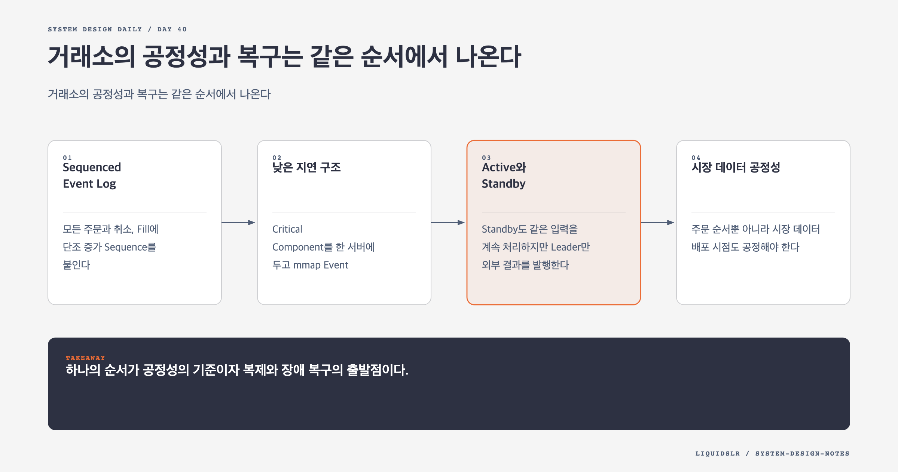

# Day 40. 거래소의 공정성과 복구는 같은 순서에서 나온다



거래소에서 결정성은 테스트 편의가 아니다. 주문 우선순위를 공정하게 정하고, Standby가 같은 Order Book을 만들고, 장애 뒤 중복 체결 없이 이어가기 위한 전제다.

## Sequenced Event Log

모든 주문과 취소, Fill에 단조 증가 Sequence를 붙인다. State Machine은 외부 시각이나 난수 없이 그 순서대로 Event를 적용한다.

```text
Input 701 NEW A
Input 702 NEW B
Output 990 FILL A,B,100
```

같은 시작 상태와 같은 로그를 가진 Replica는 같은 결과를 만든다. Timestamp는 감사 정보로 남길 수 있지만 체결 순서의 근거는 Sequencer가 만든 순서다.

## 낮은 지연 구조

Critical Component를 한 서버에 두고 `mmap` Event Store와 CPU Core에 고정한 Event Loop로 연결하면 Network Hop, Lock, Context Switch를 줄일 수 있다. 이는 Microservice 분리보다 Scale-up을 택한 설계다.

장애 영향이 커지는 대가를 치르므로 Event Log 복제와 Standby가 필요하다. 성능을 위해 텍스트 로그를 Critical Path에서 빼더라도 재생 가능한 Sequenced Event Log는 보존한다.

## Active와 Standby

Standby도 같은 입력을 계속 처리하지만 Leader만 외부 결과를 발행한다. 장애 전환 때 마지막 Commit Input Sequence와 발행 Output Sequence를 확인해 이어간다. 로그를 다수 Replica에 복제하기 전에 성공을 반환하면 장애 때 승인한 주문을 잃는다.

Heartbeat만으로 Leader를 바꾸면 느린 Primary와 새 Leader가 동시에 발행하는 Split Brain이 생길 수 있다. Quorum과 Fencing Token으로 이전 Leader의 권한을 끊는다. RPO, RTO, 신규 주문 중단이나 취소 전용 같은 Degraded Mode도 정한다.

## 시장 데이터 공정성

주문 순서뿐 아니라 시장 데이터 배포 시점도 공정해야 한다. Multicast는 여러 Subscriber에 같은 데이터를 보내지만 UDP 손실을 해결하지 않는다. Sequence Gap 감지와 Retransmission Channel이 필요하다.

Colocation을 제공한다면 Gateway 처리와 배포 경로를 공개된 규칙으로 운영해 특정 참여자의 숨은 우위를 막는다.

## 꼬리 지연

평균 지연이 낮아도 p99.99가 튀면 일부 주문이 반복해서 불리해진다. GC Pause, Page Fault, CPU Migration, 동적 할당을 줄이기 위해 미리 할당한 Ring Buffer와 고정 Core를 사용한다. 평균과 함께 높은 Percentile과 Sequence Gap을 관찰한다.

## 복구 검증

주문 유입 중 Process Kill과 Network Partition을 주입해 Commit된 주문 유실, 중복 Fill, Active와 Standby State Hash, Fencing을 검증한다. Replica가 존재한다는 사실보다 실제 Failover 결과가 증거다.

## 오늘의 한 문장

> 하나의 순서가 공정성의 기준이자 복제와 장애 복구의 출발점이다.

## 30초 확인 문제

Active와 Standby가 같은 Event를 처리하면서 현재 시각을 읽으면 왜 위험한가?

## 정답과 해설

각 Node가 다른 값을 읽어 같은 Sequence에서도 다른 State와 Fill을 만들 수 있다. 외부 판단은 입력 전에 확정해 Event에 넣고 Matching State Machine은 Event와 기존 State만 사용해야 한다.

원문: [Chapter 28, Stock Exchange](https://github.com/liquidslr/system-design-notes/tree/main/28.%20Stock%20Exchange)
